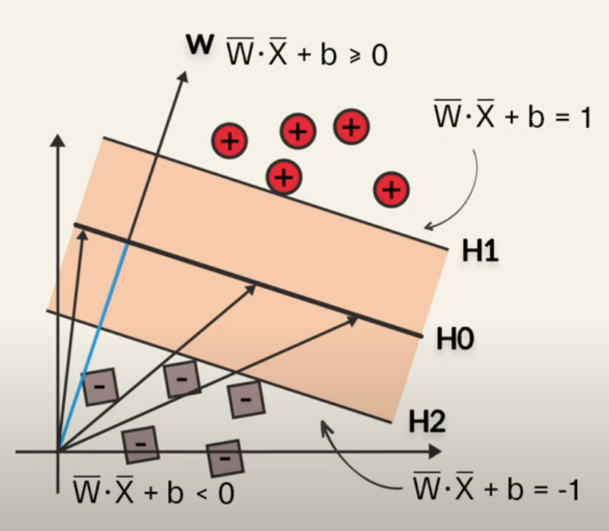
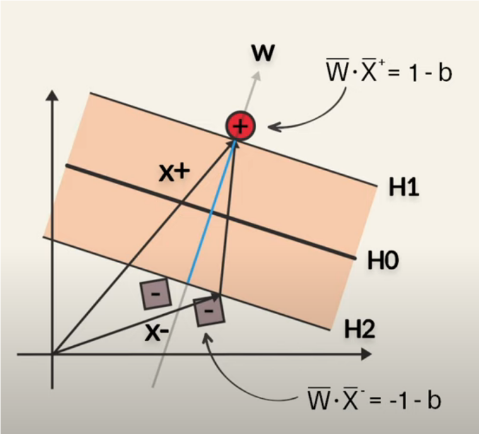

# SVM (support vector machine)

<!-- @import "[TOC]" {cmd="toc" depthFrom=1 depthTo=6 orderedList=false} -->

<!-- code_chunk_output -->

- [SVM (support vector machine)](#svm-support-vector-machine)
    - [overview](#overview)
      - [1.基本概念](#1基本概念)
      - [2.目标: find the optimum hyperplane](#2目标-find-the-optimum-hyperplane)
      - [3.原理](#3原理)
        - [(1) 分析](#1-分析)
        - [(2) 使用lagrange multiplier求解](#2-使用lagrange-multiplier求解)
      - [4.non-linear classification: kernel trick](#4non-linear-classification-kernel-trick)

<!-- /code_chunk_output -->

### overview

given a set of labeld training data, SVM will find optimal hyperplane which categorized new examples (only handle two categories)

#### 1.基本概念

* hyperplane
  * in 1d space: hyperplane is dot
  * in 2d space: hyperplane is line
  * in 3d space: hyperplane is surface

* support vector
  * the points that are closest to the hyperplane

* margin
  * the distance between the hyperplane and support vector

#### 2.目标: find the optimum hyperplane
* maximum margin
  * only support vectors determine hyperplance

* hyperplane: $\vec W \cdot\vec X + b=0$
  * $\vec W$ 是参数
  * $\vec X$ 是hyperplane上的点

#### 3.原理

##### (1) 分析

* 若$\vec W$与hyperplane垂直
* H0: $\vec W\cdot\vec X=C$，可以写成$\vec W \cdot\vec X + b=0$
* H1: $\vec W \cdot\vec X + b=k$，可以写成$\vec W \cdot\vec X + b=1$
* H2: $\vec W \cdot\vec X + b=-k$，可以写成$\vec W \cdot\vec X + b=-1$

* $\vec {X^+}$是H1上的点，$\vec {X^-}$是H2上的点，则H1和H2之前的距离：
  * marigin = $(\vec {X^+}-\vec {X^-})\cdot \frac{\vec W}{||\vec W||}=\frac{2}{||\vec W||}$
* **maximize margin**，则需要minimize $||\vec W||$
* 为了计算方便，即需要minimize $\frac{1}{2}||\vec W||^2$
* 限制条件:
  * 对于positive data: $\vec W \cdot\vec X + b\ge 1$
  * 对于negative data: $\vec W \cdot\vec X + b\le -1$
  * 即$y_i(\vec W \cdot\vec X_i + b)\ge 1$
    * 对于positive data, 标签y=1
    * 对于negative data, 标签y=-1
    * 所以这是很多个限制条件，一个样本就是一个限制条件

##### (2) 使用lagrange multiplier求解
* $L=\frac{1}{2}\vec W\cdot\vec W-\sum\lambda_i[y_i(\vec W\cdot\vec X_i+b)-1]$
    * 每个样本有一个multiplier ($\lambda_i$)
    * for non-support vectors: $\lambda_i=0$，即不参与分类

* 求解: $\max\limits_{\lambda_i\ge 0}[\min\limits_{\vec W,b}L]$
    * 寻找$\lambda_i$使得L最小

* 先求: $\min\limits_{\vec W,b}L$ (即将$\lambda_i$看成常量)
    * $\frac{\partial L}{\partial \vec W}=\vec W-\sum\lambda_i y_i \vec X_i=0$
    * $\frac{\partial L}{\partial b}=-\sum\lambda_i y_i=0$
    * 带入得 $L=\sum\lambda_i-\frac{1}{2}\sum_i\sum_j\lambda_i\lambda_j y_i y_j \vec X_i\vec X_j$

#### 4.non-linear classification: kernel trick
* polynomial kernel
  * $(a\times b+r)^d$
    * a,b: two different observations in the dataset
    * r: the coefficient of the polynomial
    * d: the degree of the polynomial

  * 比如: r=1, d=2
    * $(a\times b+1)^2=2ab+a^2b^2+1=(\sqrt 2a,a^2,1)\cdot (\sqrt 2b,b^2,1)$
    * 则将数据点从1d映射到2d
      * a: $(\sqrt 2a,a^2)$
      * b: $(\sqrt 2b.b^2)$

* redial kernel (RBF: redial basis function)
  * $e^{-\gamma(a-b)^2} $
    * 根据taylor series: $e^{ab}=(a,\sqrt{\frac{1}{2!}}a^2,\sqrt{\frac{1}{3!}}a^3,...,\sqrt{\frac{1}{\infty!}}a^{\infty})\cdot (b,\sqrt{\frac{1}{2!}}b^2,\sqrt{\frac{1}{3!}}b^3,...,\sqrt{\frac{1}{\infty!}}b^{\infty})$
