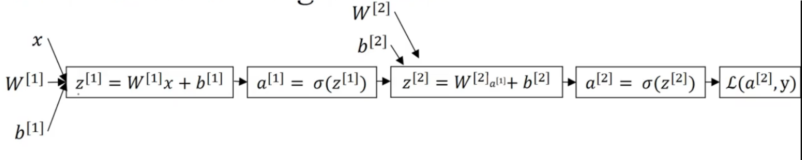
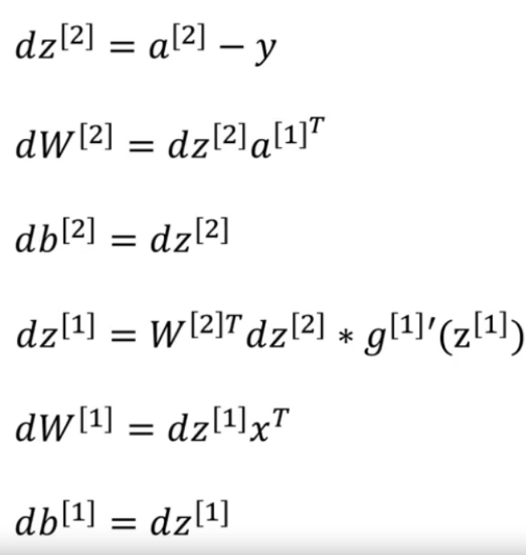

# backpropagation


<!-- @import "[TOC]" {cmd="toc" depthFrom=1 depthTo=6 orderedList=false} -->

<!-- code_chunk_output -->

- [backpropagation](#backpropagation)
    - [理解](#理解)
      - [1.对back propagation的理解](#1对back-propagation的理解)
        - [(1) 一次梯度下降的过程](#1-一次梯度下降的过程)
        - [(2) 数学表示](#2-数学表示)
        - [(3) 整体算法](#3-整体算法)
    - [概述](#概述)
      - [1.backpropagation (计算导数的算法)](#1backpropagation-计算导数的算法)
        - [(1) 通过chain rule求导数](#1-通过chain-rule求导数)
    - [demo](#demo)
      - [1.求导数](#1求导数)
      - [2.代码实现](#2代码实现)
        - [(1) initialize parameters实现](#1-initialize-parameters实现)
        - [(2) forward propagation实现](#2-forward-propagation实现)
        - [(3) cost functin实现](#3-cost-functin实现)
        - [(4) back propagation实现](#4-back-propagation实现)
        - [(5) update paramter实现](#5-update-paramter实现)
        - [(6) graident descent实现](#6-graident-descent实现)

<!-- /code_chunk_output -->


### 理解

#### 1.对back propagation的理解

一种梯度下降的算法，当参数量过大，传统的梯度下降算法效率太低

* 通过backpropagation的方式，求出 cost function基于**各层参数的导数**，从而知道如何调整各层参数，能够使得cost function最小

##### (1) 一次梯度下降的过程
* 最后一层某个neuron的输出，比如（其中使用sigmoid函数）：$\sigma(w_0a_0 + w_1a_1 + ... + w_{n-1}a_{n-1} + b)$
* 输出的值 与 正确的值相差较大，所以需要**调整**以下参数，使用趋近于正确值
    * 调整b
    * 调整w
        * a值越大的 对应的w，对代价函数的影响越大
    * 调整a，即调整上一层的输出，所以会**向前传递**
        * w值越大的 对应的a，对代价函数的影响越大
* 最后一层的每个neuron都调整 w、b、a三个值，满足自己的期望
    * 每个neuron都有自己的w和b，在一次梯度下降的过程中会有**多个训练数据**时，每个训练数据期期望w和b调整的值也不一样，所以取**期望调整的平均值**，得到最终w和b如何调整，即**w和b此次梯度下降的值**
    * 对于a，即上一层的输出，会将每个neuron对a的期望合并，得到 **期望上一层输出的如何调整**，即 **a此次梯度下降的值**，从而**向前传递**
* 倒数第二层重复上述步骤
* 依次类推

##### (2) 数学表示
* 假设
    * neuron network有4层，每层只有一个neuron，参数分别为$(w_1,b_1),(w_2,b_2),(w_3,b_3)$
    * 最后一层的neuron的activation：$a^{(L)}$，所以倒数第二层的neuron的activation：$a^{(L-1)}$
    * 对于某个训练数据，最后一层的neuron正确值是y
    * 则损失函数: $C_0(...) = (a^{(L)}-y)^2$
    * 其中
        * $z^{(L)} = w^{(L)}a^{(L-1)} + b^{(L)}$
        * $a^{(L)} = \sigma (z^{(L)})$ （sigmoid函数）
* $\frac{\partial C_0}{\partial w^{(L)}} = \frac{\partial z^{(L)}}{\partial w^{(L)}}\frac{\partial a^{(L)}}{\partial z^{(L)}}\frac{\partial C_0}{\partial a^{(L)}} = a^{(L-1)}\sigma'(z^{(L)})2(a^{(L)} - y)$
* $\frac{\partial C_0}{\partial b^{(L)}} = \frac{\partial z^{(L)}}{\partial b^{(L)}}\frac{\partial a^{(L)}}{\partial z^{(L)}}\frac{\partial C_0}{\partial a^{(L)}} = \sigma'(z^{(L)})2(a^{(L)} - y)$
* $\frac{\partial C_0}{\partial a^{(L-1)}} = \frac{\partial z^{(L)}}{\partial a^{(L-1)}}\frac{\partial a^{(L)}}{\partial z^{(L)}}\frac{\partial C_0}{\partial a^{(L)}} = w^{(L)}\sigma'(z^{(L)})2(a^{(L)} - y)$

* 则
    * $\frac{\partial J}{\partial w^{(L)}} = \frac{1}{m}\sum_{i}^{m} \frac{\partial}{\partial w}C_0^{(i)} = \frac{1}{m}\sum_{i=1}^m \frac{\partial}{\partial w}(a^{(L-1)}\sigma'(z^{(L)})2(a^{(L)} - y^{(i)}))$
    * ...


##### (3) 整体算法
一次梯度下降可以使用多个训练数据（batch）
每次虽然下降的斜率不是最优的，但是效率高

***

### 概述

#### 1.backpropagation (计算导数的算法)

* 从后往前，计算出 J关于所有参数的导数
    * 利用chain rule，能够提高计算效率
* 从而进行梯度下降


##### (1) 通过chain rule求导数
* input: $da^{[l]}$
* output: $da^{[l-1]}, dW^{[l]}, db^{[l]}$
* 关系： $a^{[l]} = g(z^{[l]}) = g(W^{[l]}a^{[l-1]} + b^{[l]})$
* 求导过程（这里不是矩阵，矩阵 和 求和平均 需要注意一下运算）:
    * 先求 $dz^{[l]} = da^{[l]} * g^{[l]'}(z^{[l]})$
    * $dW^{[l]} = dz^{[l]} * a^{[l-1]}$
    * $db^{[l]} = dz^{[l]}$
    * $da^{[l-1]} = dz^{[l]} * dW^{[l]}$

***

### demo

* 以2层neuron network为例
    * layer 1 使用tanh或sigmoid
    * output layer使用sigmoid


#### 1.求导数

* 利用chain rule求导数




#### 2.代码实现

##### (1) initialize parameters实现
```python
def initialize_parameters(n_x, n_h, n_y):
    """
    Argument:
    n_x -- size of the input layer
    n_h -- size of the hidden layer
    n_y -- size of the output layer
    
    Returns:
    params -- python dictionary containing your parameters:
                    W1 -- weight matrix of shape (n_h, n_x)
                    b1 -- bias vector of shape (n_h, 1)
                    W2 -- weight matrix of shape (n_y, n_h)
                    b2 -- bias vector of shape (n_y, 1)
    """    

    W1 = np.random.randn(n_h,n_x) * 0.01
    b1 = np.zeros((n_h,1))
    W2 = np.random.randn(n_y, n_h) * 0.01
    b2 = np.zeros((n_y,1))

    parameters = {"W1": W1,
                  "b1": b1,
                  "W2": W2,
                  "b2": b2}
    
    return parameters
```

##### (2) forward propagation实现

```python
def forward_propagation(X, parameters):
    """
    Argument:
    X -- input data of size (n_x, m)
    parameters -- python dictionary containing your parameters (output of initialization function)
    
    Returns:
    A2 -- The sigmoid output of the second activation
    cache -- a dictionary containing "Z1", "A1", "Z2" and "A2"
    """

    Z1 = parameters["W1"] @ X + parameters["b1"]
    A1 = np.tanh(Z1)
    Z2 = parameters["W2"] @ A1 + parameters["b2"]
    A2 = sigmoid(Z2)   
    
    assert(A2.shape == (1, X.shape[1]))
    
    cache = {"Z1": Z1,
             "A1": A1,
             "Z2": Z2,
             "A2": A2}
    
    return A2, cache
```

##### (3) cost functin实现

* $J = - \frac{1}{m} \sum\limits_{i = 1}^{m} \large{(} \small y^{(i)}\log\left(a^{[2] (i)}\right) + (1-y^{(i)})\log\left(1- a^{[2] (i)}\right) \large{)} \small$

```python
def compute_cost(A2, Y):
    """
    Computes the cross-entropy cost given in equation (13)
    
    Arguments:
    A2 -- The sigmoid output of the second activation, of shape (1, number of examples)
    Y -- "true" labels vector of shape (1, number of examples)

    Returns:
    cost -- cross-entropy cost given equation (13)
    
    """
    
    m = Y.shape[1] # number of examples

    # Compute the cross-entropy cost
    logprobs = np.log(A2) * Y + (1-Y)*np.log(1-A2)
    cost = - np.sum(logprobs)/m

    cost = float(np.squeeze(cost))  # makes sure cost is the dimension we expect. 
                                    # E.g., turns [[17]] into 17 
    
    return cost
```
##### (4) back propagation实现

* $g^{[1]'}(z) = 1-a^2$

```python
# GRADED FUNCTION: backward_propagation

def backward_propagation(parameters, cache, X, Y):
    """
    Implement the backward propagation using the instructions above.
    
    Arguments:
    parameters -- python dictionary containing our parameters 
    cache -- a dictionary containing "Z1", "A1", "Z2" and "A2".
    X -- input data of shape (2, number of examples)
    Y -- "true" labels vector of shape (1, number of examples)
    
    Returns:
    grads -- python dictionary containing your gradients with respect to different parameters
    """
    m = X.shape[1]
    
    """
    W1为第一层的参数,
    W2为第二层的参数
    shape=(number of nuerons, number of features)
    """
    W1 = parameters["W1"]
    W2 = parameters["W2"]
    
    """
    A1为第一层的输出
    A2为第二层的输出
    shape=(number of nuerons, m)
    这些参数是进行forwrd propagation记录下来的，避免重复计算
    """
    A1 = cache["A1"]
    A2 = cache["A2"]


    """
    A2.shape = Z2.shape = dZ2.shape = (1,m)
    dW2.shape = W2.shape = (1,4)

    A1.shape = Z1.shape = dZ1.shape = (4,m)
    dW1.shape = W1.shape = (4, n)

    X.shape = (n,m)
    """
    dZ2 = A2 - Y
    # 所有样本的dW2 求和再平均
    dW2 = dZ2 @ A1.T/ m
    # 所有样本的db2 求和再平均
    db2 = np.sum(dZ2,axis=1,keepdims=True)/m

    dZ1 = W2.T @ dZ2 * (1-np.power(A1, 2))
    # 所有样本的dW1 求和再平均
    dW1 = dZ1 @ X.T/m
    # 所有样本的db1 求和再平均
    db1 = np.sum(dZ1,axis=1,keepdims=True)/m
    
    grads = {"dW1": dW1,
             "db1": db1,
             "dW2": dW2,
             "db2": db2}
    
    return grads
```

##### (5) update paramter实现

```python

def update_parameters(parameters, grads, learning_rate = 1.2):
    """
    Updates parameters using the gradient descent update rule given above
    
    Arguments:
    parameters -- python dictionary containing your parameters 
    grads -- python dictionary containing your gradients 
    
    Returns:
    parameters -- python dictionary containing your updated parameters 
    """
    # Retrieve a copy of each parameter from the dictionary "parameters". Use copy.deepcopy(...) for W1 and W2
    W1 = copy.deepcopy(parameters["W1"])
    b1 = copy.deepcopy(parameters["b1"])
    W2 = copy.deepcopy(parameters["W2"])
    b2 = copy.deepcopy(parameters["b2"])
    
    # Retrieve each gradient from the dictionary "grads"
    dW1 = grads["dW1"]
    db1 = grads["db1"]
    dW2 = grads["dW2"]
    db2 = grads["db2"]
    
    #更新参数
    W1 = W1 - learning_rate * dW1
    b1 = b1 - learning_rate * db1
    W2 = W2 - learning_rate * dW2
    b2 = b2 - learning_rate * db2
    
    parameters = {"W1": W1,
                  "b1": b1,
                  "W2": W2,
                  "b2": b2}
    
    return parameters
```

##### (6) graident descent实现
```python
def nn_model(X, Y, n_h, num_iterations = 10000, print_cost=False):
    """
    Arguments:
    X -- dataset of shape (2, number of examples)
    Y -- labels of shape (1, number of examples)
    n_h -- size of the hidden layer
    num_iterations -- Number of iterations in gradient descent loop
    print_cost -- if True, print the cost every 1000 iterations
    
    Returns:
    parameters -- parameters learnt by the model. They can then be used to predict.
    """
    
    np.random.seed(3)
    n_x = layer_sizes(X, Y)[0]
    n_y = layer_sizes(X, Y)[2]
    
    # Initialize parameters
    parameters = initialize_parameters(n_x, n_h, n_y)

    #进行梯度下降
    for i in range(0, num_iterations):
        
        # 求 在当前参数下的 预测结果
        A2, cache = forward_propagation(X, parameters)

        # 求 在当前参数下的 代价函数
        cost = compute_cost(A2, Y)

        # 求 在当前参数下的 各个参数的导数
        grads = backward_propagation(parameters, cache, X, Y)

        # 更新参数
        parameters = update_parameters(parameters, grads)
        
        # Print the cost every 1000 iterations
        if print_cost and i % 1000 == 0:
            print ("Cost after iteration %i: %f" %(i, cost))

    return parameters
```