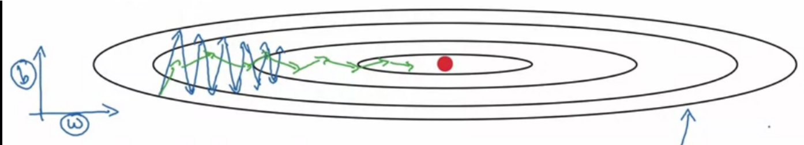

# gradient descent


<!-- @import "[TOC]" {cmd="toc" depthFrom=1 depthTo=6 orderedList=false} -->

<!-- code_chunk_output -->

- [gradient descent](#gradient-descent)
    - [概述](#概述)
      - [1.基本概念](#1基本概念)
        - [(1) 算法](#1-算法)
        - [(2) learning rate](#2-learning-rate)
        - [(3) 选择合适的learning rate](#3-选择合适的learning-rate)
        - [(4) learning curve (关于代价函数的变换曲线)](#4-learning-curve-关于代价函数的变换曲线)
        - [(5) 判断梯度下降是否收敛](#5-判断梯度下降是否收敛)
      - [2.feature scaling (normalize features)](#2feature-scaling-normalize-features)
        - [(1) why](#1-why)
        - [(2) 目标](#2-目标)
        - [(3) 常用方法](#3-常用方法)
        - [(4) 注意](#4-注意)
      - [3.gradient descent分类](#3gradient-descent分类)
        - [(1) batch (mini-batch size=m)](#1-batch-mini-batch-sizem)
        - [(2) stochastic (mini-batch size=1)](#2-stochastic-mini-batch-size1)
        - [(3) mini-batch](#3-mini-batch)
      - [4.mini-batch](#4mini-batch)
        - [(1) mini-batch size](#1-mini-batch-size)
        - [(2) 代码](#2-代码)
    - [optimization](#optimization)
      - [1.gradient descent momentum](#1gradient-descent-momentum)
        - [(1) exponentially weighted averages](#1-exponentially-weighted-averages)
        - [(2) 算法](#2-算法)
      - [2.RMSprop (root mean sqaure prop)](#2rmsprop-root-mean-sqaure-prop)
        - [(1) 算法](#1-算法-1)
      - [3.Adam (adaptive moment estimation) (momentum + RMSprop)](#3adam-adaptive-moment-estimation-momentum--rmsprop)
        - [(1) 算法](#1-算法-2)
      - [4.learning rate decay](#4learning-rate-decay)

<!-- /code_chunk_output -->


### 概述

#### 1.基本概念

##### (1) 算法
以该代价函数为例: $J(w,b) = \frac{1}{2m}\sum_{i=1}^m (f_{w,b}(x^{(i)})-y^{(i)})^2$

* w,b随便取一个值（比如w=0,b=0）

* 每次迭代
    * $temp\_w = w - \alpha\frac{\partial}{\partial w}J(w,b)$
        * $\alpha$ 
            * learning rate（在0到1之间）
        * $\frac{\partial}{\partial w}J(w,b)$
            * $\frac{\partial}{\partial w}J(w,b) = \frac{1}{m}\sum_{i=1}^m \frac{\partial}{\partial w}L(\hat y^{(i)}, y^{(i)})$
            * 表示方向，当接近局部最小值时，绝对值就会越来越小（步长就会越来越小）
            * 当为正数，表示值需要减小
            * 当为负数，表示值需要增加
        * 当w是一个向量时（即有多个w时）
            * $temp\_w_j = w_j - \alpha\frac{\partial}{\partial w_j}J(\vec w,b)$
    * $temp\_b = b - \alpha\frac{\partial}{\partial b}J(w,b)$
    * w = temp_w
    * b = temp_b

* 经过多次迭代
    * 代价函数会趋近于局部最小

##### (2) learning rate
* 范围: 0-1
* 当过小时，步长就会更短，则更慢才能找到最小代价函数
* 当过大时，代价函数可能不会收敛（convergence）

##### (3) 选择合适的learning rate
尝试多个范围的学习率（比如: ... 0.001, 0.003, 0.01, 0.03, 0.1, 0.3, 1...），进行一定量的迭代
* 观察一次迭代后，代价函数是否减小
* 如果代价函数减小，尝试增加学习率
* 如果代价函数增加，尝试减小学习率

##### (4) learning curve (关于代价函数的变换曲线)
* 比如：代价函数和迭代次数的关系，横坐标为迭代次数，纵坐标为代价函数

##### (5) 判断梯度下降是否收敛
* learning curve
    * 观察学习曲线是否收敛
* automatic convergence test
    * 如果J每一次迭代减少的数值 <= $\epsilon$，则认为梯度下降已经收敛
        * $\epsilon$的值比较难确定

#### 2.feature scaling (normalize features) 

##### (1) why
* 当特征1的范围为0-1
* 当特征2的范围为100-500
* 会导致 梯度下降较慢

##### (2) 目标
使特征的范围差不多在-1到1之间，超过这个范围也是可以的，重点是各个特征的范围相当，这样才能使用梯度下降算法更快

##### (3) 常用方法

* 除以取值范围
* mean normalization
    * $x' = \frac{x - \mu}{max(x) - min(x)}$
* Z-score normalization
    * $Z = \frac{x - \mu}{\sigma}$
        * Z: standard score
        * x: observed value
        * $\mu$: mean of the sample
        * $\sigma$: standard deviation of the sample

##### (4) 注意
训练出模型后，进行数据预测，也需要对输入的数据进行缩放

#### 3.gradient descent分类

* stochastic方式**converge速度最快**（而不是执行速度），不能利用并发
    * 即经过相同的epoch，梯度下降最快
    * 因为在每个epoch中，每处理一个训练数据，就会更新一次参数，而batch方式，是读取整个数据，只更新一次参数
* batch方式converge速度最慢，而且可以利用**并发**


##### (1) batch (mini-batch size=m)
在每次迭代时使用训练集中的所有样本进行参数更新

##### (2) stochastic (mini-batch size=1)
```python
X = data_input
Y = labels
m = X.shape[1]  # Number of training examples
parameters = initialize_parameters(layers_dims)
for i in range(0, num_iterations):
    cost_total = 0

    #SGD不一定使用全部的训练数据，所以SGD会比较快
    for j in range(0, m):
        # Forward propagation
        a, caches = forward_propagation(X[:,j], parameters)
        # Compute cost
        cost_total += compute_cost(a, Y[:,j])  # Cost for one training example
        # Backward propagation
        grads = backward_propagation(a, caches, parameters)
        # Update parameters
        parameters = update_parameters(parameters, grads)
    # Compute average cost
    cost_avg = cost_total / m
```

##### (3) mini-batch
[参考](#4mini-batch)

#### 4.mini-batch

将训练集划分为多个mini-batch，每次梯度下降使用其中一个mini-batch
第$l$个batch表示为: $x^{\{l\}}, y^{\{l\}}$
##### (1) mini-batch size

* mini-batch size = m: batch gradient descent
* mini-batch size = 1: stochastic gradient descent 
* if 数据集比较小 (m <= 2000)
    * 使用batch gradient descent, 即mini-batch size = m
* else
    * typical mini-batch size: 64, 128, 256, 512
* 注意：一个mini-batch的训练数据 要fit it CPU/GPU memory，否则性能会很差

##### (2) 代码

* 划分mini-batch
    * 先shuffle
    * 再partition
```python
# GRADED FUNCTION: random_mini_batches

def random_mini_batches(X, Y, mini_batch_size = 64, seed = 0):
    """
    Creates a list of random minibatches from (X, Y)
    
    Arguments:
    X -- input data, of shape (input size, number of examples)
    Y -- true "label" vector (1 for blue dot / 0 for red dot), of shape (1, number of examples)
    mini_batch_size -- size of the mini-batches, integer
    
    Returns:
    mini_batches -- list of synchronous (mini_batch_X, mini_batch_Y)
    """
    
    np.random.seed(seed)            # To make your "random" minibatches the same as ours
    m = X.shape[1]                  # number of training examples
    mini_batches = []
        
    # Step 1: Shuffle (X, Y)
    permutation = list(np.random.permutation(m))
    shuffled_X = X[:, permutation]
    shuffled_Y = Y[:, permutation].reshape((1, m))
    
    inc = mini_batch_size

    # Step 2 - Partition (shuffled_X, shuffled_Y).
    # Cases with a complete mini batch size only i.e each of 64 examples.
    num_complete_minibatches = math.floor(m / mini_batch_size) # number of mini batches of size mini_batch_size in your partitionning
    for k in range(0, num_complete_minibatches):
        mini_batch_X = shuffled_X[:, k*mini_batch_size:(k+1)*mini_batch_size]
        mini_batch_Y = shuffled_Y[:, k*mini_batch_size:(k+1)*mini_batch_size]

        mini_batch = (mini_batch_X, mini_batch_Y)
        mini_batches.append(mini_batch)
    
    # For handling the end case (last mini-batch < mini_batch_size i.e less than 64)
    if m % mini_batch_size != 0:
        mini_batch_X = shuffled_X[:, num_complete_minibatches*mini_batch_size:]
        mini_batch_Y = shuffled_Y[:, num_complete_minibatches*mini_batch_size:]
        mini_batch = (mini_batch_X, mini_batch_Y)
        mini_batches.append(mini_batch)
    
    return mini_batches
```

* 使用mini-batch
```python
X = data_input
Y = labels
m = X.shape[1]  # Number of training examples
parameters = initialize_parameters(layers_dims)
for i in range(num_epochs):
    
    # Define the random minibatches. We increment the seed to reshuffle differently the dataset after each epoch
    seed = seed + 1
    minibatches = random_mini_batches(X, Y, mini_batch_size, seed)
    cost_total = 0
    
    for minibatch in minibatches:

        # Select a minibatch
        (minibatch_X, minibatch_Y) = minibatch

        # Forward propagation
        a3, caches = forward_propagation(minibatch_X, parameters)

        # Compute cost and add to the cost total
        cost_total += compute_cost(a3, minibatch_Y)

        # Backward propagation
        grads = backward_propagation(minibatch_X, minibatch_Y, caches)

        # Update parameters
        parameters = update_parameters(parameters, grads)
```

***

### optimization

#### 1.gradient descent momentum

加快mini-batch梯度下降，原理：通过求平均值，避免梯度下降在相反方向上的波动，从而加快梯度下降

* 这是一个代价函数和两个参数的关系函数（比如x轴是w，y轴是b）
    * b参数的变化会影响代价函数的波动，所以平均值可以抵消这种波动
    * w参数的变化没有波动，所以平均值不会影响
    * 从而加速梯度下降

##### (1) exponentially weighted averages

* $v_t = \beta v_{t-1} + (1-\beta)\theta_t$
    * 当$\epsilon$较小时，$(1-\epsilon)^{\frac{1}{\epsilon}} \approx \frac{1}{e}$
    * 比如当$\epsilon=0.1$时, $(1-0.1)^{1/0.1} \approx\frac{1}{e}$
        * 所以对于$(1-\epsilon)^n$，当$n > 1/0.1=10$时，$(1-\epsilon)^n$就会衰减的很快
        * 所以求的是前10个数据的加权平均
        * 所以$\beta$越大，$\frac{1}{1-\beta}$就越大，即计算平均数的数据就越多，所以$v_t$的值越平滑
    * bias correction
        * 问题: 对于第一个样本$v_1$，由于$v_0=0$，所以会导致$v_1偏小$，从而导致开始的值有些偏小
        * 解决：$v_t = \frac{\beta v_{t-1} + (1-\beta)\theta_t}{1-\beta^t}$，当t越大，$\beta^t$趋近于0

##### (2) 算法

* $v_{dW} = \beta v_{dW} + (1-\beta)dW$
* $v_{db} = \beta v_{db} + (1-\beta)db$
* $W=W-\alpha v_{dW}, b=b-\alpha v_{db}$

#### 2.RMSprop (root mean sqaure prop)

根据斜率的大小，调整梯度下降的快慢
* 当斜率较大时，较小的调整梯度，避免过大的调整造成波动
* 当斜率较小时，较大的调整梯度，加快梯度下降

##### (1) 算法

* $s_{dW} = \beta s_{dW} + (1-\beta)(dW)^2$
* $s_{db} = \beta s_{db} + (1-\beta)(db)^2$
* $W=W-\alpha \frac{dW}{\sqrt {s_{dw}}+\epsilon}, b=b-\alpha \frac{db}{\sqrt {s_{db}}+\epsilon}$
    * $\epsilon = 10^{-8}$，加上这个是为了防止分母为0

* 理解
    * 以上图为例
    * dW比较小，$s_{dW}$比较小，所以$\frac{dW}{\sqrt {s_{dw}}}$就比较大，则可以较大的下降斜率
    * db比较大，则可以较小的下降斜率，避免波动过大

#### 3.Adam (adaptive moment estimation) (momentum + RMSprop)

##### (1) 算法
* $v_{dW} = \beta_1 v_{dW} + (1-\beta_1)dW$
* $v_{db} = \beta_1 v_{db} + (1-\beta_1)db$
* $s_{dW} = \beta_2 s_{dW} + (1-\beta_2)(dW)^2$
* $s_{db} = \beta_2 s_{db} + (1-\beta_2)(db)^2$
* $v_{dW}^{corrected} = \frac{v_{dW}}{1-\beta_1^t}$
* $v_{db}^{corrected} = \frac{v_{db}}{1-\beta_1^t}$
* $s_{dW}^{corrected} = \frac{s_{dW}}{1-\beta_2^t}$
* $s_{db}^{corrected} = \frac{s_{db}}{1-\beta_2^t}$
* $W=W-\alpha \frac{v_{dW}^{corrected}}{\sqrt {s_{dw}^{corrected}}+\epsilon}, b=b-\alpha \frac{v_{db}^{corrected}}{\sqrt {s_{db}^{corrected}}+\epsilon}$

* 建议的参数
    * $\beta_1$: 0.9
    * $\beta_2$: 0.999
    * $\epsilon$: $10^-8$

#### 4.learning rate decay

* 每次epoch，逐渐减小$\alpha$的值，有一定的帮助

    * $\alpha = \frac{1}{1+\text {decayRate}\times\text {epochNumber}}\alpha_0$

* 问题：经过多次epoch后，学习率会减小为0
* 解决：fixed interval scheduling，即几次epoch后，才进行一次learning rate decay