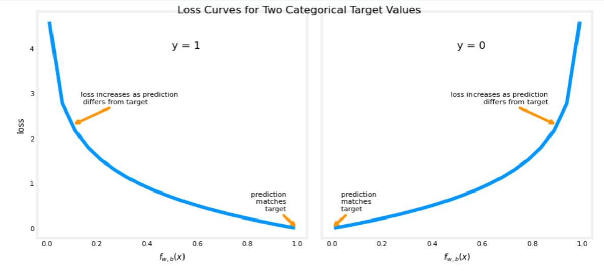

# loss function

<!-- @import "[TOC]" {cmd="toc" depthFrom=1 depthTo=6 orderedList=false} -->

<!-- code_chunk_output -->

- [loss function](#loss-function)
      - [1.Regression](#1regression)
        - [(1) Mean Square Error (Quadratic Loss) (L2 Loss)](#1-mean-square-error-quadratic-loss-l2-loss)
      - [2.Classification](#2classification)
        - [(1) Binary Cross-Entropy Loss (Log Loss)](#1-binary-cross-entropy-loss-log-loss)
        - [(2) Categorical Cross-Entropy Loss](#2-categorical-cross-entropy-loss)
        - [(3) sparse Categorical Cross-Entropy Loss](#3-sparse-categorical-cross-entropy-loss)

<!-- /code_chunk_output -->

#### 1.Regression

##### (1) Mean Square Error (Quadratic Loss) (L2 Loss)
* $L = (\hat y^{(i)}-y^{(i)})^2$

#### 2.Classification

##### (1) Binary Cross-Entropy Loss (Log Loss)
* 只有一种类别 
* $L=-y^{(i)}\log (\hat y^{(i)}) - (1-y^{(i)})\log (1 - \hat y^{(i)})$
    * 通过maximum likelihood方法，找到合适的loss function
    
    * 当$y^{(i)} = 1$时，预测的值越接近1，loss的值就越小，反之越大
    * 当$y^{(i)} = 0$时，预测的值越接近0，loss的值就越小，反之越大

##### (2) Categorical Cross-Entropy Loss
* 有多种类别，会输出多个值，比如: [0.1, 0.8, 0.1]，对应的数据可能就是[0,1,0]
* $L=y^{(i)}\log (\hat y^{(i)}) $

##### (3) sparse Categorical Cross-Entropy Loss
* 一个object可能会属于多个class
* $L=\sum\limits_c y^{(i)}_c\log (\hat y^{(i)}_c) $
  * c是第c个class