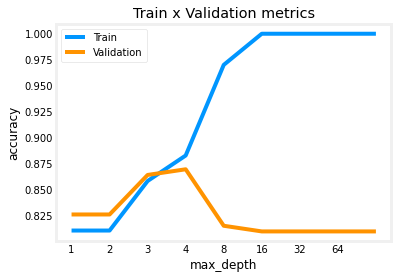
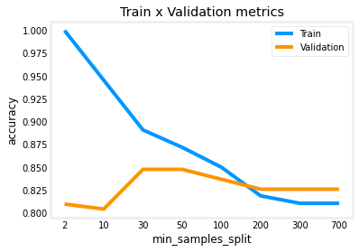

# decision tree

<!-- @import "[TOC]" {cmd="toc" depthFrom=1 depthTo=6 orderedList=false} -->

<!-- code_chunk_output -->

- [decision tree](#decision-tree)
    - [概述](#概述)
      - [1.术语](#1术语)
        - [(1) purity](#1-purity)
      - [2.如何选择feature](#2如何选择feature)
        - [(1) information gain](#1-information-gain)
        - [(2) categorical feature (即一个feature能够分为多种类别)](#2-categorical-feature-即一个feature能够分为多种类别)
        - [(3) continuous valued features](#3-continuous-valued-features)
      - [3.descision tree算法](#3descision-tree算法)
      - [4.tree ensemble](#4tree-ensemble)
        - [(1) 说明](#1-说明)
        - [(2) sampling with replacement (有放回的采样)](#2-sampling-with-replacement-有放回的采样)
        - [(3) random forest algorithm](#3-random-forest-algorithm)
        - [(4) XGBoost algorithm (extreme gradient boosting, 推荐)](#4-xgboost-algorithm-extreme-gradient-boosting-推荐)
      - [5.decision tree vs neuron network](#5decision-tree-vs-neuron-network)

<!-- /code_chunk_output -->

### 概述

#### 1.术语

##### (1) purity
* 用entropy描述purity的程度，记为H
* $H(p) = -plog_2(p) - (1-p)log_2(1-p)$
    * 当$p=0$ 和 $p=1$ 时，$H(p) = 0$，最小
    * 当$p=0.5$时，$H(p) = 1$，最大
  
#### 2.如何选择feature

##### (1) information gain
* 用于描述entropy的减少（即获取信息的多少）
  * 根据这个值，选择合适的feature
  * 当值很小时，就可以停止决策树了
* information gain = $H(p_1^{parent}) - (w^{left}H(p_1^{left}) + w^{right}H(p_1^{right}))$
  * $p_1^{parent}$
    * 父节点中，positive的数据比例
  * $w^{left}$
    * 被划分到左子节点的数据 占 总数据的比例
  * $w^{right}$
    * 被划分到右子节点的数据 占 总数据的比例
  * $p_1^{left}$
    * 左子节点中，positive的数据比例
  * $p_1^{right}$
    * 由子节点中，positive的数据比例

##### (2) categorical feature (即一个feature能够分为多种类别)

* one-hot
  * 比如: ear shape可以分为 pointy、floppy、oval 3种类别
  * 则可以添加三个binary featury: pointy ears、floppy ears、oval ears

##### (3) continuous valued features
* 比如: 以体重weight
* 则可以设置一个阈值，从而添加一个binary feature: weight < threshold
  * 如何确定threshold：
    * 将所有weights进行排序，然后选择每两个weights的中间值作为threshold（比如有10个样本，则需要尝试9次），依次计算information gain，选择information gain最大的threshold

#### 3.descision tree算法

* 在root node处，计算所有feature的information gain，选择值最高的feature
* 根据这个feature进行split
* 检查该节点split出的所有的branch，重复以上所有步骤，直到满足以下一项：
  * 节点的分类100%正确
  * 该节点的depth = 设置的maxium depth
    * 当maxium depth过大，容易出现overfitting问题
    
  * 继续split的information gain < threshold
  * 该节点的样本数 < threshold
    * 当该threshold过小，容易出现overfitting问题
    

#### 4.tree ensemble

##### (1) 说明
* 对于一个决策树，训练数据发生微小的变换，可能导致整个决策树变得完全不一样
* 为了避免这种问题，需要创建**多个决策树**，然后每个决策树进行预测，最后投票决定最终的预测结果
  * 如何创建多个决策树，有不同的算法，比如 随机森林算法等

##### (2) sampling with replacement (有放回的采样)
* 比如有10个训练数据，则有放回的采样10次，获得新的10个训练数据（可能其中有重复）

##### (3) random forest algorithm
* given traning set of size m
* For b=1 to B:
  * use sampling with replacement to create a new training set of size m
  * train a decision tree on the new dataset
    * at each node, when choosing a feature to use to split, if n features are available,
    * pick random **subset** of k < n features
      * 当n很大时，k建议取 $\sqrt{n}$
    * allow the algorithm to only choose from from this subset of features

* B建议100左右，不建议过大，过大对性能没有什么提升，返回增加了计算量

##### (4) XGBoost algorithm (extreme gradient boosting, 推荐) 

* given traning set of size m
* For b=1 to B:
  * for the first time, use origin training set
  * for the others, make it more likely pick **misclassied examples** from previous trained trees
    * 就是在前面的决策树中，预测失败的数据，有更大的可能被挑出来训练新的决策树
  * train a decision tree on the new dataset

#### 5.decision tree vs neuron network

* decision tree
  * 更适合tabular(structured) data
  * 不适合非结构化数据（比如：images, videos, texts等）

* neuron network
  * 适合所有类型数据
  * 支持transfer learning