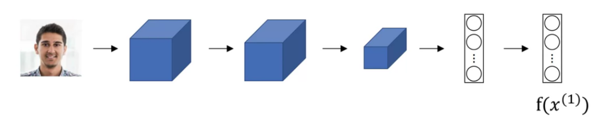
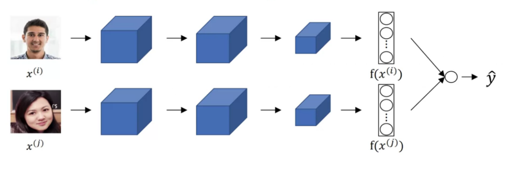

# face recognition

<!-- @import "[TOC]" {cmd="toc" depthFrom=1 depthTo=6 orderedList=false} -->

<!-- code_chunk_output -->

- [face recognition](#face-recognition)
    - [概述](#概述)
      - [1.face verification vs face recognition](#1face-verification-vs-face-recognition)
      - [2.liveness detection](#2liveness-detection)
      - [3.one-shot learning](#3one-shot-learning)
      - [4.Siamese Network](#4siamese-network)
        - [(1) 模型](#1-模型)
        - [(2) loss function: triplet loss](#2-loss-function-triplet-loss)
        - [(3) binary classification (另一种loss function)](#3-binary-classification-另一种loss-function)

<!-- /code_chunk_output -->

### 概述

#### 1.face verification vs face recognition
* face verification
    * Confirms if a person is who they claim to be
    * 1:1 (known person)
* face recognition
    * Identifies an unknown person by comparing their face to a database of known faces
    * 1:N (unknown person)
     
#### 2.liveness detection
* Motion Analysis
* Depth Sensing
    * capture depth information of the face, creating a 3D image
* Temporal Analysis
    * The system analyzes slight inconsistencies in lighting, focus, or pose across multiple frames captured during the verification process
* Anti-Spoofing Techniques
    * The system might display random challenges (比如让你张嘴，摇头)

#### 3.one-shot learning

learning from **one example** to recognize the person again

* 解决: siamese network
    * 学习 d(img1,img2) = degree of difference between images
    * if d(img1,img2) $\leq \tau$, 则认为是同一个人

#### 4.Siamese Network

##### (1) 模型
* 对每张图片进行encode

* 学习参数，达到以下效果：
    * if $x^{(i)},x^{(j)}$ are the same  person, $\Vert f(x^{(i)})-f(x^{(j)})\Vert^2$ is small
    * if $x^{(i)},x^{(j)}$ are different  person, $\Vert f(x^{(i)})-f(x^{(j)})\Vert^2$ is large

##### (2) loss function: triplet loss

* 一个训练数据是一个三元组（由三张图片构成）
    * A: Achor image (锚点图片)
    * P: Positive image （跟A是同一个人）
    * N: Negative image （跟A不是同一个人）

* $L(A,P,N) = \max(\Vert f(A)-f(P)\Vert^2 - \Vert f(A)-f(N)\Vert^2 + \alpha, 0)$
    * 目标: $\Vert f(A)-f(P)\Vert^2 - \Vert f(A)-f(N)\Vert^2 + \alpha \leq 0$
        * d(A,P)要比d(A,N)小
        * $\alpha$ 表面 d(A,P)至少比d(A,N)小这么多（防止两者过于接近）

* 怎么从训练集中构建三元组
    * training set: 10k pictures of 1k persons
    * 应该选择很难区分的（即d(A,P)和d(A,N)比较接近），这样才能训练好模型，如果太容易区分的数据，训练出的模型效果不好

##### (3) binary classification (另一种loss function)
* 一个训练数据是两张图片，判断两张图片是否 是同一个人

* $\hat y = \text {sigmoid}(\sum\limits_k w_k\vert f(x^{(i)}))_k-f(x^{(j)})_k\vert+b)$
    * $\hat  y$等于1就是同一个人，等于0就是不同的人

* 推理时能够节省计算资源，可以提前计算出已存在图片的$f(x)$，有新的图片来时，直接进行比较