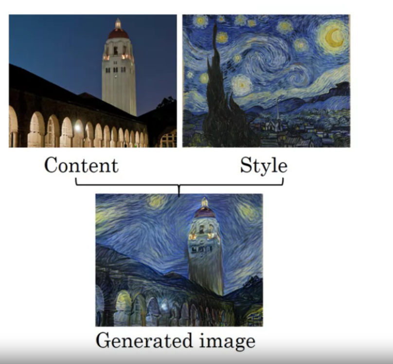

# neural style transfer

<!-- @import "[TOC]" {cmd="toc" depthFrom=1 depthTo=6 orderedList=false} -->

<!-- code_chunk_output -->

- [neural style transfer](#neural-style-transfer)
    - [概述](#概述)
      - [1.neural style transfer](#1neural-style-transfer)
      - [2.loss function](#2loss-function)
        - [(1) content loss function](#1-content-loss-function)
        - [(2) style loss function](#2-style-loss-function)

<!-- /code_chunk_output -->

### 概述

#### 1.neural style transfer

#### 2.loss function

* $L(G) = \alpha L_{content}(C, G) + \beta L_{style}(S,G)$
    * G: generated image
    * C: content image
    * S: style image

##### (1) content loss function

* 选择一个hidden layer l 计算content loss
    * l越小，学习的东西越细致
    * 所以，当选择l较少时，minimize content loss 能够使G和C很相近
* 选择一个训练好的ConvNet（比如VGG）
* $L_{content}(C, G)=\Vert a^{[l](C)} - a^{[l](G)} \Vert^2$
    * $a^{[l](C)}$ content图片在layer l的activation

##### (2) style loss function
* 定义style: correlation between activations across channels
* 存在$a^{[l]}_{i,j,k}$ (i是height, j是width, k是channel)，则$G^{[l]}$是一个$n^{[l]}_c\times n^{[l]}_c$矩阵，描述了l层，不同channel之间的相关性
    * $G^{[l](S)}_{kk'} = \sum\limits_{i=1}^{n_H}\sum\limits_{j=1}^{n_W}a^{[l](S)}_{i,j,k}a^{[l](S)}_{i,j,k'}$
    * $G^{[l](G)}_{kk'} = \sum\limits_{i=1}^{n_H}\sum\limits_{j=1}^{n_W}a^{[l](G)}_{i,j,k}a^{[l](G)}_{i,j,k'}$

* $L^{[l]}_{style}(S,G)=\frac{1}{(2n^{[l]}_Hn^{[l]}_Wn^{[l]}_C)^2}\Vert G_S-G_G\Vert_F^2 = \frac{1}{(2n^{[l]}_Hn^{[l]}_Wn^{[l]}_C)^2}\sum\limits_k\sum\limits_{k'}(G^{[l](S)}_{kk'}-G^{[l](G)}_{kk'})^2$
* $L_{style}(S,G)=\sum\limits_{l}\lambda^{[l]}L^{[l]}_{style}(S,G)$