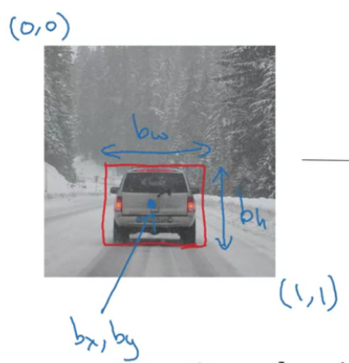

# object dection

<!-- @import "[TOC]" {cmd="toc" depthFrom=1 depthTo=6 orderedList=false} -->

<!-- code_chunk_output -->

- [object dection](#object-dection)
    - [概述](#概述)
      - [1.classification with localization](#1classification-with-localization)

<!-- /code_chunk_output -->

### 概述

#### 1.classification with localization

* 对图片进行分类，并且定位object的位置
    * $y=\begin{bmatrix} p_c\\ b_x\\ b_y\\ b_w\\ b_h \\c_1\\c_2\\c_3 \end{bmatrix}$
        * $p_c$ 表示有物体的概率
        * $(b_x,b_y)$ 表示物体的中心点位置
        * $b_w$和$b_h$ 表示物体的宽度和高度
        * $c_1,c_2,c_3$ 表示是哪一个类型的物体

* loss function
    * $p_c$使用 log loss (Binary Cross-Entropy Loss)
    * $b_x,b_y,b_w,b_h$使用 MSE
    * $c_1,c_2,c_3$ 使用 log loss (Categorical Cross-Entropy Loss)