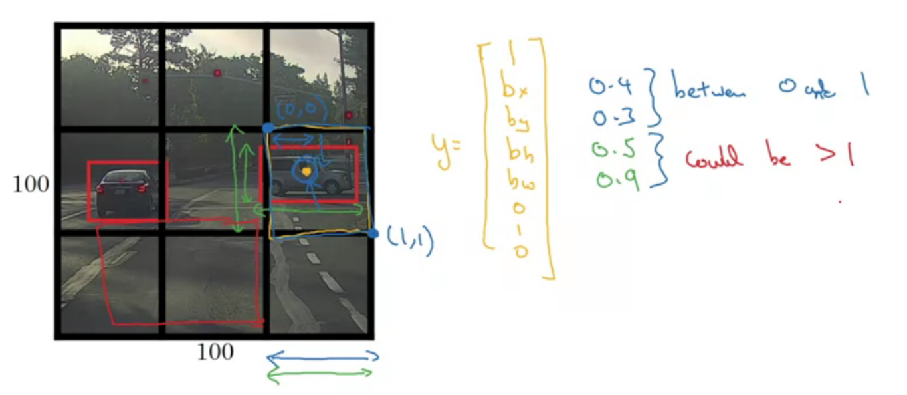
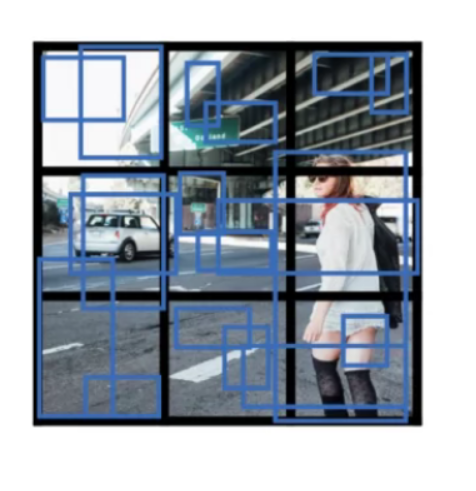
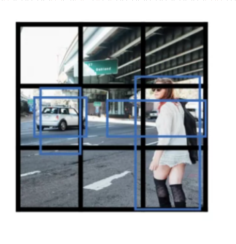
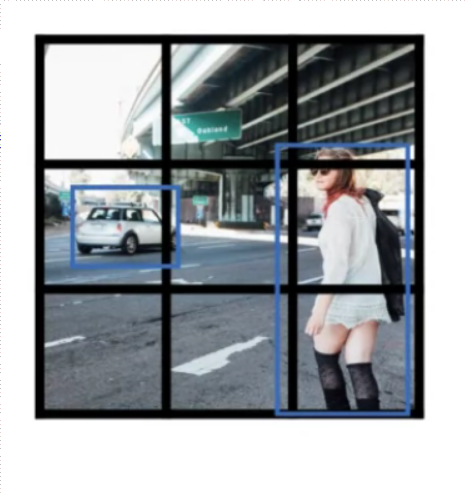

# YOLO


<!-- @import "[TOC]" {cmd="toc" depthFrom=1 depthTo=6 orderedList=false} -->

<!-- code_chunk_output -->

- [YOLO](#yolo)
    - [概述](#概述)
      - [1.bounding box predications](#1bounding-box-predications)
      - [2.inersection over union](#2inersection-over-union)
      - [3.non-max suppression](#3non-max-suppression)
      - [4.anchor boxes](#4anchor-boxes)
      - [5.YOLO](#5yolo)
        - [(1) training](#1-training)
        - [(2) prediction](#2-prediction)
    - [implementation](#implementation)
      - [1.boxes filer](#1boxes-filer)
      - [2.non-max suppression](#2non-max-suppression)
      - [3.实现yolo_eval](#3实现yolo_eval)
      - [4.加载训练好的模型进行predict](#4加载训练好的模型进行predict)

<!-- /code_chunk_output -->


### 概述

#### 1.bounding box predications

* 将图片划分为均等网格（19*19）
* 对每个网格进行打标
    * $y=\begin{bmatrix} p_c\\ b_x\\ b_y\\ b_w\\ b_h \\c_1\\c_2\\c_3 \end{bmatrix}$
    * 一个object的中心点 ($b_x,b_y$) 只能属于一个网格
    * $b_w,b_h$能够超过网格
    

#### 2.inersection over union
用于评估object dection算法的性能

* $\text{IoU} = \frac{\text{area of intersection}}{\text{area of union}}$


* 一般，当IoU >= 0.5时，则认为正确

#### 3.non-max suppression

* 存在问题：一个object可能被检测到多次，比如：两个网格都认为该object的midpoint在自己的网格中，所以需要确定一个网格

* 当多个网格检测到object的midpoint，选择概率（即$p_c$）最大的那个网格

* 算法（对于某一类object使用一次）
    * discard all boxs with $p_c \le 0.6$
    * 进行non-max suppression:
        * while there are any remaining boxes:
            * pick the box with largest $p_c$ output that as a prediction
            * discard any remaining box with IoU(with the picked box) >= 0.5

#### 4.anchor boxes
* 存在问题：一个网格只能检测一个object，实际情况是一个网格中可能存在多个object

* anchor box 是 **预先定义好的** 不同形状（是固定的，不是训练出来的）

* 一个object会分配到 一个grid cell 和 一个anchor box
    * 被分配到midpoint所在的网格
    * 被分配到IoU最大的anchor box

* 以2个anchor boxes为例


    * 训练集需要对每个grid cell进行打标
        * $y=\begin{bmatrix} p_c\\ b_x\\ b_y\\ b_w\\ b_h \\c_1\\c_2\\c_3\\ p_c\\ b_x\\ b_y\\ b_w\\ b_h \\c_1\\c_2\\c_3 \end{bmatrix}$
        * y的前一半是 属于anchor box1的object的bounding box（注意区分anchor box和bounding box）
        * y的后一半是 属于anchor box2的object的bounding box
    
    * 局限性：不适合处理 一个grid cell可能有3个object、两个object的相状相似等情况

#### 5.YOLO

##### (1) training

* 将图片划分为$19\times 19$个grid cell
* 有2个anchor box
* 则每个图片的标签 $19\times 19\times 2\times 8$

##### (2) prediction

* 输出grid cell结果
    * 以$3\times 3$ grid cells 且 2个anchor boxes为例
    

* 进行boxes filter
    * get rid of low probability predictions
    
* 进行non-max supressed
    * for each class use non-max suppression
    


***

### implementation

#### 1.boxes filer
```python
def yolo_filter_boxes(boxes, box_confidence, box_class_probs, threshold = .6):
    """Filters YOLO boxes by thresholding on object and class confidence.
    
    Arguments:
        boxes -- tensor of shape (19, 19, 5, 4)
        box_confidence -- tensor of shape (19, 19, 5, 1)
        box_class_probs -- tensor of shape (19, 19, 5, 80)
        threshold -- real value, if [ highest class probability score < threshold],
                     then get rid of the corresponding box

    Returns:
        scores -- tensor of shape (None,), containing the class probability score for selected boxes
        boxes -- tensor of shape (None, 4), containing (b_x, b_y, b_h, b_w) coordinates of selected boxes
        classes -- tensor of shape (None,), containing the index of the class detected by the selected boxes

    Note: "None" is here because you don't know the exact number of selected boxes, as it depends on the threshold. 
    For example, the actual output size of scores would be (10,) if there are 10 boxes.
    """
    
    ### START CODE HERE
    # Step 1: Compute box scores
    ##(≈ 1 line)
    box_scores = box_confidence * box_class_probs

    # Step 2: Find the box_classes using the max box_scores, keep track of the corresponding score
    ##(≈ 2 lines)
    # IMPORTANT: set axis to -1
    box_classes = tf.math.argmax(box_scores, axis=-1)
    box_class_scores = tf.math.reduce_max(box_scores, axis=-1)
    
    # Step 3: Create a filtering mask based on "box_class_scores" by using "threshold". The mask should have the
    # same dimension as box_class_scores, and be True for the boxes you want to keep (with probability >= threshold)
    ## (≈ 1 line)
    filtering_mask = box_class_scores >= threshold
    
    # Step 4: Apply the mask to box_class_scores, boxes and box_classes
    ## (≈ 3 lines)
    scores = tf.boolean_mask(box_class_scores,filtering_mask)
    boxes = tf.boolean_mask(boxes,filtering_mask)
    classes = tf.boolean_mask(box_classes, filtering_mask)
    ### END CODE HERE
    
    return scores, boxes, classes
```

#### 2.non-max suppression
```python
def yolo_non_max_suppression(scores, boxes, classes, max_boxes = 10, iou_threshold = 0.5):
    """
    Applies Non-max suppression (NMS) to set of boxes
    
    Arguments:
    scores -- tensor of shape (None,), output of yolo_filter_boxes()
    boxes -- tensor of shape (None, 4), output of yolo_filter_boxes() that have been scaled to the image size (see later)
    classes -- tensor of shape (None,), output of yolo_filter_boxes()
    max_boxes -- integer, maximum number of predicted boxes you'd like
    iou_threshold -- real value, "intersection over union" threshold used for NMS filtering
    
    Returns:
    scores -- tensor of shape (None, ), predicted score for each box
    boxes -- tensor of shape (None, 4), predicted box coordinates
    classes -- tensor of shape (None, ), predicted class for each box
    
    Note: The "None" dimension of the output tensors has obviously to be less than max_boxes. Note also that this
    function will transpose the shapes of scores, boxes, classes. This is made for convenience.
    """
    
    max_boxes_tensor = tf.Variable(max_boxes, dtype='int32')     # tensor to be used in tf.image.non_max_suppression()

    ### START CODE HERE
    # Use tf.image.non_max_suppression() to get the list of indices corresponding to boxes you keep
    ##(≈ 1 line)
    nms_indices = tf.image.non_max_suppression(boxes, scores, max_boxes, iou_threshold)
    
    # Use tf.gather() to select only nms_indices from scores, boxes and classes
    ##(≈ 3 lines)
    scores = tf.gather(scores, nms_indices)
    boxes = tf.gather(boxes, nms_indices)
    classes = tf.gather(classes, nms_indices)
    ### END CODE HERE

    
    return scores, boxes, classes
```

#### 3.实现yolo_eval
```python
def yolo_eval(yolo_outputs, image_shape = (720, 1280), max_boxes=10, score_threshold=.6, iou_threshold=.5):
    """
    Converts the output of YOLO encoding (a lot of boxes) to your predicted boxes along with their scores, box coordinates and classes.
    
    Arguments:
    yolo_outputs -- output of the encoding model (for image_shape of (608, 608, 3)), contains 4 tensors:
                    box_xy: tensor of shape (None, 19, 19, 5, 2)
                    box_wh: tensor of shape (None, 19, 19, 5, 2)
                    box_confidence: tensor of shape (None, 19, 19, 5, 1)
                    box_class_probs: tensor of shape (None, 19, 19, 5, 80)
    image_shape -- tensor of shape (2,) containing the input shape, in this notebook we use (608., 608.) (has to be float32 dtype)
    max_boxes -- integer, maximum number of predicted boxes you'd like
    score_threshold -- real value, if [ highest class probability score < threshold], then get rid of the corresponding box
    iou_threshold -- real value, "intersection over union" threshold used for NMS filtering
    
    Returns:
    scores -- tensor of shape (None, ), predicted score for each box
    boxes -- tensor of shape (None, 4), predicted box coordinates
    classes -- tensor of shape (None,), predicted class for each box
    """
    
    ### START CODE HERE
    # Retrieve outputs of the YOLO model (≈1 line)
    box_xy, box_wh, box_confidence, box_class_probs = yolo_outputs
    
    # Convert boxes to be ready for filtering functions (convert boxes box_xy and box_wh to corner coordinates)
    boxes = yolo_boxes_to_corners(box_xy, box_wh)
    
    # Use one of the functions you've implemented to perform Score-filtering with a threshold of score_threshold (≈1 line)
    scores, boxes, classes = yolo_filter_boxes(boxes, box_confidence, box_class_probs, score_threshold)
    
    # Scale boxes back to original image shape.
    boxes = scale_boxes(boxes, image_shape)
    
    # Use one of the functions you've implemented to perform Non-max suppression with 
    # maximum number of boxes set to max_boxes and a threshold of iou_threshold (≈1 line)
    scores, boxes, classes = yolo_non_max_suppression(scores,boxes,classes,max_boxes,iou_threshold)
    ### END CODE HERE
    
    return scores, boxes, classes
```

#### 4.加载训练好的模型进行predict
```python
class_names = read_classes("model_data/coco_classes.txt")
anchors = read_anchors("model_data/yolo_anchors.txt")
model_image_size = (608, 608) # Same as yolo_model input layer size
```

```python
yolo_model = load_model("model_data/", compile=False)
```

```python
def predict(image_file):
    """
    Runs the graph to predict boxes for "image_file". Prints and plots the predictions.
    
    Arguments:
    image_file -- name of an image stored in the "images" folder.
    
    Returns:
    out_scores -- tensor of shape (None, ), scores of the predicted boxes
    out_boxes -- tensor of shape (None, 4), coordinates of the predicted boxes
    out_classes -- tensor of shape (None, ), class index of the predicted boxes
    
    Note: "None" actually represents the number of predicted boxes, it varies between 0 and max_boxes. 
    """

    # Preprocess your image
    image, image_data = preprocess_image("images/" + image_file, model_image_size = (608, 608))
    
    yolo_model_outputs = yolo_model(image_data)
    yolo_outputs = yolo_head(yolo_model_outputs, anchors, len(class_names))
    
    out_scores, out_boxes, out_classes = yolo_eval(yolo_outputs, [image.size[1],  image.size[0]], 10, 0.3, 0.5)

    # Print predictions info
    print('Found {} boxes for {}'.format(len(out_boxes), "images/" + image_file))
    # Generate colors for drawing bounding boxes.
    colors = get_colors_for_classes(len(class_names))
    # Draw bounding boxes on the image file
    #draw_boxes2(image, out_scores, out_boxes, out_classes, class_names, colors, image_shape)
    draw_boxes(image, out_boxes, out_classes, class_names, out_scores)
    # Save the predicted bounding box on the image
    image.save(os.path.join("out", image_file), quality=100)
    # Display the results in the notebook
    output_image = Image.open(os.path.join("out", image_file))
    imshow(output_image)

    return out_scores, out_boxes, out_classes
```

```python
out_scores, out_boxes, out_classes = predict("test.jpg")
```