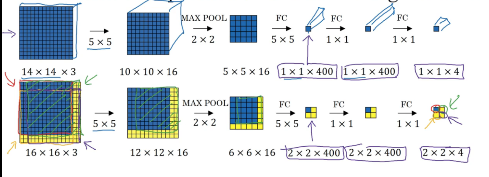
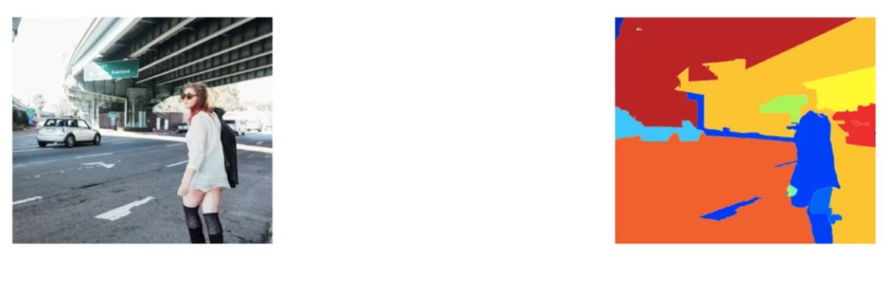
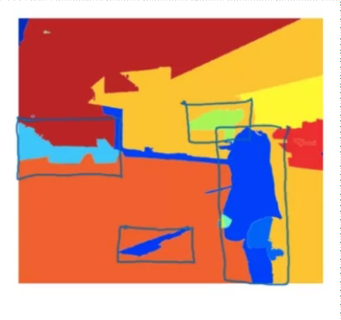

# object dection

<!-- @import "[TOC]" {cmd="toc" depthFrom=1 depthTo=6 orderedList=false} -->

<!-- code_chunk_output -->

- [object dection](#object-dection)
    - [概述](#概述)
      - [1.object localization](#1object-localization)
      - [2.landmark dection](#2landmark-dection)
      - [3.sliding windows](#3sliding-windows)
        - [(1) FC layer -> convolutional layer](#1-fc-layer---convolutional-layer)
        - [(2) 原理](#2-原理)
      - [4.region proposals: R-CNN](#4region-proposals-r-cnn)

<!-- /code_chunk_output -->

### 概述

#### 1.object localization
* 目的：找到object的bounding box
* 应用场景：自动驾驶等
* 对图片进行分类，并且定位object的位置
    * $y=\begin{bmatrix} p_c\\ b_x\\ b_y\\ b_w\\ b_h \\c_1\\c_2\\c_3 \end{bmatrix}$
        * $p_c$ 表示有物体的概率
        * $(b_x,b_y)$ 表示物体的中心点位置
        * $b_w$和$b_h$ 表示物体的宽度和高度
        * $c_1,c_2,c_3$ 表示是哪一个类型的物体

* loss function
    * $p_c$使用 log loss (Binary Cross-Entropy Loss)
    * $b_x,b_y,b_w,b_h$使用 MSE
    * $c_1,c_2,c_3$ 使用 log loss (Categorical Cross-Entropy Loss)

#### 2.landmark dection
* 目的：找到一个特定的点或区域
* 应用场景：人脸识别等
* landmark: 图片中的一个点的坐标
* 可以标注多个landmark（比如脸型轮廓），然后用neural network训练学习

#### 3.sliding windows

##### (1) FC layer -> convolutional layer

##### (2) 原理
* 指定大小的窗口，以指定步长在图片上移动，对窗口内的进行检测
* 有大量的重复计算，所以可以使用卷积，从而只需要对图片进行一次检测，不要对每个窗口进行检测

#### 4.region proposals: R-CNN

* 首先通过segmentation算法，将图片转变成一个个blobs

* 对指定区域进行检测（就不要像sliding windows一样逐个区域进行检测了）
