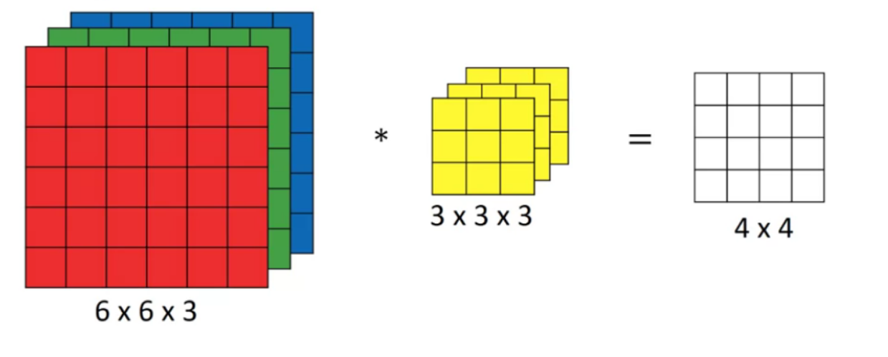
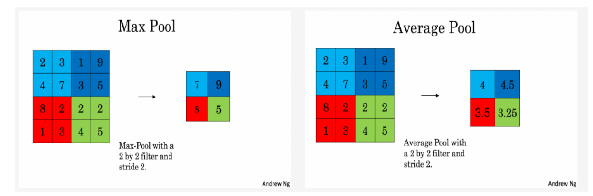
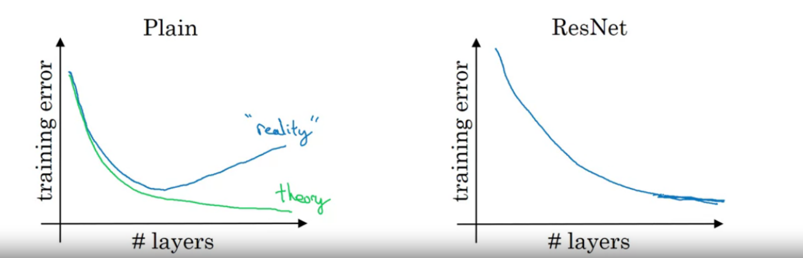
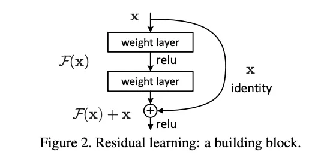
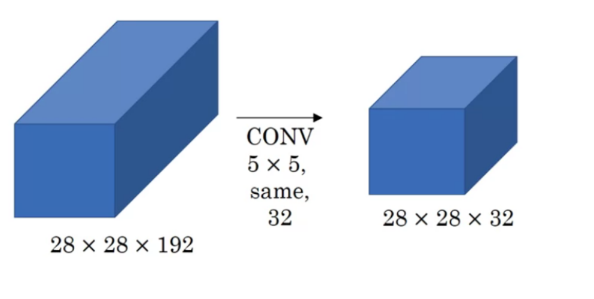
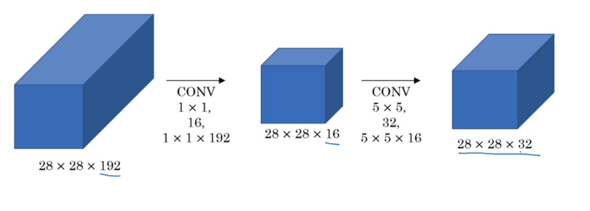
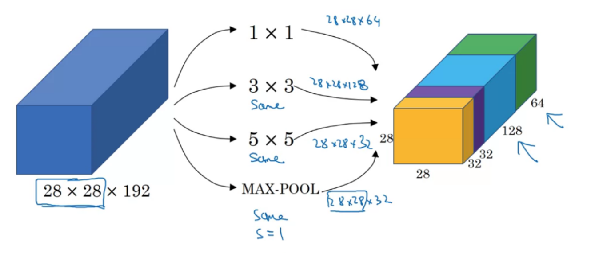
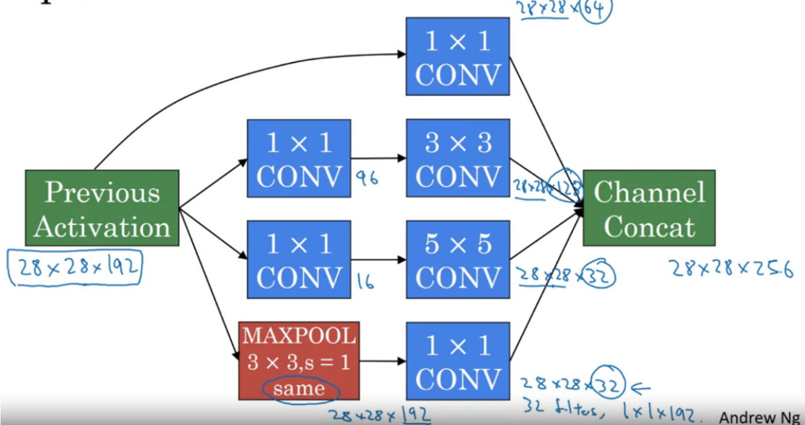
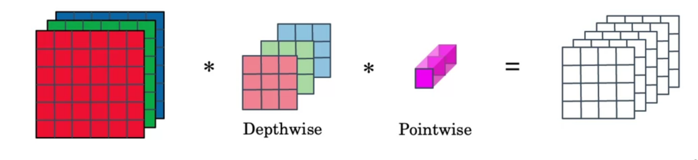
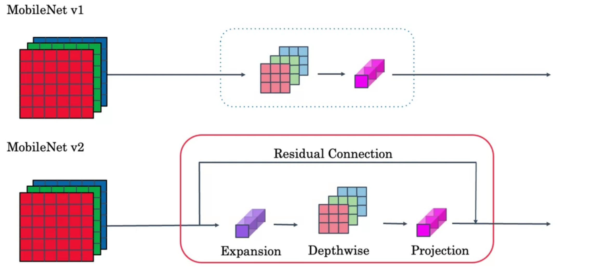

# overview

<!-- @import "[TOC]" {cmd="toc" depthFrom=1 depthTo=6 orderedList=false} -->

<!-- code_chunk_output -->

- [overview](#overview)
    - [概述](#概述)
      - [1.基础](#1基础)
        - [(1) padding](#1-padding)
        - [(2) cross-correlation vs convolution](#2-cross-correlation-vs-convolution)
        - [(3) 有多个channel](#3-有多个channel)
      - [2.CNN符号表示](#2cnn符号表示)
      - [3.layer类型](#3layer类型)
        - [(1) convolution (conv)](#1-convolution-conv)
        - [(2) pooling (pool)](#2-pooling-pool)
        - [(3) full connected (FC)](#3-full-connected-fc)
      - [4.classic networks](#4classic-networks)
        - [(1) LeNet-5](#1-lenet-5)
        - [(2) AlexNet](#2-alexnet)
        - [(3) VGG-16](#3-vgg-16)
      - [5.ResNets](#5resnets)
        - [(1) degradation problem](#1-degradation-problem)
        - [(2) residual block](#2-residual-block)
      - [6.1x1 convolutions (network in network)](#61x1-convolutions-network-in-network)
      - [7.inception network](#7inception-network)
        - [(1) 使用1x1 convolutions减小计算量](#1-使用1x1-convolutions减小计算量)
        - [(2) inception module](#2-inception-module)
        - [(3) inception network v1](#3-inception-network-v1)
      - [8.MobileNet](#8mobilenet)
        - [(1) depthwise separable convolution](#1-depthwise-separable-convolution)
        - [(2) 计算量](#2-计算量)
        - [(3) MobileNet v1 vs v2](#3-mobilenet-v1-vs-v2)
      - [9.EfficientNet](#9efficientnet)

<!-- /code_chunk_output -->

### 概述

#### 1.基础

* 已知
    * 图片: $n\times n$
    * kernel: $f\times f$
    * padding的数量: p (即在每个边缘加p个元素)
    * stride: s
* 则最终的output: $(\frac{n+2p-f}{s} + 1) \times (\frac{n+2p-f}{s} + 1)$

##### (1) padding

* valid convolutions
    * 不进行填充，对图片进行卷积后，图片会变小
* same convolutions
    * 对图片边缘进行填充（一般用0填充），卷积后，图片大小保持不变

##### (2) cross-correlation vs convolution
* 在数学上，kernel需要先逆时针旋转180度，然后进行移动，将窗口内的元素 相乘并相加
* 这里不需要（即cross-correlation）

##### (3) 有多个channel
* kernel也需要有相同数量的channel

#### 2.CNN符号表示
* 基础符号
    * $f^{[l]}$: 第l层kernel(filter) size
    * $p^{[l]}$: 第l层padding size
    * $s^{[l]}$: 第l层stride
    * $n_c^{[l]}$: 第l层filters的数量
        * 对于最开始的输入，这个就是图片channel的数量（比如RGB）
    * $W_c^{[l]}$: **第l层第c个kernel**
    * $b_c^{[l]}$: 第l层第c个kernel的bias
* $a^{[l-1]}$: $n_H^{[l-1]} \times n_W^{[l-1]} \times n_c^{[l-1]}$
* parameters
    * weights: $f^{[l]} \times f^{[l]} \times n_c^{[l-1]} \times n_c^{[l]}$
        * 每个kernel: $f^{[l]} \times f^{[l]} \times n_c^{[l-1]}$
        * 一共有$n_c^{[l]}$个kernel
    * bias: $1 \times 1 \times 1\times n_c^{[l]}$
* $a^{[l]}$: $n_H^{[l]} \times n_W^{[l]} \times n_c^{[l]}$

#### 3.layer类型

##### (1) convolution (conv)

* $z^{[l]} = a^{[l-1]} * W_c^{[l]} + b_c^{[l]}$
    * $*$表示卷积
* $a^{[l]} = g(z^{[l]})$

##### (2) pooling (pool)
* 本质也是卷积，只不过这里的kernel不需要训练
    * conv用于自动发现特定的模式
    * pool用于明确指定模式（比如max或average）
        * 能够减小计算量

##### (3) full connected (FC)

普通的层

#### 4.classic networks

##### (1) LeNet-5

* `input(32*32*1) -> CONV2D(f=5,s=1,c=6) -> AVGPOOL(f=2,s=2) -> CONV2D(f=5,s=1,c=16) -> AVGPOOL(f=2,s=2) -> FC(120) -> FC(84) -> softmax`
* 参数量: 60k

##### (2) AlexNet
* `input(227*227*3) -> CONV2D(f=11,s=4,c=96) -> MAXPOOL(f=3,s=2) -> CONV2D(f=5,s=1,c=256,p=same) -> MAXPOOL(f=3,s=2) -> CONV2D(f=3,s=1,c=384,p=same) -> CONV2D(f=3,s=1,c=384,p=same) -> CONV2D(f=3,s=1,c=256,p=same) -> MAXPOOL(f=3,s=2) -> FC(9216) -> FC(4096) -> FC(4096) -> softmax`
* 参数量: 60m

##### (3) VGG-16

* CONV： 使用统一的kernel, f=3,s=1,p=same
* MAXPOOL: f=2,s=2

* `input(224*224*3) -> [CONV 64]x2 -> MAXPOOL -> [CONV 128]x2 -> MAXPOOL -> [CONV 256]x3 -> MAXPOOL -> [CONV 512]x3 -> MAXPOOL -> [CONV 512]x3 -> MAXPOOL -> FC(4096) -> FC(4096) -> softmax`
    * `[CONV 64]x2`
        * 两层 卷积层
        * 每层使用64个kernel(CONV)

* 参数量: 138m

#### 5.ResNets

##### (1) degradation problem
* 随着层数的增加，错误率先下降，之后反而会上升

* 直觉上，deeper network性能应该比shallower network好
    * 因为deeper network可以理解成shallower network加上identity layer
* 实际上，deeper network性能可能更差
    * 因为学习identity function很难
    * 因为每层擅长学习的是非线性函数，而identity function是线性函数

* 对vanishing gradient也有帮助

##### (2) residual block

* $a^{[l+2]} = g(z^{[l+2]} + a^{[l]})$
    * 当$z^{[l+2]}=0$时，则$a^{[l+2]} = a^{[l]}$，则就学习到了identity function

#### 6.1x1 convolutions (network in network)

* weights: $1 \times 1 \times n_c^{[l-1]} \times n_c^{[l]}$
    * 能够改变channel的数量

#### 7.inception network

##### (1) 使用1x1 convolutions减小计算量

* 存在的问题

    * 需要进行的乘法量：$28*28*32\ *5*5*192=120m$

* 减少计算量

    * 需要进行的乘法量：$28*28*16*192 + 28*28*32*5*5*16=12.4m$

##### (2) inception module
* 在一层中进行$1*1$, $3*3$, $5*5$, pool

##### (3) inception network v1
[参考](https://arxiv.org/pdf/1409.4842v1.pdf)
* 由多个inception module组成
* 中间还有Auxiliary classifier，用作regularization

#### 8.MobileNet

##### (1) depthwise separable convolution

* depthwise convolution
    * filter: $f\times f\times n_c^{[l-1]}$
        * 有$n_c^{[l-1]}$个filter，对input的每个channel使用一个filter进行convolution

* pointwise convolution
    * filter: $1\times 1\times n_c^{[l-1]} \times n_c^{[l]}$

##### (2) 计算量

* depthwise separable convolution 计算量为普通convolution的 $\frac{1}{n_c^{[l]}}+\frac{1}{f^2}$

##### (3) MobileNet v1 vs v2

* v2的改进
    * 使用ResNet
    * 使用expansion先扩展dimension，进行复杂计算，再使用projection缩小dimension
        * 从而能够计算复杂的函数，且使用较少的内存
    

#### 9.EfficientNet
根据设备的资源，调整以下参数，从而使得neural network能够运行各个设备：
* 图片的resolution (r)
* neural network的 depth (d) 和 width (w)