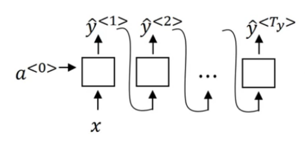
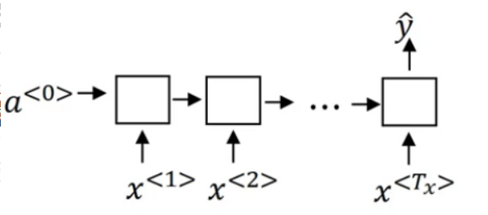
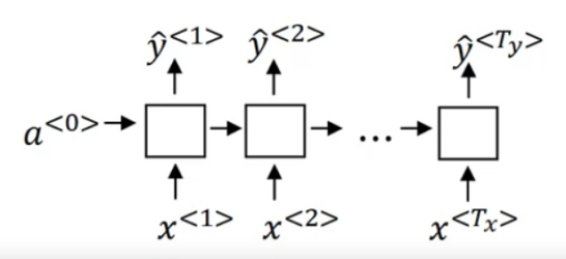
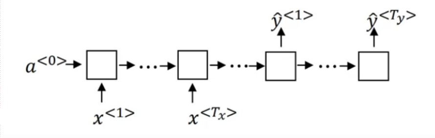
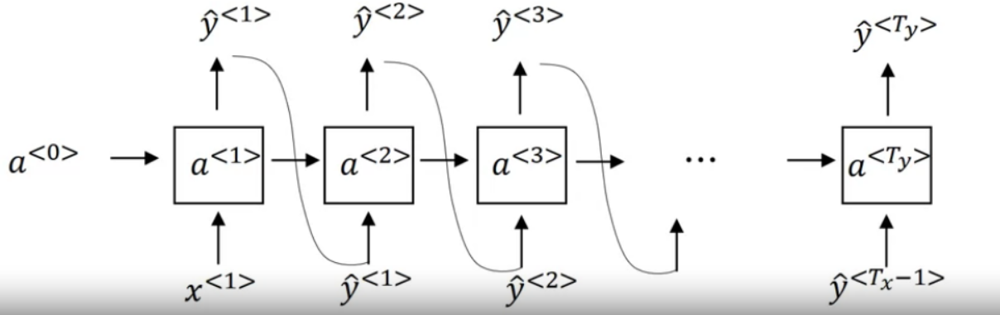
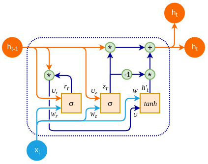
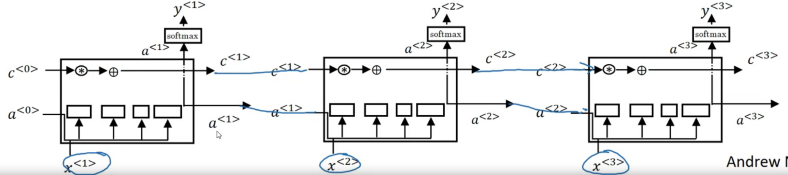
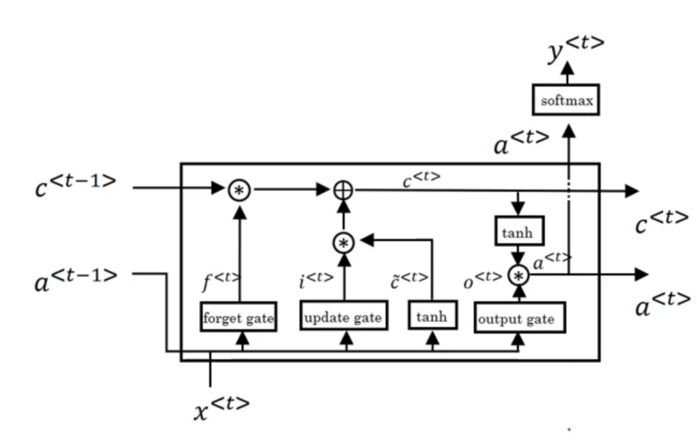
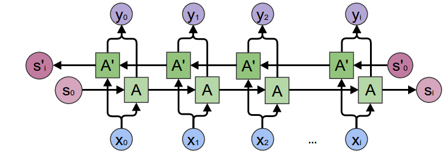
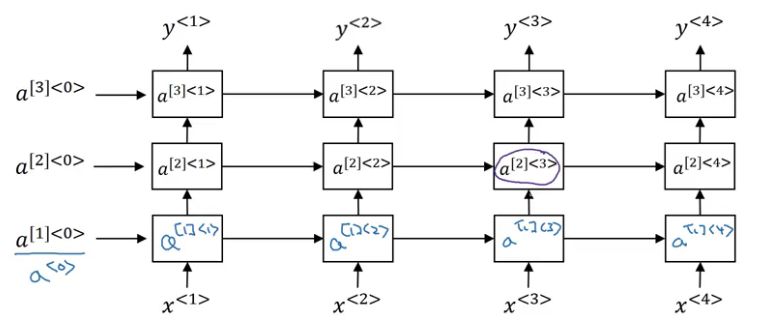

# overview

<!-- @import "[TOC]" {cmd="toc" depthFrom=1 depthTo=6 orderedList=false} -->

<!-- code_chunk_output -->

- [overview](#overview)
    - [overview](#overview-1)
      - [1.预备知识](#1预备知识)
        - [(1) word vs token](#1-word-vs-token)
      - [2.notation](#2notation)
        - [(1) vocabulary](#1-vocabulary)
      - [3.RNN (recurrent neural network)](#3rnn-recurrent-neural-network)
      - [4.RNN 类型](#4rnn-类型)
      - [5.language model](#5language-model)
      - [6.GRU (gated recurrent unit)](#6gru-gated-recurrent-unit)
        - [(1) GRU cell](#1-gru-cell)
      - [7.LSTM (long short term memory)](#7lstm-long-short-term-memory)
        - [(1) LSTM cell](#1-lstm-cell)
      - [8.bidirectional RNN (BRNN)](#8bidirectional-rnn-brnn)
      - [9.deep RNN](#9deep-rnn)

<!-- /code_chunk_output -->

### overview

#### 1.预备知识

##### (1) word vs token
* 一个token可以是 word的一部分，也可以一个或多个words组成
    * 比如: "Albert Einstein"是一个token

#### 2.notation

* $x^{<t>}$: 输入序列的第t个item
* $y^{<t>}$: 输出序列的第t个item
* $T_x$: 输入序列的长度
* $T_y$: 输出序列的长度

* representing words
    * 构建一个vocabulary (比如有10,000个words)
    * 可以使用one-hot表示序列
        * 比如一个序列有9个words，则可以用9个长度为10,000的vector表示，
        * 如果第一个word是we，则vector在we的索引处值为1，其他都为0

##### (1) vocabulary
* 普通的token
* 特殊token:
    * \<EOS\>: end of senetence，表示句子的结束
    * \<UNK\>: unknown，不在vocabulary的token都用这个表示

#### 3.RNN (recurrent neural network)

* model
    * $a^{<0>}$一般设为0
    * $a^{<t>} = g(W_{a}[a^{<t-1>},x^{<t>}] +b_a)$
    * $\hat y^{<t>} = g(W_{y}a^{<t>}+b_y)$
        * 是下面两个公式的简化写法（将参数堆叠成一个更大的矩阵）
            * $a^{<t>} = g(W_{aa}a^{<t-1>} + W_{ax}x^{<t>}+b_a)$
            * $\hat y^{<t>} = g(W_{ya}a^{<t>}+b_y)$
        * 注意：两个g函数不一样

* 特点
    * 只考虑了之前输入的信息，未考虑之后输出的信息

#### 4.RNN 类型

* one to many

* many to one

* many to many ($T_x = T_y$)

* many to many ($T_x \neq T_y$)

#### 5.language model

* 利用one to many RNN模型，根据其前面的输入，预测下一个单词（y是一个vector，用于描述vocabulary每个单词在此处出现的概率）
    * $x^{<1>}$为0
* y是 从vocabulary中 根据概率分布 随机取一个token

* $L=\sum\limits_t-y^{<t>}\log \hat y^{<t>}$

#### 6.GRU (gated recurrent unit)

* 能够保存之前层的**状态**，通过cell保存之前的状态并且传递

##### (1) GRU cell
* 
    * 图例: $r_t$(reset gate), $z_t$(update gate)

* reset gate
    * $\Gamma_r = \sigma(W_r[c^{<t-1>}, x^{<t>}] + b_r)$
        * 使用sigmoid函数，所以输出范围 0-1
* update gate
    * $\Gamma_u = \sigma(W_u[c^{<t-1>}, x^{<t>}] + b_u)$
        * 使用sigmoid函数，所以输出范围 0-1
* 当前cell的state (在GRU也叫candidate activation)
    * $\tilde{c}^{<t>} = \tanh(\Gamma_r * W_c[c^{<t-1>}, x^{<t>}] + b_c)$
        * $\Gamma_r$: how much of the previous hidden state to forget 
        * 当=0时，就相当于全部忘记，即清空memory
* 全部cell的state (在GRU中, $a^{<t>} = c^{<t>}$)
    * $c^{<t>} = \Gamma_u * \tilde{c}^{<t>} + (1-\Gamma_u) * c^{<t-1>}$
        * $\Gamma_u$: how much of the candidate activation vector to incorporate into the new hidden state
        * 当=1时，表示全部注入，则会丢弃之前的状态
        * 当=0时，表示不注入，则完全保留之前的状态

#### 7.LSTM (long short term memory)

##### (1) LSTM cell

* forget gate
    * $\Gamma_f = \sigma(W_f[a^{<t-1>}, x^{<t>}] + b_f)$
        * 使用sigmoid函数，所以输出范围 0-1
* update gate
    * $\Gamma_u = \sigma(W_u[a^{<t-1>}, x^{<t>}] + b_u)$
* output gate
    * $\Gamma_o = \sigma(W_o[a^{<t-1>}, x^{<t>}] + b_o)$
* 当前cell的state
    * $\tilde{c}^{<t>} = \tanh(W_c[a^{<t-1>}, x^{<t>}] + b_c)$
* 全部cell的state 
    * $c^{<t>} = \Gamma_u * \tilde{c}^{<t>} + \Gamma_f * c^{<t-1>}$
        * $\Gamma_u$: how much of the present hidden state to incorporate
        * $\Gamma_f$: how much of the previous hidden state to forget 
        * $\Gamma_o$: how much of the present hidden information to pass to the next 
* activation
    * $a^{<t>} = \Gamma_o * \tanh(c^{<t>})$

#### 8.bidirectional RNN (BRNN)

#### 9.deep RNN
