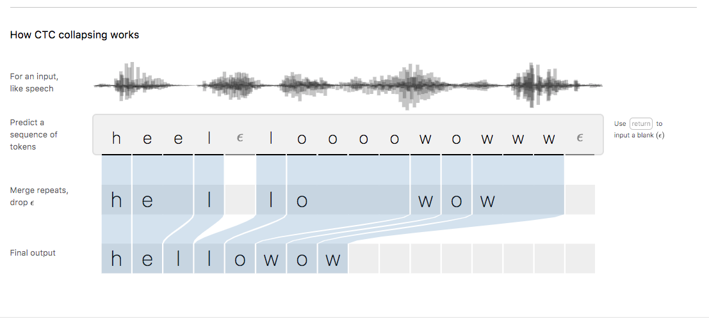

# speech recognition

<!-- @import "[TOC]" {cmd="toc" depthFrom=1 depthTo=6 orderedList=false} -->

<!-- code_chunk_output -->

- [speech recognition](#speech-recognition)
    - [overview](#overview)
      - [1.CTC (connectionist temporal classificaiton)](#1ctc-connectionist-temporal-classificaiton)

<!-- /code_chunk_output -->

### overview

#### 1.CTC (connectionist temporal classificaiton)

* 输入（对音频数据进行采样） 和 输出长度一样
* 预测的结果是一个个字符，还有分割符($\epsilon$)
    * 每一段内（有$\epsilon$进行分割），连续重复的字符都只留下一个