# transformers

<!-- @import "[TOC]" {cmd="toc" depthFrom=1 depthTo=6 orderedList=false} -->

<!-- code_chunk_output -->

- [transformers](#transformers)
    - [overview](#overview)
      - [1.transformers特点](#1transformers特点)
        - [(1) 传统模型](#1-传统模型)
        - [(2) transformers](#2-transformers)
      - [2.transform representations](#2transform-representations)
      - [3.one head attention](#3one-head-attention)
        - [(1) 与RNN attention比较](#1-与rnn-attention比较)
        - [(2) self-attention vs cross-attention](#2-self-attention-vs-cross-attention)
        - [(3) self-attention](#3-self-attention)
        - [(4) attention pattern](#4-attention-pattern)
        - [(5) a head of attention](#5-a-head-of-attention)
        - [(6) $W_q,W_k,W_v$ shape](#6-w_qw_kw_v-shape)
        - [(7) context window](#7-context-window)
      - [4.multi-head attention](#4multi-head-attention)
      - [5.transformer network](#5transformer-network)
        - [(1) postional encoding](#1-postional-encoding)
        - [(2) masked multi-head attention](#2-masked-multi-head-attention)
        - [(3) 训练技巧](#3-训练技巧)

<!-- /code_chunk_output -->

### overview

#### 1.transformers特点

##### (1) 传统模型
* RNN
    * 存在vanishing graidents问题
* GRU/LSTM
    * 模型变得更加复杂
    * sequential，需要按顺序处理一个个token，导致性能比较低

##### (2) transformers
* **并行**计算每个token的 attention-based representations

#### 2.transform representations

* transformers的目的: 调整word的representations，使得其不仅仅encode单个单词，还要包含**context信息** (**attention-based representations**)
    * `没有context信息的embedding` `-->` `有（context信息 + position信息）的embedding`

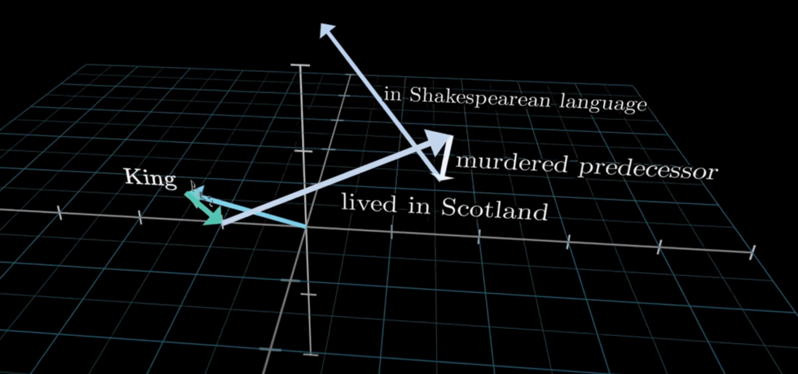
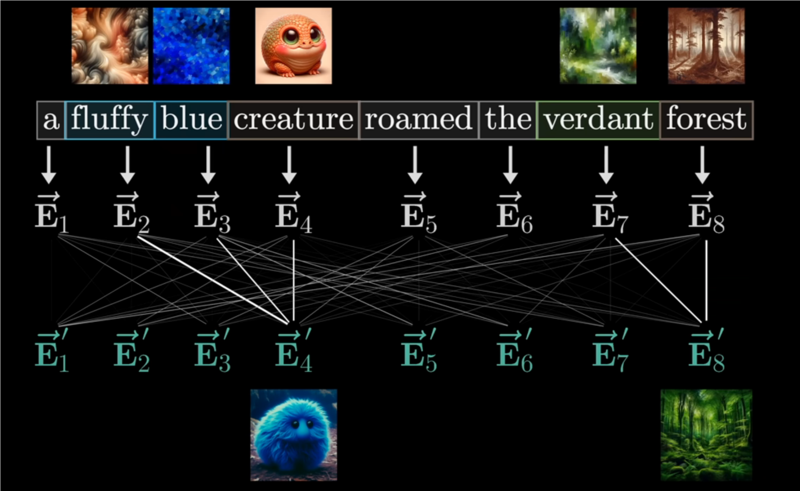

#### 3.one head attention

##### (1) 与RNN attention比较
[参考](../RNN/NLP.md#7attetion-model)

* $\text {context}^{<t>}=\sum\limits_{t'}\frac {\exp(e^{<t,t'>})}{\sum_{t'=1}^{T_x}exp(e^{<t,t'>})}a^{<t'>}$
* $A(q^{<t>},K,V)=\sum\limits_i\frac{\exp(q^{<t>}\cdot k^{<i>})}{\sum_j\exp(q^{<t>}\cdot k^{<j>})}v^{<i>}$

* 目的不一样
    * RNN计算context，作为每个decoder unit的输入
    * transformer计算attention-based representations
* 本质是一样，计算当前token对其他token的attention

##### (2) self-attention vs cross-attention
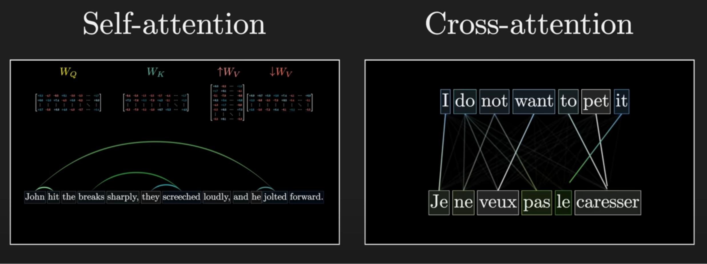

* cross-attention 与 self-attention基本一致
    * 只不过q和k来自不同的序列
    * 没有masking
    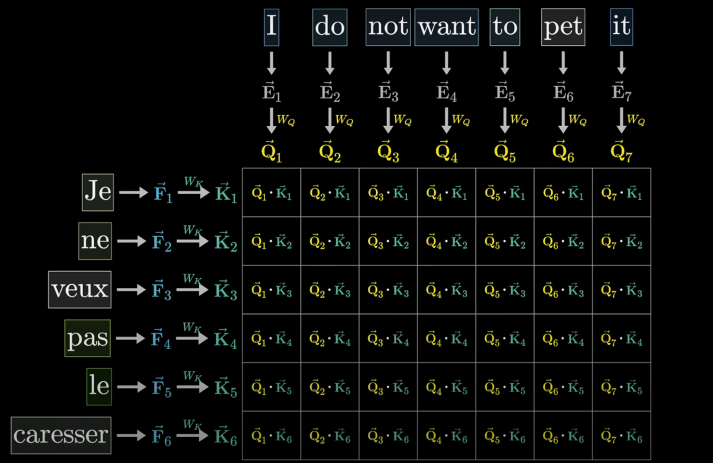

##### (3) self-attention

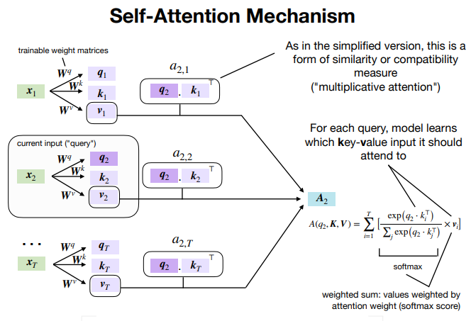

* 第t个token的attention-based representations
    * $A^{<t>} = A(q^{<t>},K,V)=\sum\limits_i\frac{\exp(q^{<t>}\cdot k^{<i>})}{\sum_j\exp(q^{<t>}\cdot k^{<j>})}v^{<i>}$
        * $q^{<t>}$: 第t个token的query值，即需要transform的
        * $k^{<j>}$: 第j个token的key值
        * q和k: 用于计算 每个token 对于 当前token的 context贡献的权重
        * $v^{<i>}$: 第i个token的value值
        * 权重和v: 用于计算context，即attention-based representations
* 实际使用如下公式: 
    * $\text {Attention}(Q,K,V) = \text {softmax}(\frac{QK^T}{\sqrt {d_k}})V$
        * $\sqrt {d_k}$是防止graident exploding

##### (4) attention pattern
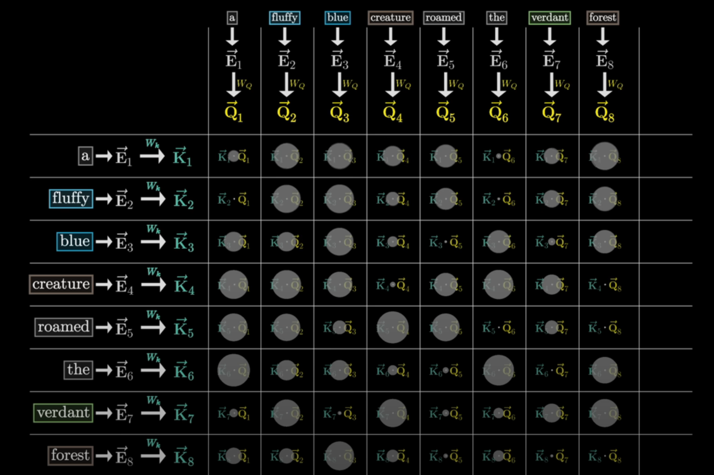

##### (5) a head of attention
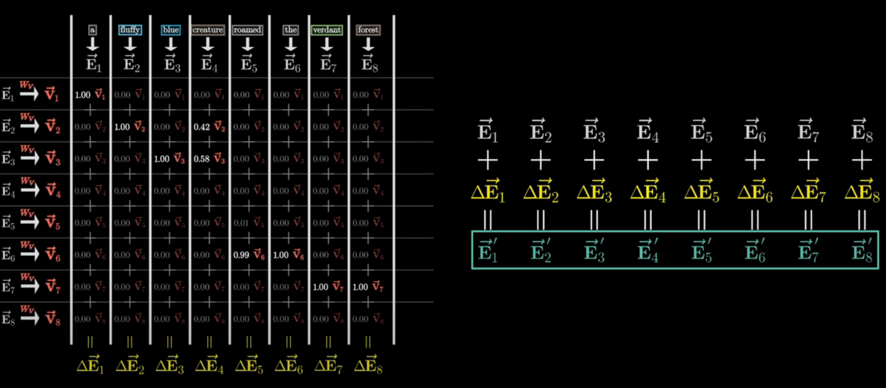

##### (6) $W_q,W_k,W_v$ shape
* $W_q,W_k$: (key query space, embedding dimension)
* $W_v$:
    * 理论上
        * (embedding dimension, embedding dimension)
        * key query space小于embedding dimension

    * 实际上
        * #value params = #query params + #key params
            * 参数量减少了，但是效果一样
            * 理论上的$W_v$
                * 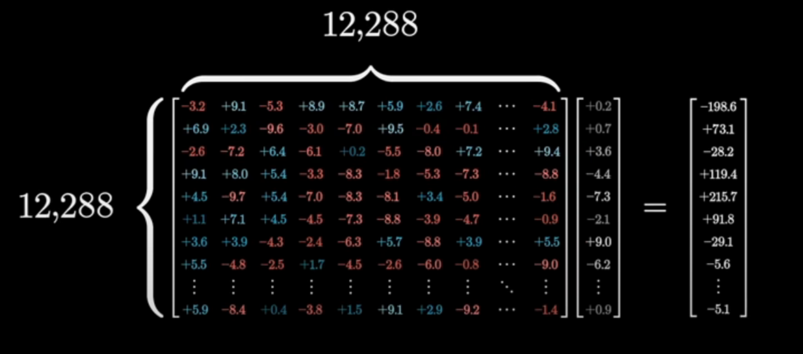
            * 将$W_v$拆分成: $\uparrow W_v$ 和 $\downarrow W_v$
                * 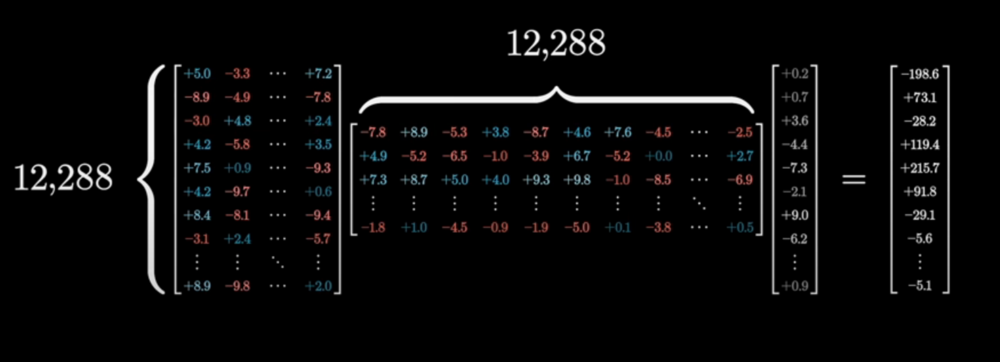
                * $\downarrow V$称为value
                * $\uparrow V$称为output matrix

##### (7) context window
network每次能够处理的vectors数量
* 对于gpt3: context size = 2048

#### 4.multi-head attention

* $\text {MultiHead}(Q,K,V) = \text {concat}(\text {head}_1,\text {head}_2,...,\text {head}_n)W_o$
    * $\text {head}_i=\text {Attention}(W_i^QQ,W_i^KK,W_i^VV)$
        * 一个token由多个heads，一个head就是一个特征
        * $Q=K=V=X$
            * 因为这里将W参数提取出来了，而在self-attention中，q/k/v是用W参数计算出来的，本质是一样的

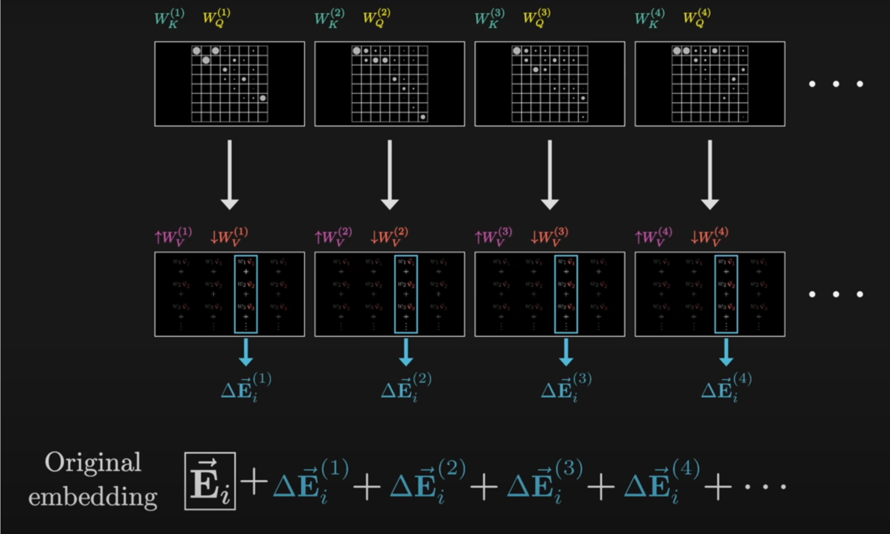

#### 5.transformer network

以翻译为例
* 简化的
    * 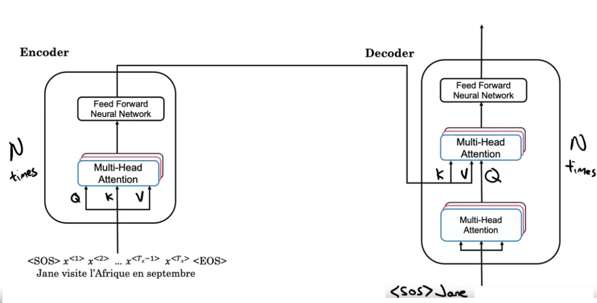
        * decoder中的Q来自 已经输出内容 的attetion，即需要考虑已经输出的内容
* 实际的
    * 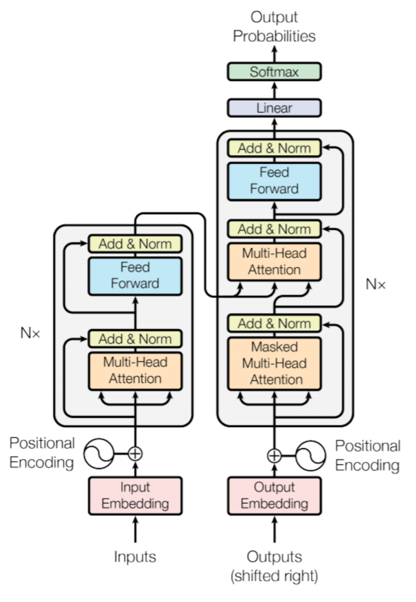
        * Add & Norm就类似于batchnormalization

* blocks重复多次的目的（类似CNN）
    * shallower blocks寻找的是low level context的关联
    * deeper blocks寻找的是high level context的关联

##### (1) postional encoding
* 由于transformer是并行处理的，丢失了位置信息，所以需要补充位置信息

* how
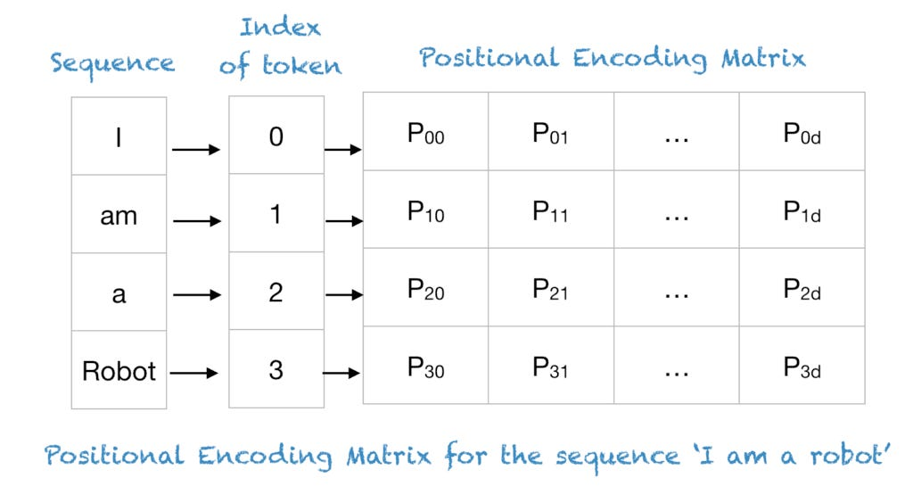
    * $PE(pos,2i)=\sin (\frac{pos}{n^{2i/d}})$
    * $PE(pos,2i+1)=\cos (\frac{pos}{n^{2i/d}})$
        * d: token的维度
        * n建议取10,000
    * 比如token的维度是4，则计算出的postional vector为: ( PE(pos,0), PE(pos,1), PE(pos,2), PE(pos,3) )

* 特点
    * 唯一的
        * 只要有一个周期大于序列长度（即context长度），则一定是唯一的，因为一个周期内的值是不重复的
    * 确定的
    * 可以评估出两个vector的位置距离
        * 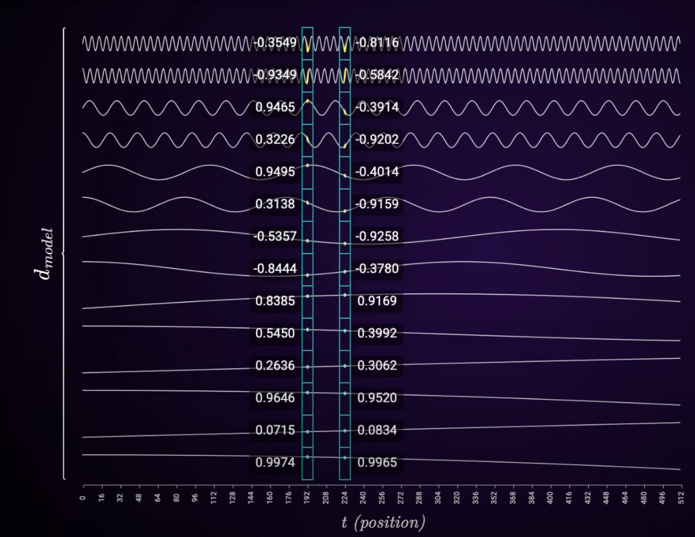
        * 从周期大的部分能看出，两者是否接近
        * 如果两者接近，从周期小的部分能够更细致的看出两者的距离

* 使用sin和cos是因为 PE(pos)和PE(pos+k)之间可以通过**线性变换**的得到
    * 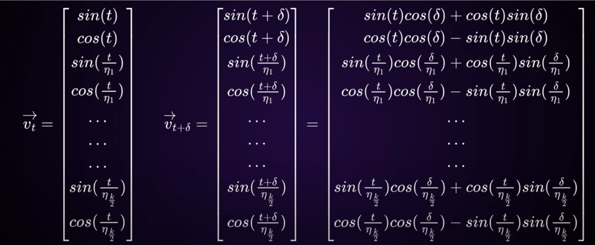
    * 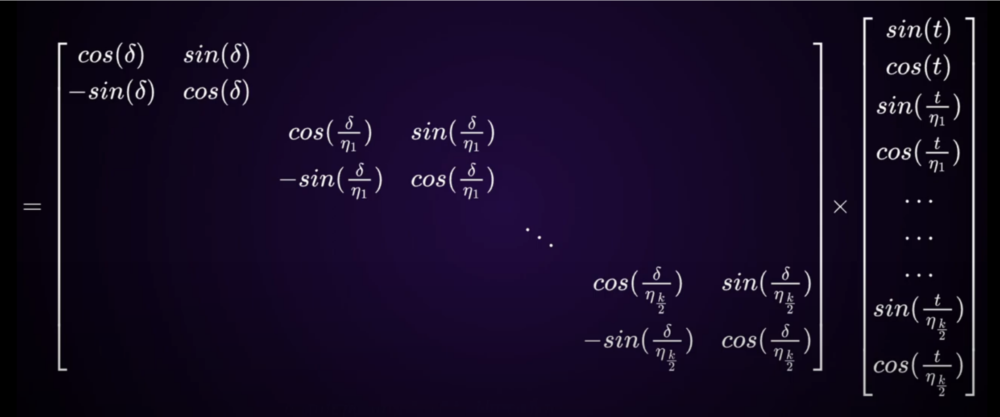

##### (2) masked multi-head attention
* a key feature that prevents the model from "cheating" by looking at future words in the sequence when trying to understand the current word
    * 用于 根据前面context 预测下一个单词的 训练场景（对后面的内容进行遮挡）
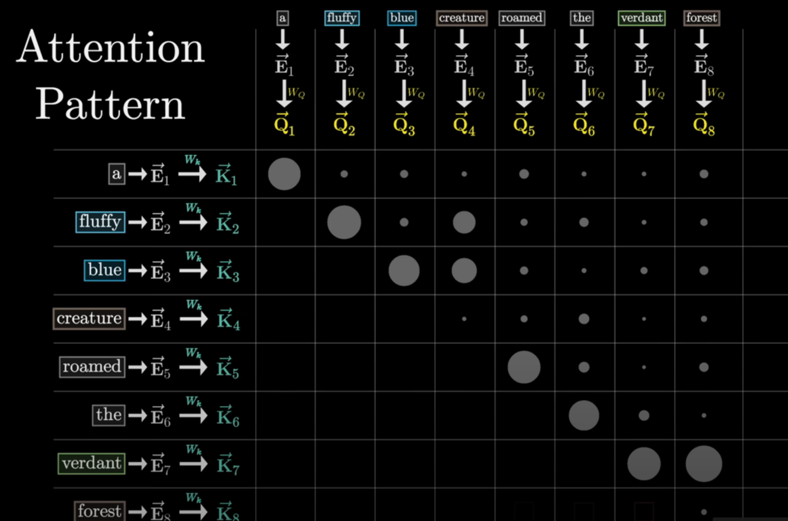
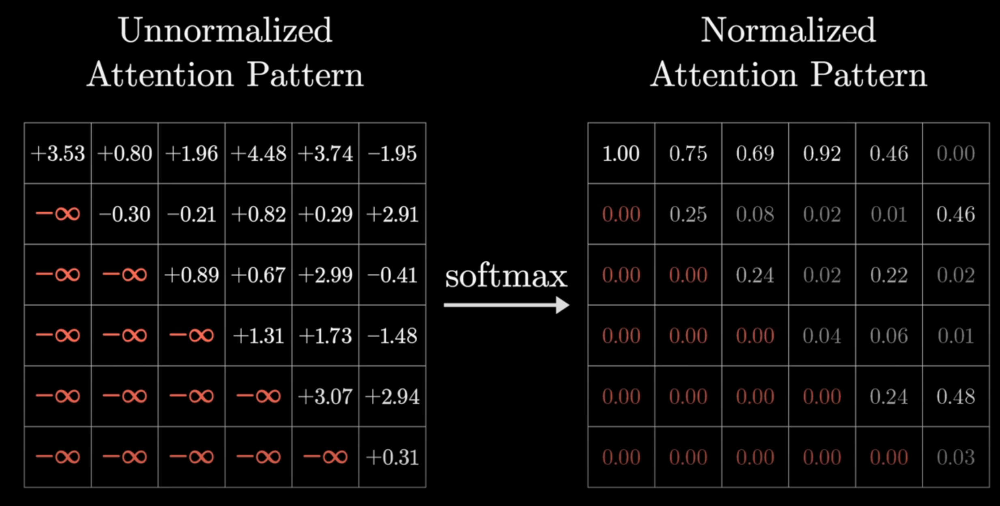

##### (3) 训练技巧
* 一个训练样本，能用作多个训练样本
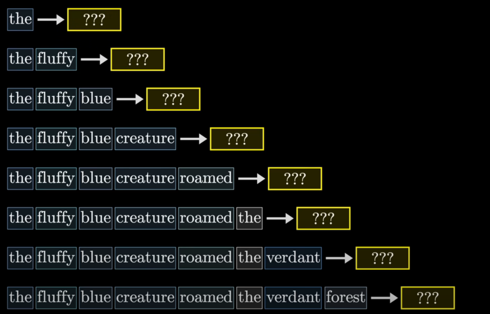