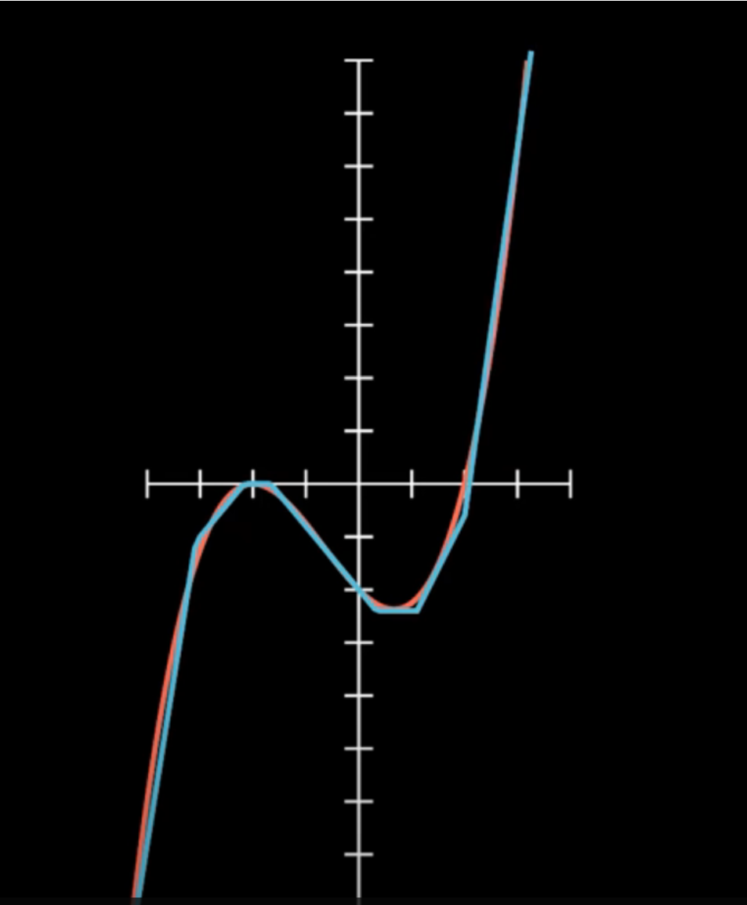
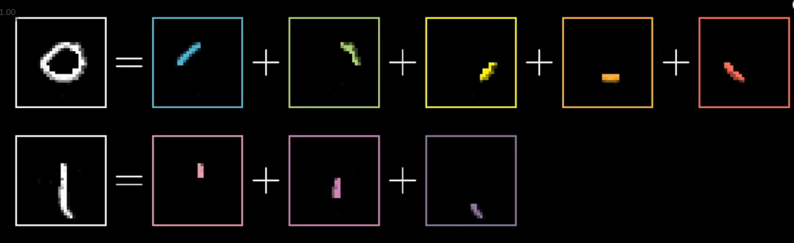
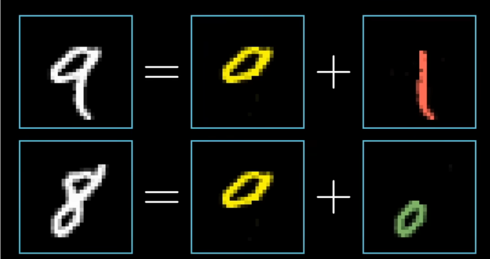
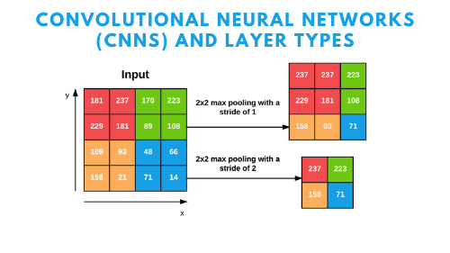
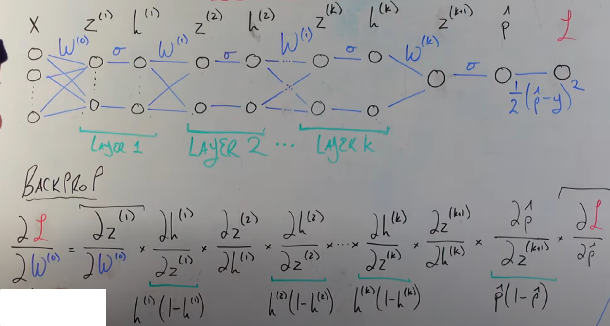
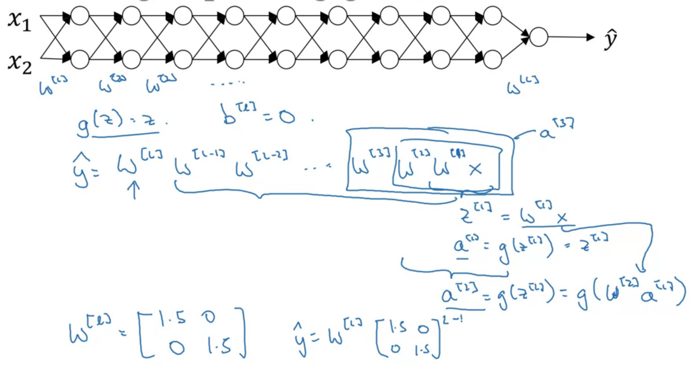
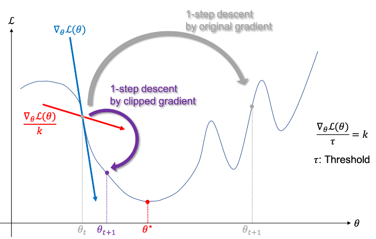

# neural network


<!-- @import "[TOC]" {cmd="toc" depthFrom=1 depthTo=6 orderedList=false} -->

<!-- code_chunk_output -->

- [neural network](#neural-network)
    - [理解](#理解)
      - [1.本质理解](#1本质理解)
      - [2.分层的理解](#2分层的理解)
    - [概述](#概述)
      - [1.术语](#1术语)
        - [(1) layer](#1-layer)
        - [(2) activation (公式重要)](#2-activation-公式重要)
        - [(3) 为什么使用`非线性函数`作为activation function](#3-为什么使用非线性函数作为activation-function)
      - [2.常用activation function](#2常用activation-function)
        - [(1) linear (no activation function)](#1-linear-no-activation-function)
        - [(2) sigmoid (不常用)](#2-sigmoid-不常用)
        - [(3) tanh](#3-tanh)
        - [(4) ReLU (rectified linear unit)](#4-relu-rectified-linear-unit)
        - [(5) softmax activation](#5-softmax-activation)
      - [3.activation function的选择](#3activation-function的选择)
        - [(1) output layer](#1-output-layer)
        - [(2) hidden layer](#2-hidden-layer)
      - [4.classification](#4classification)
        - [(1) multiclass](#1-multiclass)
        - [(2) multi-label (multi-task learning)](#2-multi-label-multi-task-learning)
      - [5.layer type](#5layer-type)
        - [(1) dense (full connected) layer](#1-dense-full-connected-layer)
        - [(2) convolutional layer](#2-convolutional-layer)
      - [6.initialization](#6initialization)
        - [(1) zero initialization](#1-zero-initialization)
        - [(2) random initialization](#2-random-initialization)
        - [(3) He Initialization (跟Xavier类似) (减轻 vanishing/exploding gradients)](#3-he-initialization-跟xavier类似-减轻-vanishingexploding-gradients)
      - [7.end-to-end deep learning](#7end-to-end-deep-learning)
      - [8.vanishing (or exploding) gradients](#8vanishing-or-exploding-gradients)
        - [(1) sigmoid作为activation (造成vanishing)](#1-sigmoid作为activation-造成vanishing)
        - [(2) 不恰当的initialization (造成vanishing/exploding)](#2-不恰当的initialization-造成vanishingexploding)
        - [(3) graident clipping (解决exploding)](#3-graident-clipping-解决exploding)

<!-- /code_chunk_output -->

### 理解

#### 1.本质理解
* 根据 大量的函数点（训练数据），寻找 **接近**的函数
* neural network就是一个非线性函数
    * 能够描述 指定范围内（即x有界的） 的所有函数
        * 因为通过趋近函数的方式描述的，所以不能准确描述一个函数
        * 所以当范围无限大时，就无法描述
* 
    * 红色是真实的函数
    * 蓝色是neural network描述的函数

#### 2.分层的理解
* 每一层的每个neuron 用来 **匹配**一个**特征**
* 接收上一层的输入
    * 然后根据设置的**权重w**（即特征，比如某些位置为负数，某些位置为整数），计算出一个值（即进行**特征匹配**）
        * $w_1a_1 + w_2a_2 + ... + w_na_n$
        
            * 绿色区域：权重为正数，红色区域：权重为负数
    * 然后这个值会跟**偏差值b**进行比较，只有大于b，才认为**该特征可能存在**，即这个**neuron被activate**
        * $w_1a_1 + w_2a_2 + ... + w_na_n - b > 0$
    * 然后进行函数映射（比如sigmoid，能够衡量一个正数有多大）
    * 根据输出值，判断该**特征的明显程度**（越接近1,说明该特征越明显）
* 最前面的层，寻找的特征比较**小**（比如一个小直线，一个点等）

* 越往后，根据前面找到的小特征（将小特征组合），判断是否存在比较**大**的特征（比如一个圈、一条垂直线）
    * 还会寻找特征的关联（比如: 一个圈和一个竖线的组合，可能9这个数字）
    

***

### 概述

#### 1.术语

在线代中，大写代笔矩阵，小写代表向量

##### (1) layer
* input layer
* hidden layer
* output layer

* 表示: 
    * $[0]$ 表示第0层，即input layer
    * $[1]$ 表示layer 1，以此类推
    * $w_1^{[1]}$ 表示layer 1中第一个neuron的参数
    * $n^{[l]}$ 表示第$l$层的neuron数量（可以理解成特征）

* n-layer neuron network
    * 表示除了input layer，有n个layer

##### (2) activation (公式重要)

* 第$l$层第$j$个unit的**输出**: **$a_j^{[l]} = g(z_j^{[l]}) =g(\vec w_j^{[l]} \cdot \vec a^{[l-1]} + b_j^{[l]})$**
    * 经过 **activation function** 产生输出
        * g表示使用的sigmoid function作为activation function
    * $\vec a^{[l-1]}$上一层所有的activation

* layer l 所有activation（即所有unit的输出）表示：$\vec a^{[l]}$
    * input layer的activation: $\vec a^{[0]}$

##### (3) 为什么使用`非线性函数`作为activation function
比如使用线性函数g(z)=z作为activation function:
* $a^{[1]} = z^{[1]} = W^{[1]}x+b^{[1]}$
* $a^{[2]} = z^{[2]} = W^{[2]}a^{[1]}+b^{[2]} = (W^{[2]}W^{[1]})x + W^{[2]}W^{[1]}+b^{[2]}$
* 结果变成了线性方程回归

#### 2.常用activation function

##### (1) linear (no activation function)
* 比如: $g(z) = z$
* 在hidden layer中使用linear function没有任何意义，相当于没有使用activation function

##### (2) sigmoid (不常用)

* $g(z) = \frac{1}{1+e^{-z}}$
    * 能够使得输出范围在 0-1 之间
* sigmoid的导数
    * $\frac{d}{dz}g(z)=g(z)(1-g(z))$

* 现在ReLU更常用，因为sigmoid在两端，**斜率趋近于0**，会导致训练效率很差
    * 一般只用在output layer，要求输出结果在0-1之间，比如binary classfication

##### (3) tanh

* $g(z) = \tanh(x) = \frac{\sinh x}{\cosh x} = \frac{e^x-e^{-x}}{e^x+e^{-x}}$

* tanh的导数
    * $\frac{d}{dz}g(z)=(1-(g(z))^2)$


##### (4) ReLU (rectified linear unit)

* $g(z) = max(0, z)$


* 通过一段段线性函数，组合成各种复杂的非线性的函数
    * 

##### (5) softmax activation

* 进行normalize，用于多种情况的概率分布
    * $z_j = \vec W_j \cdot \vec X + b_j$ &ensp; $j = 1,...,N$
    * $a_j = \frac{e^{z_j}}{\sum_{k=1}^{N}{e^{z_k}}} = P(y=j|\vec X)$
        * N表示分为了N个类
        * $a_1 + ... a_N = 1$
* 输入称为: logits
* 输出称为: probabilities

#### 3.activation function的选择
不同layer选择不同的activation function

##### (1) output layer
* 二元分类: sigmoid
* regression (有正负): linear
* regression (没有负值，比如房价): ReLU

##### (2) hidden layer
* Relu (最常用)
    * 比sigmoid 训练速度更快
* 不要使用linear activation function，因为相当于没使用neuron network
    * 线性函数的线性函数，还是线性函数
        * layer 1: $a^{[1]} = W_1^{[1]}x + b_1^{[1]}$
        * layer 2 (output layer): $a^{[2]} = W_1^{[2]}a^{[1]} + b_1^{[2]} = W_1^{[1]}W_1^{[2]}x + W_1^{[2]}b_1^{[1]} + W_1^{[2]} = Wx + b$

#### 4.classification

##### (1) multiclass
* 说明：结果属于多个类别中的一个（比如给定一个包含数字0-9的图片，判断图片是数字几）
* 方式：
    * output layer的activation function使用softmax
    * output layer有N个unit
        * N是一共分为多少类别
        * 所有unit的值加起来是1

##### (2) multi-label (multi-task learning)
* 说明：即结果可能属于多个类别（比如判断图片是否包含汽车、行人、信号灯等）
* 方式：
    * output layer的activation function使用sigmoid
    * output layer有N个unit
        * N是一共分为多少类别
        * 一个unit就是判断属于该类别的概率

#### 5.layer type

##### (1) dense (full connected) layer
* 每个unit的输出 = activation function (上一层所有activation输出)
    * 比如: $\vec a^{[2]} = g(\vec w^{[2]} \cdot \vec a^{[1]} + b^{[2]})$


##### (2) convolutional layer
* each neuron only looks at part of previous layer's outputs


#### 6.initialization

##### (1) zero initialization
* 当参数都初始化为0（或都相同）时，同一层的neuron的参数下降的都一样，导致同一层neuron都是**等价的**，就相当于**只有一个neuron**
    * 当都为0，还有可能导致梯度为0，即无法进行梯度下降

```python
for l in range(1, L):
    parameters['W' + str(l)] = np.zeros((layers_dims[l], layers_dims[l-1]))
    parameters['b' + str(l)] = np.zeros((layers_dims[l],1))
```

##### (2) random initialization

* 初始化时，要小一点，因为小一点，sigmoid函数的梯度越大，即下降的越快
    * `np.random.randn(shape) * 0.01`

```python
for l in range(1, L):
    parameters['W' + str(l)] = np.random.randn(layers_dims[l], layers_dims[l-1])
    parameters['b' + str(l)] = np.zeros((layers_dims[l],1))
```

##### (3) He Initialization (跟Xavier类似) (减轻 vanishing/exploding gradients)

* 对weight进行normalize，不能解决问题，但是能够使斜率的vanishing/exploding不会太快
    * 默认平均值mean=0，方差$Var(W^{[i]})$根据activation function的类型确定
        * 比如Relu: $Var(W^{[i]}) = \frac{2}{n^{n-1}}$
    * $W^{[i]} = \text {np.random.randn(...)} * \sqrt {Var(W^{[i]})}$

```python
for l in range(1, L):
    parameters['W' + str(l)] = np.random.randn(layers_dims[l],layers_dims[l-1]) * np.sqrt(2 / layers_dims[l-1])
    parameters['b' + str(l)] = np.zeros((layers_dims[l], 1))
```

#### 7.end-to-end deep learning
* end-to-end: `input --model--> 所需要的output`
    * 简单
    * 需要大量数据，而传统的方式需要的数据少的多，但是步骤复杂
* 传统的方式，需要可能需要多个中间步骤
    * 比如：人脸识别 `input --model-->  识别出人脸  --人脸对比模型--> 输入是否匹配`
    * 比如：语音识别 `input --> features --> phonemes --> words --> transcript`

#### 8.vanishing (or exploding) gradients

* 当neuron network**层数过多**，导致**gradient**都特别大/特别小，导致训练会很困难
    * 当gradient很小时，计算机就会处理成0

##### (1) sigmoid作为activation (造成vanishing)
* 当使用sigmoid作为activation function时，会存在vanishing graidents问题
    * 
    * 因为sigmoid的值在0-1之间，所以 $0<h<1$ ，所以 $h(1-h) < 1/4$
    * **earlier layer**的gradient就会越小
    * 所以当层数较多时，就会出现vanishing gradient

##### (2) 不恰当的initialization (造成vanishing/exploding)

* 当neuron network**层数过多**
    * 可能会导致activation呈**指数级**增长/减小
    * backpropa时，gradient会 特别大/特别小

##### (3) graident clipping (解决exploding)
有多中裁剪方法

* 方法一：You will use a simple element-wise clipping procedure, in which every element of the gradient vector is clipped to fall between some range [-N, N].
    * For example, if the N=10
        * The range is [-10, 10]
        * If any component of the gradient vector is greater than 10, it is set to 10.
        * If any component of the gradient vector is less than -10, it is set to -10.
        * If any components are between -10 and 10, they keep their original values.
```python
#out用于就地（in place）设置，比如下面就是将 np.clip返回值 赋值给 graident
for gradient in [dWax, dWaa, dWya, db, dby]:
    np.clip(gradient, -maxValue, maxValue, out = gradient)
```

* 方法二：除以一个k值（k是变化的），使得gradient满足阈值范围$\tau$
