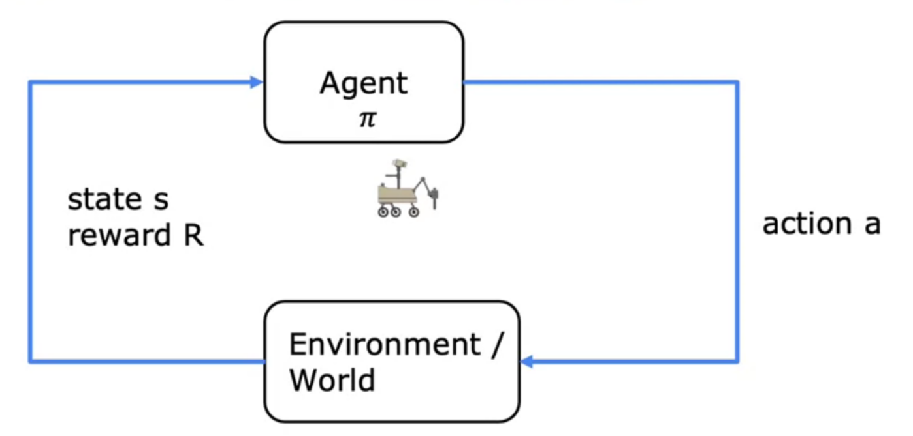
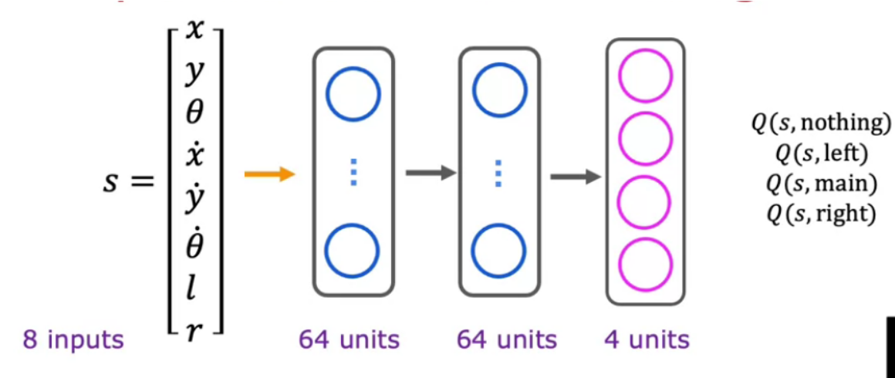

# reinforment learning

<!-- @import "[TOC]" {cmd="toc" depthFrom=1 depthTo=6 orderedList=false} -->

<!-- code_chunk_output -->

- [reinforment learning](#reinforment-learning)
    - [概述](#概述)
      - [1.MDP (Markav decision process)](#1mdp-markav-decision-process)
        - [(1) states and action](#1-states-and-action)
        - [(2) rewards](#2-rewards)
        - [(3) discount factor $\gamma$ 和 return](#3-discount-factor-gamma-和-return)
        - [(4) police $\pi$](#4-police-pi)
      - [2.state-action value function](#2state-action-value-function)
        - [(1) Bellman equation](#1-bellman-equation)
      - [3.MDP random environment](#3mdp-random-environment)
        - [(1) expect return](#1-expect-return)
        - [(2) Bellman equation](#2-bellman-equation)
      - [4.continuous state spaces](#4continuous-state-spaces)
        - [(1) 描述](#1-描述)
      - [5.DQN (deep Q-network) algorithm](#5dqn-deep-q-network-algorithm)
        - [(1) 算法概述](#1-算法概述)
        - [(2) $\epsilon$-greedy plicy](#2-epsilon-greedy-plicy)
        - [(3) target model and soft update](#3-target-model-and-soft-update)

<!-- /code_chunk_output -->

### 概述

#### 1.MDP (Markav decision process)

##### (1) states and action
* state
    * 描述可能处于的状态
        * 包括 intermidiate state、terminal state
* action
    * s -a-> s'
        * 表示在该状态下可采取的动作，然后进入下一个状态

##### (2) rewards
* R(s): 在状态s下，能够获取的reward值
    * 当reward为负数时，表示该状态不好

##### (3) discount factor $\gamma$ 和 return
* $R_1 + \gamma R_2 + \gamma^2 R_3 + ...$
    * $\gamma$
        * 从某个状态 到 某个终止状态（有多个动作，即有多个中间状态），每个中间状态的reward都要打折，越往后，打折的越多
            * $R_1$是当前状态的reward值
        * 一般取接近1的值，比如: 0.9, 0.99, 0.99等
    * 从某个状态 到 某个终止状态（有多个动作，即有多个中间状态），所获得的rewards值
        * 某个终止状态不会转移到其他终止状态（即reward值是其本身）

##### (4) police $\pi$
* $\pi(s) = a$
    * 当处于状态s时，根据police $\pi$而决定采取什么动作a
        * 比如：移动到最大的rewards状态，或者移动到最小的rewards状态，或者移动到最大的returns状态等等

#### 2.state-action value function

##### (1) Bellman equation
* $Q(s,a) = R(s) + \gamma\ \underset{a'}{max} Q(s',a')$
    * 状态s，执行动作a后，之后都采取**最优策略** 的return值
    * 计算出，在每个状态，每个动作 的$Q(s,a)$，从而选择最大的$Q(s,a)$，即$\underset{a}{max} Q(s,a)$（或$Q^*(s,a)$）
        * 即选择最优策略（即能够确定从该状态到哪个终止状态能获取最大的return值）

#### 3.MDP random environment

* agent 有一定概率，没有按照指令进入某个状态（可能由于环境的原因，比如风太大等等）

##### (1) expect return
* expect return = $E[R_1 + \gamma R_2 + \gamma^2 R_3 + ...]$
    * 执行很多次最优策略后（在最优策略中，状态有一定概率没有按照指令进行），取平均值

##### (2) Bellman equation

* $Q(s,a) = R(s) + \gamma\ E[\underset{a'}{max} Q(s',a')]$

#### 4.continuous state spaces

##### (1) 描述
在连续的空间中，状态有无数种情况，状态可以用：坐标、速度、方向等表示

#### 5.DQN (deep Q-network) algorithm

* 以月球着陆器为例
    * 状态：x、y坐标，角度$\theta$，x、y方向上的速度，角度的转速，l (左腿是否与地面接触)、r (右腿是否与地面接触)
    * 动作：nothing, left (左变推进), main (中间推进), right (右边推进)

##### (1) 算法概述
* 使用neuron network训练 $Q(s, a)$
    * input: $(s)$
    * output: $Q(s,a)$
        * 输出多个Q(s,a): 某个状态，所有可能的动作 的Q值
    * 训练集内容: 
        * $x=(s,a,R(s), s')$
            * a根据$\epsilon$-greedy policy策略选择
            * 根据x值计算y:
                * $y= \hat Q(s,a;w^-) = R(s) + \gamma\ \underset{a'}{max} \hat Q(s',a')$
                    * y可以使用$Q$模型，但是会导致模型不太稳定，因为训练集的y值会一直在变
                    * y的值是用到的时候进行计算的，并**没有进行存储**

* 算法简述
    * 初始化neuron network的参数（即随便计算一个$Q(s,a)$的值）
    * 重复以下步骤（每次迭代）：
        * 在仿真环境中，根据一定策略（比如$\epsilon$-greedy）对agent进行各种action，每次action后，得到一条数据：$(s,a,R(s),s')$
        * replay buffer: 根据内存大小，存储最近的数据，用作训练数据
        * 随机选取buffer中的数据，训练neuron  network:
            * 构建训练集合
            * 训练模型
                * 模型输出所有action的$Q(s,a)$

* pseudo code

>initialize memory buffer D with capacity N
>initialize neuron network $Q$ with random weights $w$
>initialize target neuron network $\hat Q = Q$
>for episode i=1 to M do
>>receive inital state $S_1$
>>for t=1 to T do
>>>based on state $S_t$, choose action $A_t$, using $\epsilon$-greedy policy
>>>take action $A_t$ in the environment, get reward  $R_t$ and next state $S_{t+1}$
>>>store experience tuple $(S_t,A_t,R_t,S_{t+1})$ in memory buff D
>>>every C steps perform a learning update:
>>>>sample random mini-batch of experience tuples $(S_t,A_t,R_t,S_{t+1})$ from D
>>>>set $y_j=R_j$ if episode terminates at step j+1, otherwise set $y_j=R_j + \gamma\ \underset{a'}{max} Q(s_{j+1},a')$
>>>>perform a gradient descent step on $(y_i-Q(s_j,a_j;w))^2$ (i.e. update the weights of Q)  
>>>>update the weights of the $\hat Q$ using a soft update
>>
>>end
>
>end

##### (2) $\epsilon$-greedy plicy

* greedy step
    * 95%的概率，选择Q(s,a)最大的动作（这里用的不是$\hat Q$模型）
* exploration step
    * 5%的概率，随机选择动作
* 随着算法的迭代，逐渐调整$\epsilon$的值
    * 初始化时，$epsilon$比较大
    * 每次迭代后逐渐减小$\epsilon$

##### (3) target model and soft update

* 基于soft update创建一个target模型（即生成样本数据的模型）$\hat Q$，避免由于样本数据的y值变化过大而导致模型不稳定
    * 初始化时target模型等于Q模型，即$\hat Q = Q$
    * 当每个阶段，$Q(s,a;w)$模型完成训练，则更新$\hat Q(s,a;w^-)$模型参数，比如：
        * $w^- = 0.01w + 0.99w^-$
        * $b^- = 0.01b + 0.99b^-$

* 所以error就变为
    $y\ target - Q(s,a;w) = \hat Q(s,a;w^-) - Q(s,a;w)$