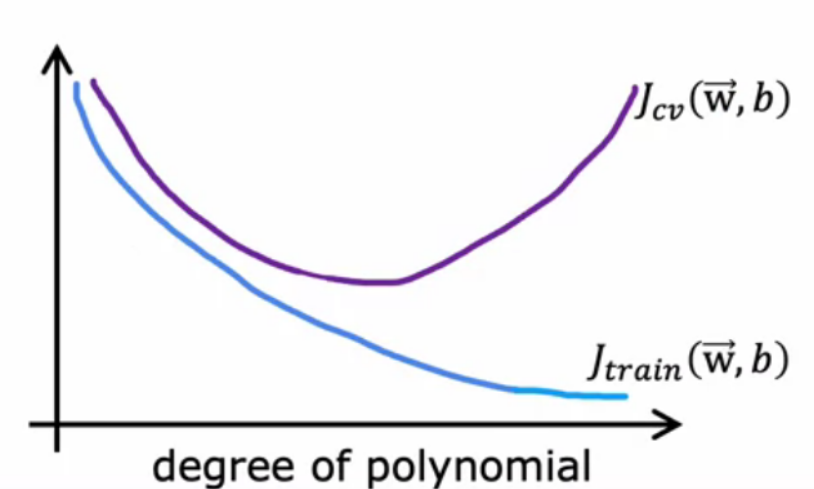
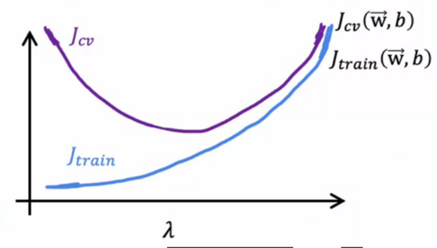
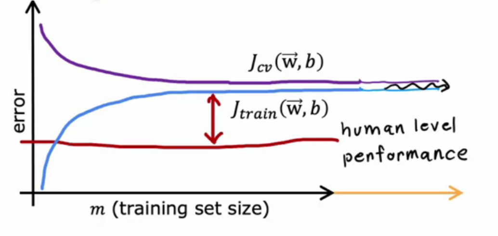
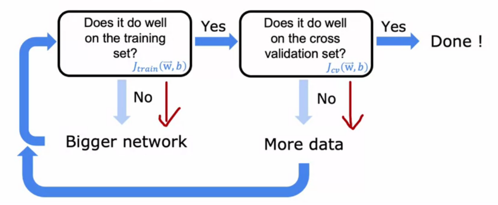

# optimization

<!-- @import "[TOC]" {cmd="toc" depthFrom=1 depthTo=6 orderedList=false} -->

<!-- code_chunk_output -->

- [optimization](#optimization)
    - [概述](#概述)
      - [1.evaluate a model](#1evaluate-a-model)
        - [(1) 划分数据集](#1-划分数据集)
        - [(2) 计算dev set的代价函数](#2-计算dev-set的代价函数)
        - [(3) 报告泛化误差](#3-报告泛化误差)
      - [2.bias 和 variance](#2bias-和-variance)
        - [(1) 定义](#1-定义)
        - [(2) 选择regularization $\lambda$参数](#2-选择regularization-lambda参数)
        - [(3) 确定基准性能（baseline performance）](#3-确定基准性能baseline-performance)
        - [(4) 对learning curve的影响](#4-对learning-curve的影响)
        - [(5) 处理bias或variance过高](#5-处理bias或variance过高)
        - [(6) 在neuron network中的影响](#6-在neuron-network中的影响)
      - [3. ML development process](#3-ml-development-process)
        - [(1) 整体流程](#1-整体流程)
        - [(2) error analysis](#2-error-analysis)
      - [4.增加训练数据方法](#4增加训练数据方法)
        - [(1) data augmentation](#1-data-augmentation)
        - [(2) data synthesis](#2-data-synthesis)
        - [(3) transfer learning](#3-transfer-learning)
      - [5.skewed data sets](#5skewed-data-sets)
          - [(1) 特殊的error metric](#1-特殊的error-metric)

<!-- /code_chunk_output -->

### 概述

#### 1.evaluate a model

##### (1) 划分数据集
* training set (60%)
    * 用于训练模型
* cross validation set (validation set、development set、dev set) (20%)
    * 用于evaluate the different model configurations you are choosing from（比如:模型使用哪种多项式，$x^2$还是$x^3$等）
* test set (20%)
    * 用于估计泛化误差，评价模型的性能

##### (2) 计算dev set的代价函数
* $J_{cv}(\vec w,b)$
* 当有多个模型配置时，选择$J_{cv}(\vec w,b)$最小的模型配置

##### (3) 报告泛化误差
* $J_{test}(\vec w,b)$

#### 2.bias 和 variance

##### (1) 定义
* bias: 区别对待的意思，即对训练数据区别对待，导致拟合度不够，即$J_{train}$和$J_{cv}$较大
* variance: 就是差值的意思，即验证数据的代价函数 远大于 训练数据的代价函数，即过拟合，即$J_{train}$较小，$J_{cv}$较大

* high bias和high variance同时存在: 即$J_{train}$较大，并且$J_{cv} \gg J_{train}$
    * 部分训练数据过拟合，部分训练数据拟合度不够

##### (2) 选择regularization $\lambda$参数

##### (3) 确定基准性能（baseline performance）

* 目标基准性能
    * human level performance 
        * 比如：对于语音识别人类能够达到的性能（准确率等）
    * competing algorithms performance
        * 其他算法训练出的性能（准确率等）
    * guess based on experience

* $J_{train}$与基准性能进行比较
    * 目标是$J_{train}$能够达到基准性能
    * 如果差距较大，说明high bias

##### (4) 对learning curve的影响

* high bias
    * 增加训练数据，不会有很大帮助

* high variance
    * 增加训练数据，有帮助

##### (5) 处理bias或variance过高 

* high bias
    * try getting additional features
    * try adding polynomial features
    * try descreasing $\lambda$

* high variance
    * get more training examples
    * try smaller set of features
    * try increasing $\lambda$

##### (6) 在neuron network中的影响

只要regularization设置合理，neurom network越大，性能越好

#### 3. ML development process

##### (1) 整体流程
* choose architecture
    * model, data, etc
    * 根据diagnostics结果，调整模型、参数、增加训练数据等
* train model
* diagnostics
    * bias, variance, and error analysis
* 重复上述步骤

##### (2) error analysis

* 比如：对于垃圾邮件识别模型，有$m_{cv}=500$条验证数据，结果有100条垃圾邮件未识别出
* 则将这些数据挑出来（如果数据很多，则采样）
* 尝试弄明白为什么出错，并对其分类（比如：关于药品的、钓鱼邮件等）
* 看哪一类错误率较高，错误率较低的可以不用管
* 优化：
    * 多搜集一些该类别的垃圾邮件，进行训练
    * 增加一些 关于该类别的 特征

#### 4.增加训练数据方法

##### (1) data augmentation
* 修改已存在的训练数据（要做现实中可能的修改，不要做无意义的修改），创造新的训练数据
* 适用：图像识别（比如进行缩放、旋转、扭曲等）、语音识别（比如添加一些背景音）
    
##### (2) data synthesis
* 自己造数据（可以写代码自动生成数据）
* 适用：computer vision
    
##### (3) transfer learning
* supervised pretraining
    * 先用**大数集**训练出一个neuron network
    * 这里的训练任务和下面的训练任务**有一定的相关性**
        * 比如 这些训练图片能够识别猫、狗等（训练数据有上百万）
        * 而下面的训练任务是识别手写的数字（训练数据只有几百几千）
        * 这两个任务都是对图片的识别
* fine tuning
    * 然后将训练好的模型拿过来，在此基础上用**较小数据集**调整
        * option 1: 修改输出层，用少量数据训练 输出层参数
        * option 1: 修改输出层，用少量数据训练重新训练 所有层参数
    * 输入数据 必须和supervised pretraining中的输入数据 类型一样
* 原理
    * 在supervised pretraining中，比如训练图片能够识别猫、狗等，前面几层相当于对特征的识别（比如：线条、基础图形等）
    * 在fine tuning中，比如同样是需要对图片进行识别，所以能够在此基础上进行调整

#### 5.skewed data sets

positive data和negative data 不均衡
* 比如一个罕见的病，只会有0.5%的人会得，所以只要预测不会得这个病，正确率就能达到99.5% 

###### (1) 特殊的error metric