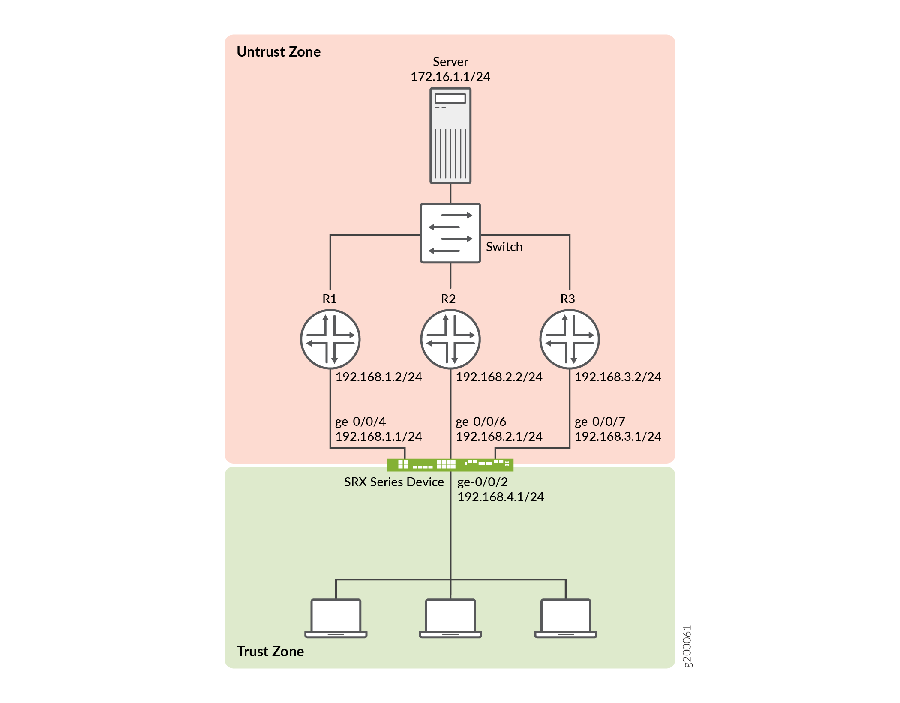
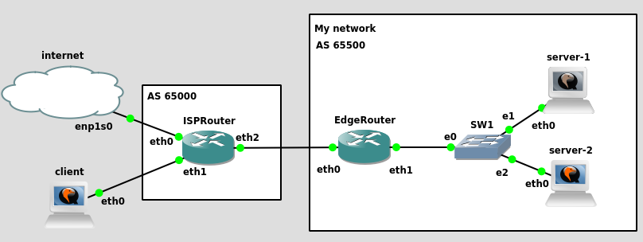

# ECMP

<!-- @import "[TOC]" {cmd="toc" depthFrom=1 depthTo=6 orderedList=false} -->

<!-- code_chunk_output -->

- [ECMP](#ecmp)
    - [概述](#概述)
      - [1.equal-cost multi-path](#1equal-cost-multi-path)
      - [2.如何工作](#2如何工作)
      - [3.结合BGP实现LoadBalance](#3结合bgp实现loadbalance)
        - [(1) 如果`10.13.13.1`是内部ip（即client不可见）](#1-如果1013131是内部ip即client不可见)

<!-- /code_chunk_output -->

### 概述

#### 1.equal-cost multi-path

* 是一种路由策略
* 下一跳路由转发可以有多条路径
* 没有ECMP的话
    * 下一跳只会有一条**确定**的路径
    * 只有在失败或者更新时，下一跳的路径才有可能改变

#### 2.如何工作

* 客户端访问 172.16.1.1
* SRX路由器那里设置了ECMP
    * 后面设置了三条路径到达172.16.1.1

#### 3.结合BGP实现LoadBalance

[参考](https://gist.github.com/bufadu/0c3ba661c141a2176cd048f65430ae8d?permalink_comment_id=3479895)

* EdgeRouter
    * eth0: 172.16.42.3
    * eth1: 10.12.12.254
    * enable **ECMP**
* server-1 and server-2 will announce the same public IP (10.13.13.1) to EdgeRouter using BGP
* server-1
    * eth0: 10.12.12.1
    * lo: 10.13.13.1
* server-2
    * eth0: 10.12.12.2
    * lo: 10.13.13.1

##### (1) 如果`10.13.13.1`是内部ip（即client不可见）

* 则在EdgeRouter上添加一个映射
    * destination address `172.16.42.3` -> translation address `10.13.13.1`
* 用户访问`172.16.42.3`