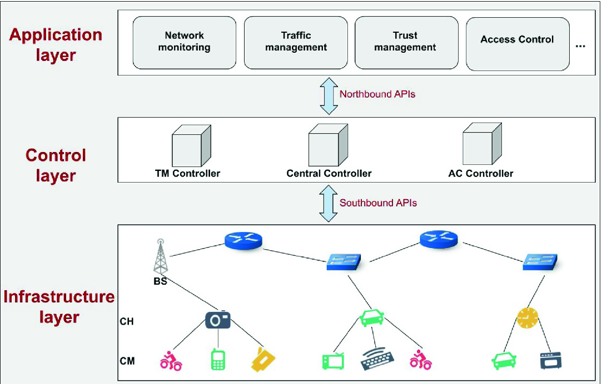
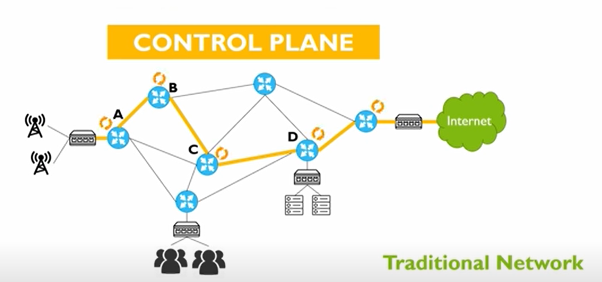

# SDN(software definitied network)

[toc]

### 概述

#### 1.SDN架构

* Southbound使用的协议：openflow

#### 2.与traditional network比较

* traditional network，每个device都有自己的控制平面，依靠自己的控制平面，决定路由等，如果需要改配置，每个device都要改
* SDN，对底层的设备进行了抽象，有**统一的控制平面**，在controller上进行配置，然后下发给各个device，不需要操作每台设备
