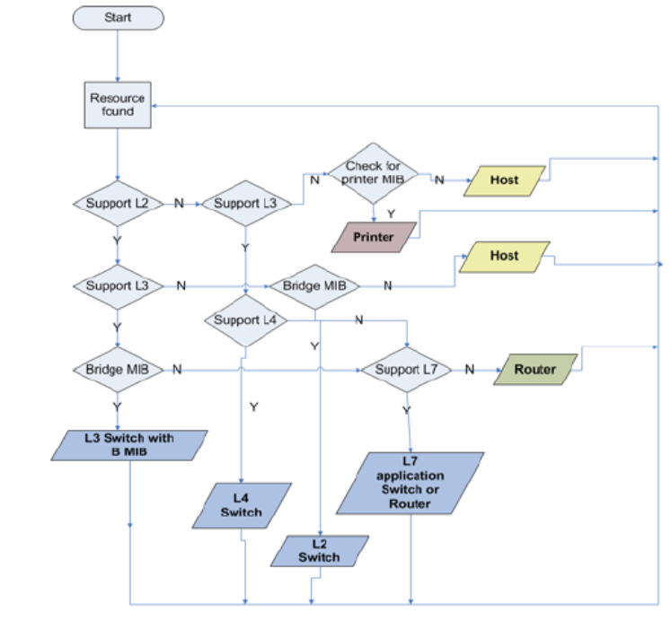

# topology discovery

[toc]

### 流程

* 需要的oid

|名称|oid|说明|
|-|-|-|
|sysServices|1.3.6.1.2.1.1.7|将获取的值转换成二进制，每一位对应osi上的一层，最低位对应osi的第一层|
|bridge mib|1.3.6.1.2.1.17|mac表信息，端口信息等|
|ospf|1.3.6.1.2.1.14||
|ipRouteTable|1.3.6.1.2.1.4.21|路由表|

#### 1.设备发现
* 输入一个网段和凭证
* 扫描网段，对存活ip进行snmp部署，获取路由表和arp表
* 根据路由表和arp进行其他网段扫描

#### 2.设备类型发现
* Router
* L3 switch
* L2 switch
* hosts



#### 3.连接发现（当设备有bridge mib时）

##### （1）LLDP
根据 对端的 mac 和 端口名 去匹配

##### （2）STP
```shell
[]display stp breif
[]display stp interface <INTERFACE>
#看designated port对应的mac，如果mac匹配本身不用管，如果mac匹配其他设备，则就可以建立连接
```

##### （3）mac地址表
* 分析类型为learned的条目
* 根据已经发现的连接，可以将部分条目去掉（将指定端口条目去掉），删除其他设备这些mac地址记录，再进行以下分析
* 一个端口，只有一个条目，则该端口与目标设备直连
* 找出直连的后，删除其他设备mac地址这条记录
* 重复上面的步骤
* 经过上述分析之后，再次去掉一些条目，再进行以下分析

#### 4.连接发现（当设备是router时，即没有bridge mib）

##### （1）OSPF
```shell
[]display ospf peer
```

##### （2）路由表
找出indirect的路由，然后查看下一跳，找到相应的设备
