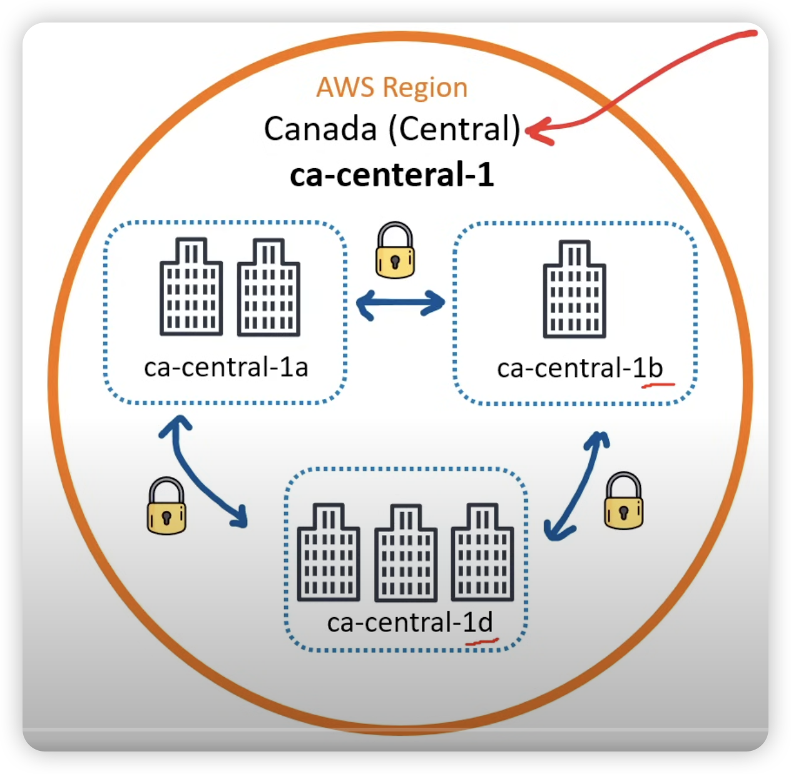
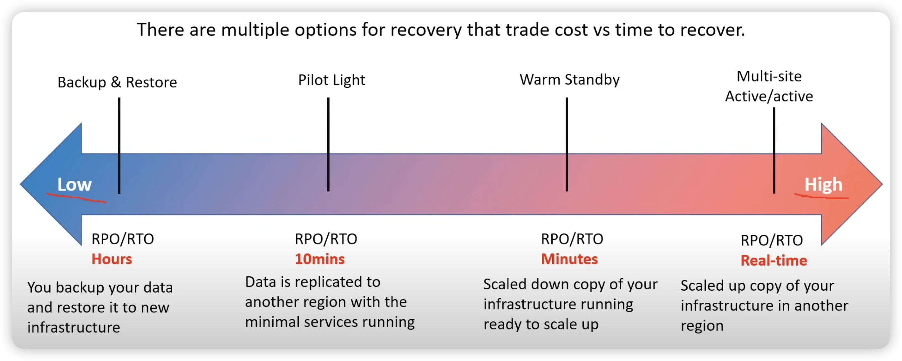
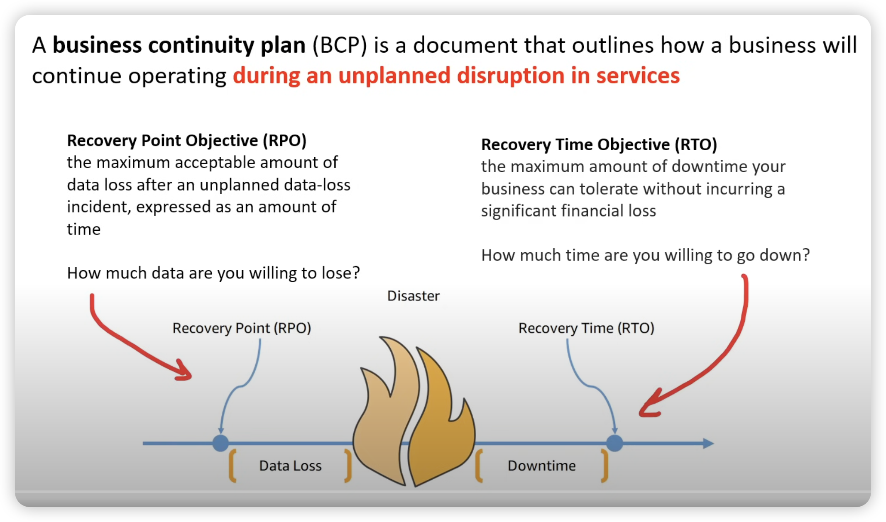

# disaster recovery

<!-- @import "[TOC]" {cmd="toc" depthFrom=1 depthTo=6 orderedList=false} -->

<!-- code_chunk_output -->

- [disaster recovery](#disaster-recovery)
    - [概述](#概述)
      - [1.disaster recovery](#1disaster-recovery)
      - [2.failure domain（故障域）](#2failure-domain故障域)
        - [（1）availability zone vs region](#1availability-zone-vs-region)
      - [3.容灾方案的五个要素](#3容灾方案的五个要素)
        - [（1）disaster recovery team（容灾团队）](#1disaster-recovery-team容灾团队)
        - [（2）risk evaluation（风险评估）](#2risk-evaluation风险评估)
        - [（3）Business-critical asset identification（关键业务资产确认）](#3business-critical-asset-identification关键业务资产确认)
        - [（4）backups（备份）](#4backups备份)
        - [（5）Testing and optimization（测试和优化）](#5testing-and-optimization测试和优化)
      - [4.容灾系统的分类](#4容灾系统的分类)
        - [（1）数据级容灾](#1数据级容灾)
        - [（2）应用级容灾](#2应用级容灾)
        - [（3）业务级容灾](#3业务级容灾)
      - [5.容灾的等级](#5容灾的等级)
        - [（1）第 0 级：没有备份中心](#1第-0-级没有备份中心)
        - [（2）第 1 级：本地磁带备份，异地保存](#2第-1-级本地磁带备份异地保存)
        - [（3）第 2 级：热备份站点备份（主备模式）](#3第-2-级热备份站点备份主备模式)
        - [（4）第 3 级：活动备份中心（双活模式，需要实时进行数据的复制）](#4第-3-级活动备份中心双活模式需要实时进行数据的复制)
      - [6.容灾的关键技术](#6容灾的关键技术)
        - [（1）远程镜像技术](#1远程镜像技术)
        - [（2）快照技术](#2快照技术)
        - [（3）互连技术](#3互连技术)
      - [7.技术指标](#7技术指标)
        - [（1）RPO（recovery point objective）](#1rporecovery-point-objective)
        - [（2）RTO（recovery time objective）](#2rtorecovery-time-objective)

<!-- /code_chunk_output -->

### 概述

#### 1.disaster recovery

容灾系统是指在相隔较远的异地，建立两套或多套功能相同的 IT 系统，互相之间可以进行健康状态监视和功能切换，当一处系统因意外（如火灾、地震等）停止工作时，整个应用系统可以切换到另一处，使得该系统功能可以继续正常工作。

#### 2.failure domain（故障域）

一个故障域，就是其中某个资源出现问题，会相互影响
不同的故障域，资源是相互独立的，不会影响到对方

##### （1）availability zone vs region

-   region 是地理区域，由地理位置靠近的 zone 组成，一个 region 也是一个故障域（防止某地因为发生自然灾害，导致该地区的服务不可用）
    -   each region generally has three Availability Zone
        
-   an AZ is physical location made up of one or more datacenter
    -   all the AZs in the same region will be isolated from each other
    -   its common practice to run workloads in at least 3 AZs to ensure services remain available in case one or two datacenters fail

#### 3.容灾方案的五个要素

##### （1）disaster recovery team（容灾团队）

需要明确团队中每个人的职责

##### （2）risk evaluation（风险评估）

评估可能发生的风险

##### （3）Business-critical asset identification（关键业务资产确认）

知道哪些是关键的业务资产，需要特别考虑

##### （4）backups（备份）

确定要备份的内容，备份的频率，多长时间能够恢复等

##### （5）Testing and optimization（测试和优化）

不断测试和优化容灾方案

#### 4.容灾系统的分类

##### （1）数据级容灾

通过建立异地容灾中心，做数据的远程备份，在灾难发生之后要确保原有的数据不会丢失或者遭到破坏，但在数据级容灾这个级别，发生灾难时应用是会中断的。

##### （2）应用级容灾

在数据级容灾的基础之上，在备份站点同样构建一套相同的应用系统，通过同步或异步复制技术，这样可以保证关键应用在允许的时间范围内恢复运行，尽可能减少灾难带来的损失，让用户基本感受不到灾难的发生

##### （3）业务级容灾

全业务的灾备，除了必要的 IT 相关技术，还要求具备全部的基础设施。其大部分内容是非 IT 系统（如电话、办公地点等），当大灾难发生后，原有的办公场所都会受到破坏，除了数据和应用的恢复，更需要一个备份的工作场所能够正常的开展业务。

#### 5.容灾的等级

-   pilot light
    -   data is replicated to another region with the minimal services running

##### （1）第 0 级：没有备份中心

实际上没有灾难恢复能力，它只在本地进行数据备份，并且被备份的数据只在本地保存，没有送往异地

##### （2）第 1 级：本地磁带备份，异地保存

在本地将关键数据备份，然后送到异地保存。

##### （3）第 2 级：热备份站点备份（主备模式）

在异地建立一个热备份点，通过网络进行数据备份。备份站点一般只备份数据，不承担业务。当出现灾难时，备份站点接替主站点的业务，从而维护业务运行的连续性。

##### （4）第 3 级：活动备份中心（双活模式，需要实时进行数据的复制）

在相隔较远的地方分别建立两个数据中心，它们都处于工作状态，并进行相互数据备份。当某个数据中心发生灾难时，另一个数据中心接替其工作任务

-   分为两种：
    -   两个数据中心之间只限于关键数据的相互备份
    -   两个数据中心之间互为镜像，即零数据丢失等

#### 6.容灾的关键技术

##### （1）远程镜像技术

备份中心从主数据中心复制数据

##### （2）快照技术

远程镜像技术往往同快照技术结合起来实现远程备份，即通过镜像把数据备份到远程存储系统中，再用快照技术把远程存储系统中的信息备份到远程的磁带库、光盘库中。

##### （3）互连技术

早期的主数据中心和备援数据中心之间的数据备份，主要是基于 SAN 的远程复制（镜像），即通过光纤通道 FC，把两个 SAN 连接起来，进行远程镜像（复制）
目前，出现了多种基于 IP 的 SAN 的远程数据容灾备份技术。它们是利用基于 IP 的 SAN 的互连协议，将主数据中心 SAN 中的信息通过现有的 TCP/IP 网络，远程复制到备援中心 SAN 中

#### 7.技术指标

##### （1）RPO（recovery point objective）

数据恢复点目标，主要指的是业务系统所能容忍的数据丢失量

##### （2）RTO（recovery time objective）

即恢复时间目标，主要指的是所能容忍的业务停止服务的最长时间
