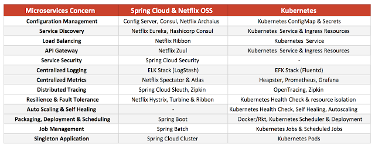
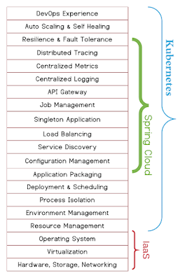

# overview

<!-- @import "[TOC]" {cmd="toc" depthFrom=1 depthTo=6 orderedList=false} -->
<!-- code_chunk_output -->

- [overview](#overview)
    - [概述](#概述)
      - [1.微服务存在的问题](#1微服务存在的问题)
      - [2.微服务架构（以传统方式为例）](#2微服务架构以传统方式为例)
      - [3.传统微服务架构 与 云原生微服务架构 对比](#3传统微服务架构-与-云原生微服务架构-对比)
      - [4.服务编排](#4服务编排)
        - [（1）what](#1what)
        - [（2）why](#2why)
      - [5.三种常见的服务编排方式](#5三种常见的服务编排方式)
        - [（1）Orchestration](#1orchestration)
        - [（2）Choreography](#2choreography)
        - [（3）API网关](#3api网关)

<!-- /code_chunk_output -->

### 概述

#### 1.微服务存在的问题

#### 2.微服务架构（以传统方式为例）

* 架构说明

|服务|说明|
|-|-|
|Auth Service|用于认证，实现SSO|
|Account Service|提供用户和角色管理|

#### 3.传统微服务架构 与 云原生微服务架构 对比
[参考](https://dzone.com/articles/deploying-microservices-spring-cloud-vs-kubernetes)

#### 4.服务编排

##### （1）what
与传统架构相比，微服务架构下会更依赖通过各微服务之间的协作来实现一个完整的业务流程，这种协作就是服务编排
编排涉及到RPC、分布式事务等，需要有完善的编排框架来支撑

##### （2）why

使多个微服务进行协作，从而提供某些功能，这样提高了微服务的复用性，不必要重复开发

#### 5.三种常见的服务编排方式

##### （1）Orchestration
通过一个可执行的流程来协同内部及外部的服务交互，通过流程来控制总体的目标、涉及的操作、服务调用顺序（比如google的workflow，类似于jenkins的流水线）

##### （2）Choreography
通过消息的交互序列来控制各个部分资源的交互，参与交互的资源都是对等的，没有集中的控制

##### （3）API网关
每笔业务到来后先到达网关，网关调用各微服务，并最终聚合/拆分需反馈的结果
