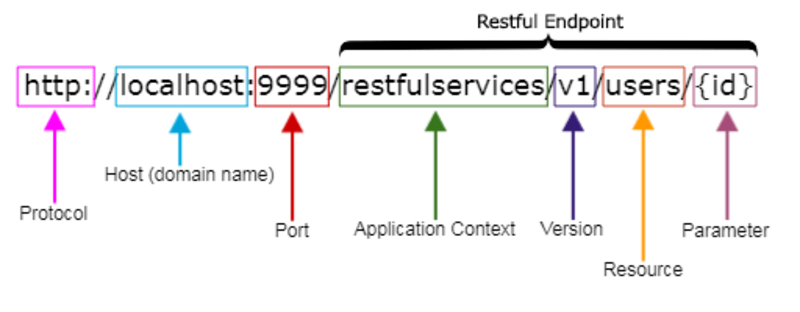
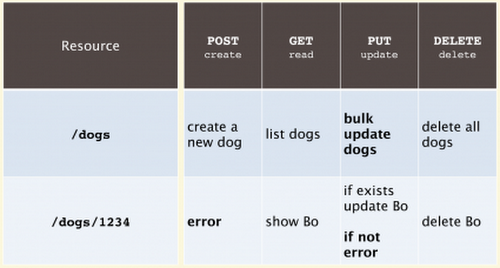

# restful

<!-- @import "[TOC]" {cmd="toc" depthFrom=1 depthTo=6 orderedList=false} -->
<!-- code_chunk_output -->

- [restful](#restful)
    - [概述](#概述)
      - [1.restful规范](#1restful规范)

<!-- /code_chunk_output -->

### 概述

#### 1.restful规范  

* 全部**使用名词**，**不要使用动词**
  * 因为使用动词的话，会导致API数量增多，不利于后期维护和使用者使用
* 利用http方法来实现动词的能力

