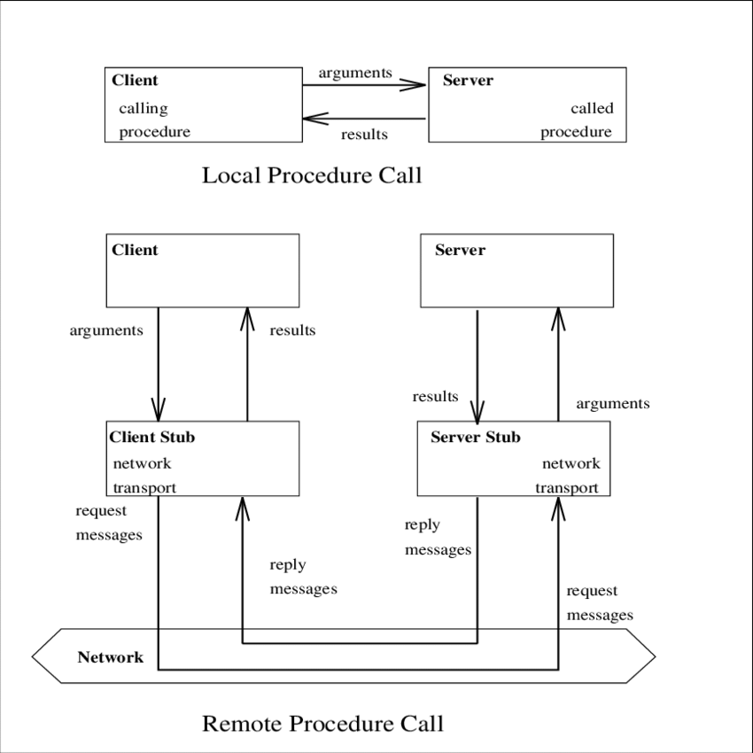
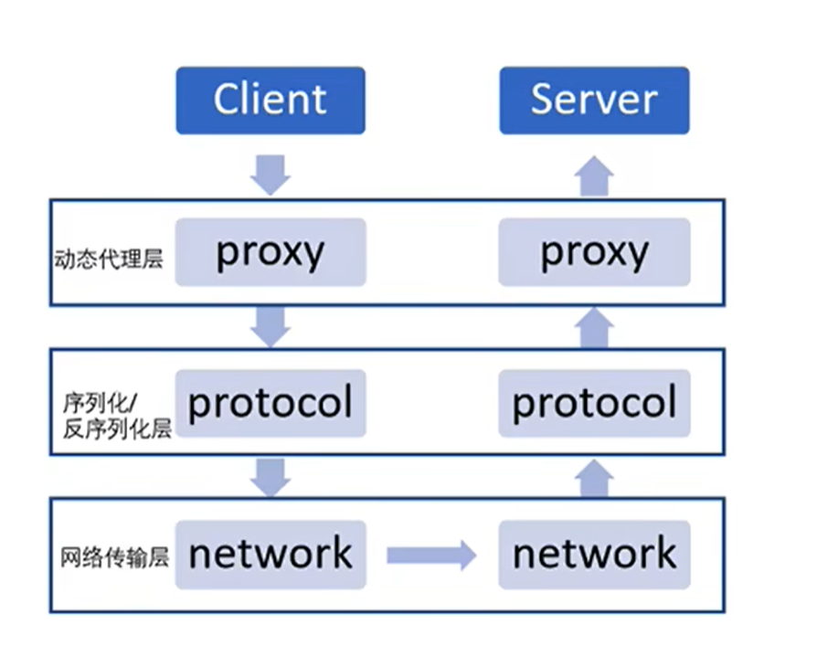
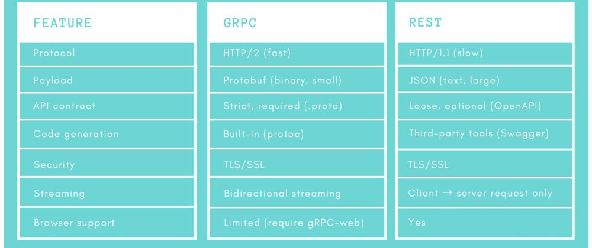
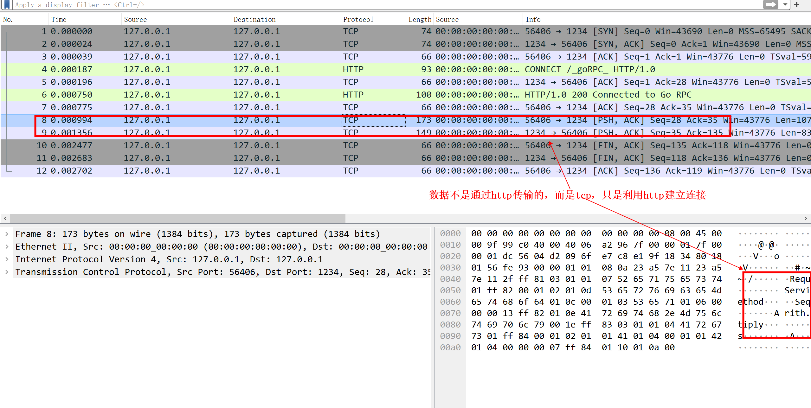
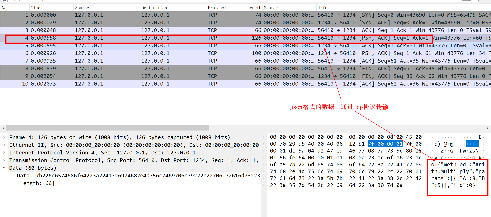
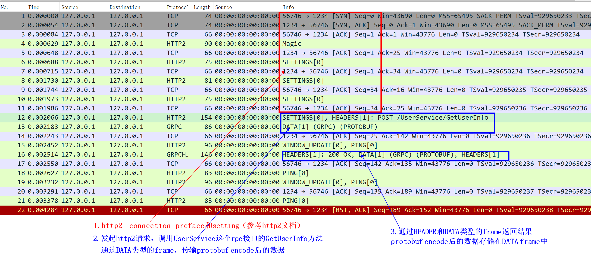
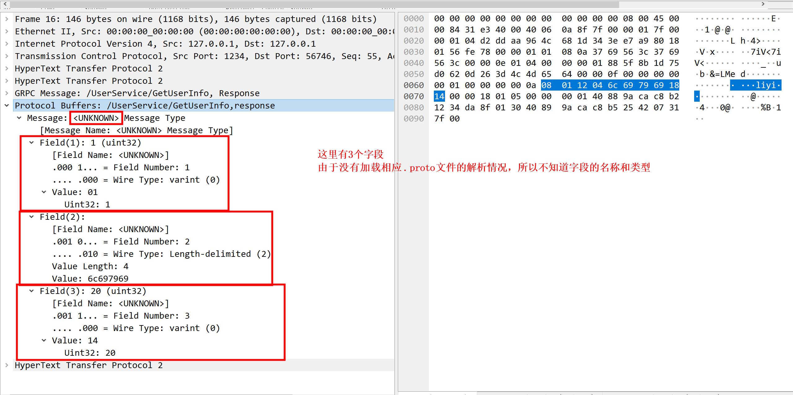
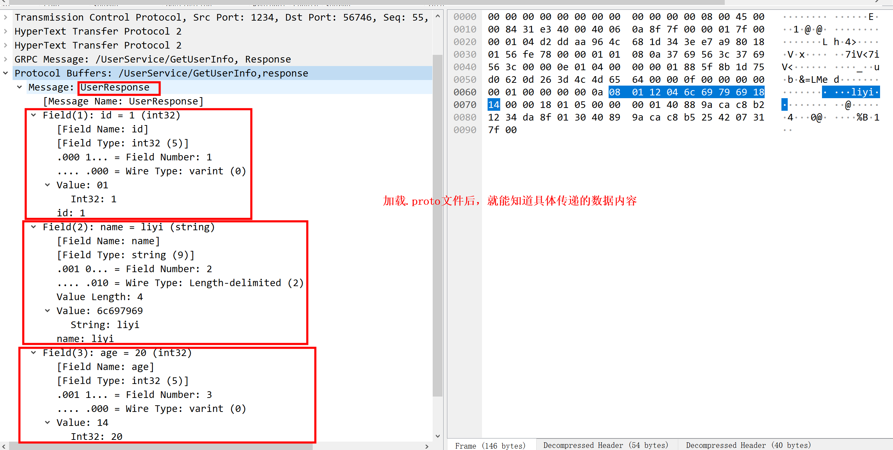

# RPC

<!-- @import "[TOC]" {cmd="toc" depthFrom=1 depthTo=6 orderedList=false} -->
<!-- code_chunk_output -->

- [RPC](#rpc)
    - [预备知识](#预备知识)
      - [1.动态代理](#1动态代理)
    - [概述](#概述)
      - [1.RPC(remote procedure call)](#1rpcremote-procedure-call)
      - [2.底层原理](#2底层原理)
        - [（1）动态代理](#1动态代理-1)
        - [（2）序列化和反序列化](#2序列化和反序列化)
        - [（3）网络存储](#3网络存储)
      - [3.分布式通信的解决方案: http 或者 rpc](#3分布式通信的解决方案-http-或者-rpc)
        - [（1）RestFul 与 RPC 比较](#1restful-与-rpc-比较)
    - [rpc（以go的`net/rpc`为例）](#rpc以go的netrpc为例)
      - [1.go中的rpc库说明](#1go中的rpc库说明)
      - [2.rpc（序列化:gob、协议:http）](#2rpc序列化gob-协议http)
        - [（1）server端](#1server端)
        - [（2）client端](#2client端)
        - [（3）抓包分析](#3抓包分析)
      - [3.rpc（序列化:gob、协议:tcp）](#3rpc序列化gob-协议tcp)
        - [（1）server](#1server)
        - [（2）client](#2client)
      - [4.rpc（序列化:json、协议:tcp）](#4rpc序列化json-协议tcp)
        - [（1）server](#1server-1)
        - [（2）client](#2client-1)
        - [（3）抓包分析](#3抓包分析-1)
    - [grpc](#grpc)

<!-- /code_chunk_output -->

### 预备知识

#### 1.动态代理
* 用来**包装**原始方法调用，用于**增强或改写**现有方法的逻辑，类似于**python的装饰函数**
* python中可以使用类的__getattribute__方法装饰原有函数，从而实现动态代理
* 好处是可以为某些类或函数动态添加某些功能，而不需重写这个类或函数

***

### 概述

#### 1.RPC(remote procedure call)


* stub隐藏了底层的实现细节
* server stub
  * 绑定相关函数（即能够被远程调用的函数）
  * 负责监听指定端口
* client stub
  * 与server stub建立通信
  * 传入相关参数:
    * 要调用的函数名
    * 传入的参数
    * 接收返回值

* 常见的RPC框架实现:
  * dubbo（只支持java）
  * thrift（跨语言）
  * grpc（跨语言）
  * go中的net/rpc库（只支持go）

* 注意：两边stub需要使用相同实现的rpc，不然无法进行通信

#### 2.底层原理


##### （1）动态代理
对底层进行封装，提供stub，用户只要关心，需要调用的函数名、参数和返回结果

##### （2）序列化和反序列化
即如何传输数据，常用的方式: json、protobuf等

##### （3）网络存储
即如何传输序列化后的数据，常用的方式: tcp、http、http2等

#### 3.分布式通信的解决方案: http 或者 rpc


##### （1）RestFul 与 RPC 比较

* 都是跨应用调用的解决方案
* RestFul利用**HTTP协议+json**，HTTP协议有用信息占比少（包含了大量的HTTP头等信息），效率低（工作在第七层）
* RPC通常使用TCP或UDP协议，也可以使用HTTP协议，因此效率更高

***

### rpc（以go的`net/rpc`为例）

#### 1.go中的rpc库说明
* 没有超时处理的功能
* 支持两种协议: http、tcp
* 支持两种序列化: gob、json
  * 当使用gob时，其他语言编写的client端就无法连接到服务端

#### 2.rpc（序列化:gob、协议:http）

##### （1）server端

```go
//定义参数的结构体（rpc规范要求：参数名必须大写）
type Args struct {
	A, B int
}

//定义一个Arith类
type Arith int

//绑定一个Multiply方法
//rpc方法的要求
//	接收两个参数：参数（需要以结构体的形式传入）、接收返回值
func (t *Arith) Multiply(args *Args, reply *int) error {
	*reply = args.A * args.B
	return nil
}

func main() {
	//实例化Arith类
	arith := new(Arith)
	//注册到rpc中
	rpc.Register(arith)
	//rpc绑定到http协议上
	rpc.HandleHTTP()

	//启动rpc server
	l, e := net.Listen("tcp", ":1234")
	if e != nil {
		log.Fatal("listen error:", e)
	}
	http.Serve(l, nil)
}
```

##### （2）client端
```go
//定义参数的结构体（rpc规范要求：参数名必须大写）
type Args struct {
	A, B int
}

func main() {
	client, err := rpc.DialHTTP("tcp", "127.0.0.1" + ":1234")
	if err != nil {
		log.Fatal("dialing:", err)
	}


	args := &Args{8,5}

	var reply int
	//进行rpc调研，需要传入三个参数: rpc方法名、参数（结构体）、接收返回值
	err = client.Call("Arith.Multiply", args, &reply)
	if err != nil {
		log.Fatal("arith error:", err)
	}
	fmt.Println(reply)


  //下面是用异步的方式进行rpc调用

	//var reply int
	//divCall := client.Go("Arith.Multiply", args, &reply, nil)
	//replyCall := <-divCall.Done	// will be equal to divCall
	//if replyCall.Error != nil {
	//	fmt.Println("error")
	//}
	//fmt.Println(reply)
}
```

##### （3）抓包分析


#### 3.rpc（序列化:gob、协议:tcp）

##### （1）server
```go
//Args 和 类Arith 就是stub，需要通知给client，不然client不知道如何进行远程调用

//定义参数的结构体（rpc规范要求：参数名必须大写）
type Args struct {
	A, B int
}

//定义一个Arith类
type Arith int

//绑定一个Multiply方法
//rpc方法的要求
//	接收两个参数：参数（需要以结构体的形式传入）、接收返回值
func (t *Arith) Multiply(args *Args, reply *int) error {
	*reply = args.A * args.B
	return nil
}

func main() {

	//实例化Arith类
	arith := new(Arith)
	//注册到rpc中
	rpc.Register(arith)

	//启动rpc server
	l, e := net.Listen("tcp", ":1234")
	if e != nil {
		log.Fatal("listen error:", e)
	}
	for {
		conn, err := l.Accept()
		if err != nil {
			continue
		}
		rpc.ServeConn(conn)
	}

}
```

##### （2）client
```go
//定义参数的结构体（rpc规范要求：参数名必须大写）
type Args struct {
	A, B int
}

func main() {
	client, err := rpc.Dial("tcp", "127.0.0.1" + ":1234")
	if err != nil {
		log.Fatal("dialing:", err)
	}


	args := &Args{8,5}

	var reply int
	//进行rpc调研，需要传入三个参数: rpc方法名、参数（结构体）、接收返回值
	err = client.Call("Arith.Multiply", args, &reply)
	if err != nil {
		log.Fatal("arith error:", err)
	}
	fmt.Println(reply)
}
```

#### 4.rpc（序列化:json、协议:tcp）

##### （1）server
```go
//Args 和 类Arith 就是stub，需要通知给client，不然client不知道如何进行远程调用

//定义参数的结构体（rpc规范要求：参数名必须大写）
type Args struct {
	A, B int
}

//定义一个Arith类
type Arith int

//绑定一个Multiply方法
//rpc方法的要求
//	接收两个参数：参数（需要以结构体的形式传入）、接收返回值
func (t *Arith) Multiply(args *Args, reply *int) error {
	*reply = args.A * args.B
	return nil
}

func main() {

	//实例化Arith类
	arith := new(Arith)
	//注册到rpc中
	rpc.Register(arith)

	//启动rpc server
	l, e := net.Listen("tcp", ":1234")
	if e != nil {
		log.Fatal("listen error:", e)
	}
	for {
		conn, err := l.Accept()
		if err != nil {
			continue
		}
		jsonrpc.ServeConn(conn)
	}

}
```

##### （2）client
```go
//定义参数的结构体（rpc规范要求：参数名必须大写）
type Args struct {
	A, B int
}

func main() {
	client, err := jsonrpc.Dial("tcp", "127.0.0.1" + ":1234")
	if err != nil {
		log.Fatal("dialing:", err)
	}


	args := &Args{8,5}

	var reply int
	//进行rpc调研，需要传入三个参数: rpc方法名、参数（结构体）、接收返回值
	err = client.Call("Arith.Multiply", args, &reply)
	if err != nil {
		log.Fatal("arith error:", err)
	}
	fmt.Println(reply)


	//var reply int
	//divCall := client.Go("Arith.Multiply", args, &reply, nil)
	//replyCall := <-divCall.Done	// will be equal to divCall
	//if replyCall.Error != nil {
	//	fmt.Println("error")
	//}
	//fmt.Println(reply)
}
```

##### （3）抓包分析


***

### grpc





[参考](../../../programming/go/modules/grpc_protobuf.md)
