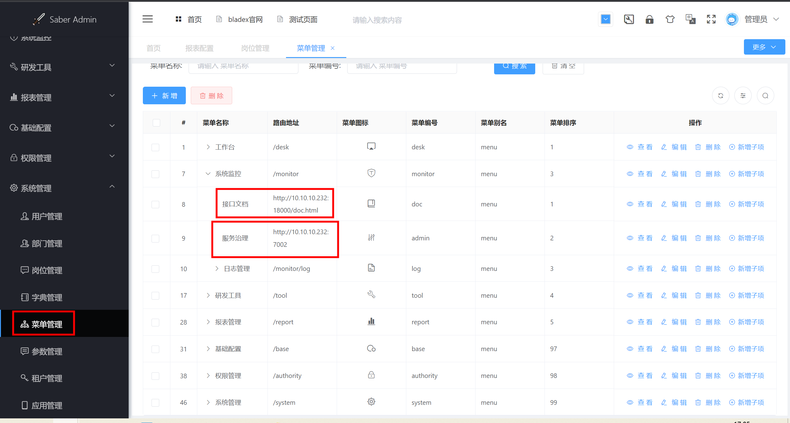

# spring blade

[toc]

[后端](https://github.com/chillzhuang/SpringBlade)
[前端](https://gitee.com/smallc/Saber)

### 概述

#### 1.服务说明

```shell
SpringBlade
├── blade-auth -- 授权服务提供
├── blade-common -- 常用工具封装包（无需启动）
├── blade-gateway -- Spring Cloud 网关
├── blade-ops -- 运维中心
├    ├── blade-admin -- spring-cloud后台管理
├    ├── blade-develop -- 代码生成
├    ├── blade-resource -- 资源管理
├    ├── blade-seata-order -- seata分布式事务demo
├    ├── blade-seata-storage -- seata分布式事务demo
├── blade-service -- 业务模块
├    ├── blade-desk -- 工作台模块
├    ├── blade-log -- 日志模块
├    ├── blade-system -- 系统模块
├    └── blade-user -- 用户模块
├── blade-service-api -- 业务模块api封装
├    ├── blade-desk-api -- 工作台api
├    ├── blade-dict-api -- 字典api
├    ├── blade-system-api -- 系统api
└──  └── blade-user-api -- 用户api
```

***

### 部署后端

#### 1.部署基础服务

##### （1）部署nacos
* 启动nacos服务
```shell
docker run --name nacos-standalone -e MODE=standalone -d -p 8848:8848 -p 9848:9848 -p 9849:9849 nacos/nacos-server:2.0.0
```

* 导入配置到nacos中
  * `doc/nacos/blade.yaml`
    * 修改sentinel的配置
    ```yaml
    spring:
      cloud:
        sentinel:
          eager: true   #是否开启
          transport:
            dashboard: <sentinel_endpoint>
    ```
  * `doc/nacos/blade-dev.yaml`
    * 修改redis和mysql的配置

##### （2）部署sentinel（不是必须）

sentinel用于服务治理

```shell
docker run --name sentinel -d -p 8858:8858 -d bladex/sentinel-dashboard
```

##### （3）初始化数据库
数据库脚本：`doc/sql/blade/blade-saber-mysql.sql`

#### 2.其他服务的配置

##### （1） 配置sentinel（在配置服务器上配置）
```yaml
spring:
  cloud:
    sentinel:
      eager: true
      transport:
        dashboard: localhost:8880
```

#### 部署其他服务

##### （1）构建
```shell
mvn clean package -DskipTests=true
```

##### （2）启动其他服务
```shell
nohup java -Xms1G -Xmx1G -jar blade-auth/target/blade-auth.jar &

nohup java -Xms1G -Xmx1G -jar blade-service/blade-desk/target/blade-desk.jar &
nohup java -Xms1G -Xmx1G -jar blade-service/blade-log/target/blade-log.jar &
nohup java -Xms1G -Xmx1G -jar blade-service/blade-user/target/blade-user.jar &
nohup java -Xms1G -Xmx1G -jar blade-service/blade-system/target/blade-system.jar &
nohup java -Xms1G -Xmx1G -jar blade-ops/blade-resource/target/blade-resource.jar &
nohup java -Xms1G -Xmx1G -jar blade-ops/blade-develop/target/blade-develop.jar &
nohup java -Xms1G -Xmx1G -jar blade-ops/blade-report/target/blade-report.jar &
nohup java -Xms1G -Xmx1G -jar blade-ops/blade-admin/target/blade-admin.jar &
nohup java -Xms1G -Xmx1G -jar blade-ops/blade-swagger/target/blade-swagger.jar &

nohup java -Xms1G -Xmx1G -jar blade-gateway/target/blade-gateway.jar &
```

* 停止所有服务
```shell
for i in `jps | awk '{print $1}'`;do kill $i;done
```

#### 服务访问地址

```shell
#服务治理(sentinel)
http://<ip>:8858/

#spring boot后台管理:
http://<ip>:7002

#接口服务：
http://<ip>:18000/doc.html

#报表服务:
http://<ip>:8108/ureport/designer
```

***

### 部署前端

#### 1.构建
```shell
npm config set registry https://registry.npm.taobao.org/
npm run build || (npm install --ignore-scripts && npm run build)
```

#### 2.部署（需要nginx）

##### （1）修改配置
```shell
$ vim docker/nginx.k8s.conf

#修改gateway暴露的地址
upstream gateway {
    server <ip:port>;
}  
```

##### （2）部署
```shell
cp docker/nginx.k8s.conf /etc/nginx/nginx.conf
cp -r dist /usr/share/nginx/html
systemctl restart nginx
```

***

### 使用和配置

#### 1.配置菜单


#### 2.使用代码生成
数据源需要配置正确，才能够生成代码
