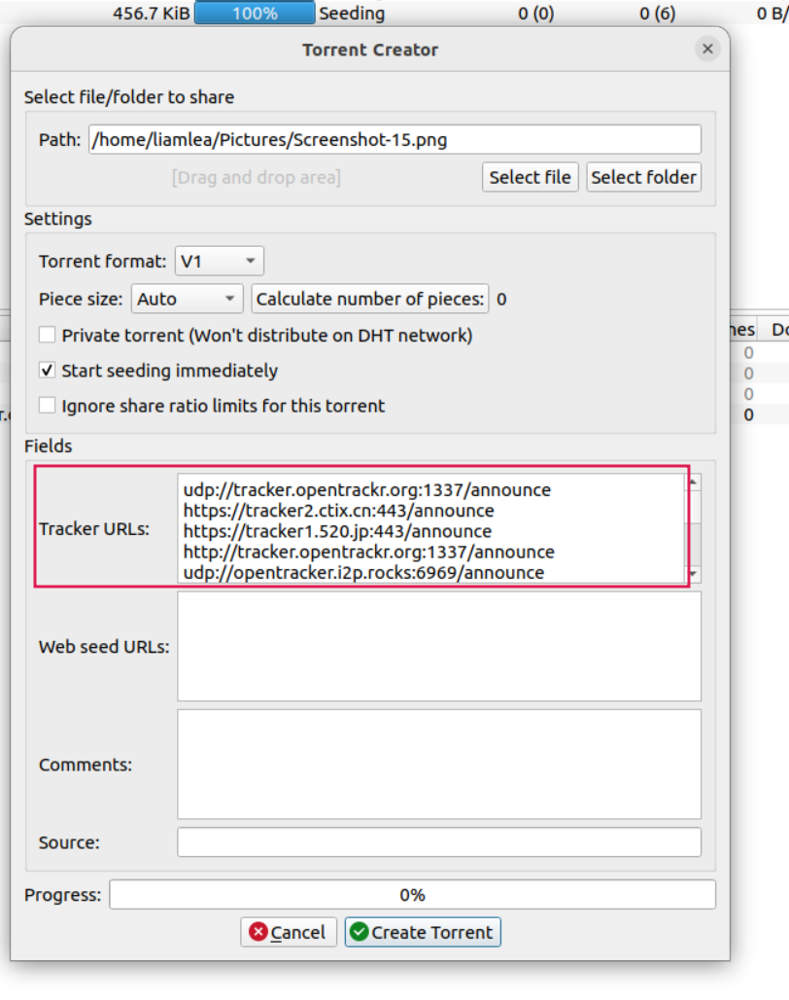

# bittorrent


<!-- @import "[TOC]" {cmd="toc" depthFrom=1 depthTo=6 orderedList=false} -->

<!-- code_chunk_output -->

- [bittorrent](#bittorrent)
    - [概述](#概述)
      - [1.基础概念](#1基础概念)
        - [(1) seed](#1-seed)
        - [(2) peer](#2-peer)
        - [(3) leech](#3-leech)
        - [(4) bittorrent中的字段解释](#4-bittorrent中的字段解释)
      - [2.原理简述](#2原理简述)
    - [使用](#使用)
      - [1.显示torrent file信息](#1显示torrent-file信息)
      - [2.运行tracker (以qbittorrent为例)](#2运行tracker-以qbittorrent为例)
        - [(1) 前提条件](#1-前提条件)
        - [(2) 开启tracer](#2-开启tracer)
        - [(3) 创建torrent file](#3-创建torrent-file)
        - [(4) 使用DHT client根据torrent file进行下载](#4-使用dht-client根据torrent-file进行下载)
      - [3.共享文件 (利用DHT和public trackers)](#3共享文件-利用dht和public-trackers)
        - [(1) 前提条件](#1-前提条件-1)
        - [(2) 创建torrent file](#2-创建torrent-file)
        - [(3) 使用DHT client根据torrent file进行下载](#3-使用dht-client根据torrent-file进行下载)

<!-- /code_chunk_output -->

### 概述

#### 1.基础概念

##### (1) seed
拥有完整文件并上传（可供其他节点下载）的节点

##### (2) peer
正在下载且同时还在上传的节点

##### (3) leech
没有上传的节点

##### (4) bittorrent中的字段解释

Trackers中个字段的意思
* seeds
    * seed地址数量，即tracker能够发现这个资源的seed的地址数量
* peers
    * peer地址数量，即tracker能够发现这个资源的peer的地址数量
* leeches
    * leech地址数量，即tracker能够发现这个资源的leech的地址数量
* downloaded
    * 这个资源被下载的次数

#### 2.原理简述

* DHT通过gossip protocol，交换DHT peers的信息，从而能够互相发现
* 有些DHT peer扮演tracker的角色，保存 文件hash和相应的peers的信息，当查找文件时，可以很快找到对应的peers
  * 从而提高效率

***

### 使用

#### 1.显示torrent file信息

```shell
aria2c -S <torrent_file>
```

#### 2.运行tracker (以qbittorrent为例)

##### (1) 前提条件

* 需要有公网ip地址

##### (2) 开启tracer

* Preferences -> Advanced -> Enable embedded tracker 并设置port

##### (3) 创建torrent file

这里使用ipv6地址
* Tracker URLs:
    * `http://[240e:479:1020:a42:aac7:4b5b:5c12:6e2e]:9000/announce`

* 指定的文件处于seeding状态
    * 当创建成功后，指定的文件就处于seeding状态中，即可以被其他peer下载

##### (4) 使用DHT client根据torrent file进行下载

* 直接使用
* 转换成magnet link (磁力链接)
    * `aria2c -S <torrent_file>`会显示磁力链接的地址

#### 3.共享文件 (利用DHT和public trackers)

##### (1) 前提条件
* 需要有公网ip地址
* 需要设置几个[public trackers](https://raw.githubusercontent.com/ngosang/trackerslist/master/trackers_all.txt)
    * 因为有些tracker不可达
    * 因为不是所有tracker都能及时更新自己的peer信息

##### (2) 创建torrent file



##### (3) 使用DHT client根据torrent file进行下载
* 直接使用
* 转换成magnet link (磁力链接)
    * `aria2c -S <torrent_file>`会显示磁力链接的地址