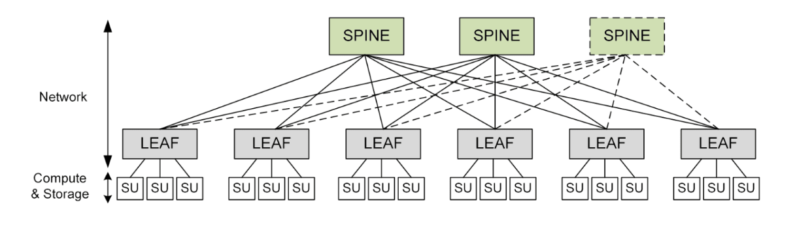

# data center

[toc]

### 概述

#### 1.网络架构的演进

##### (1) 3-tier architecture
适合**north-south流量**多的场景
很多东西向的流量会在core核心层进行路由

* Access layer（接入层）
  * 控制终端用户访问网络资源

* Distribution layer（分发层/汇聚层）
提供路由、过滤、管理等功能

* Core layer（核心层）
网络骨干网，负责路由大量流量

##### (2) spine-and-leaf architecture
适合**east-west流量**多的场景
全网状

