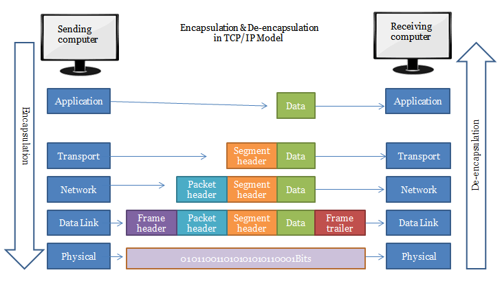

# overview

<!-- @import "[TOC]" {cmd="toc" depthFrom=1 depthTo=6 orderedList=false} -->
<!-- code_chunk_output -->

- [overview](#overview)
    - [概述](#概述)
      - [1.各层的数据单元](#1各层的数据单元)
        - [(1) 工作原理](#1-工作原理)
      - [2.session相关概念](#2session相关概念)
        - [(1) session endpoint](#1-session-endpoint)
        - [(2) session](#2-session)
        - [(3) session direction](#3-session-direction)

<!-- /code_chunk_output -->

### 概述

#### 1.各层的数据单元
|protocol|PDU (protocol data unit)|控制PDU大小的参数|
|-|-|-|
|tcp|segment|MSS (maximum segment size), 默认值: 1500-40=1460|
|ip|packet (fragment)|MTU (maximum transmission unit), 默认值: 1500|
|data link layer|frame|

##### (1) 工作原理

* tcp会根据MSS（maximum segment size），将数据分为多个segment
* 然后将每个segment封装为ip packet
* ip协议会根据MTU（Maximum Transmission Unit），会将ip数据报分为多个fragment
* 接收端会reassemble ip fragment

#### 2.session相关概念

##### (1) session endpoint
ip:port

##### (2) session
一对session endpoints组成session

##### (3) session direction
对于TCP，根据SYN判断
对于UDP，根据谁发送第一个数据包判断
