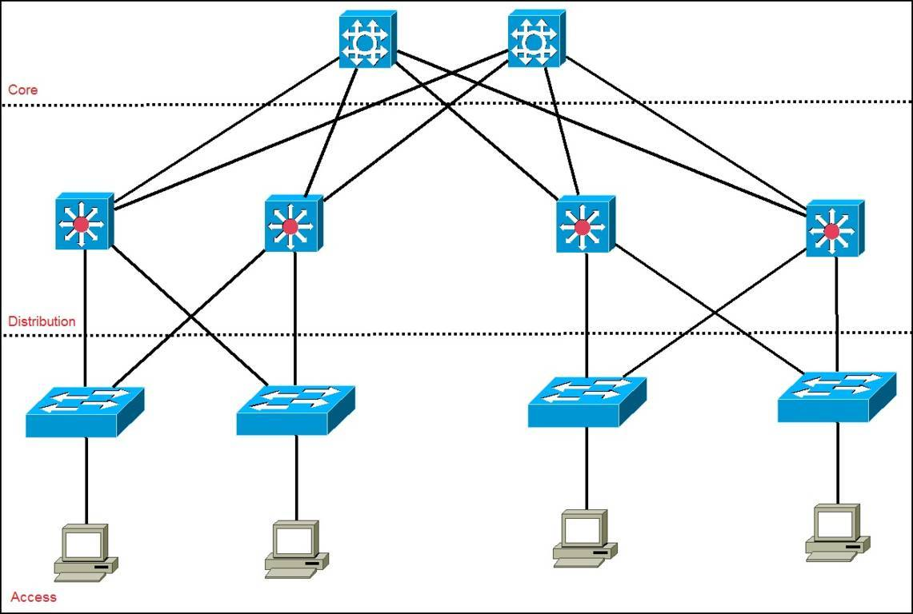

# overview
[toc]

### 概述

#### 1.各层的数据单元
|协议|数据单位|
|-|-|
|tcp|segment（报文段）|
|ip|datagram（数据报）|
|ip分片|fragment（数据分片）|
|数据链路层|frame（数据帧）|

#### 2.数据切分
* tcp会根据MSS（max segment size），将数据分为多个报文段
* 然后将每个报文段封装为ip数据报
* ip协议会根据MTU（Maximum Transmission Unit），会将ip数据报分为多个ip数据分片
* 接收端会重组ip数据分片

#### 3.网络架构的三层模型

##### （1）Access layer（接入层）
控制终端用户访问网络资源

##### （2）Distribution layer（分发层/汇聚层）
提供路由、过滤、管理等功能

##### （3）Core layer（核心层）
网络骨干网，负责传输大量流量

#### 4.接入运营商MPLS网络

##### （1）Access layer（接入层）: CE(customer edge) router
本地所有流量通过CE router外出，接入到PE router
CE设备特点：接口类型丰富，数据量不大

##### （2）Distribution layer（分发层/汇聚层）: PE(provider edge) router
连接不同运行商的网络
PE设备特点：汇聚、封装/解封装能力强

##### （3）Core layer（核心层）: P(provider) router
根据标签进行路由
P设备: 强大的交换能力

#### 5.session相关概念

##### (1) session endpoint
ip:port

##### (2) session
一对session endpoints组成session

##### (3) session direction
对于TCP，根据SYN判断
对于UDP，根据谁发送第一个数据包判断
