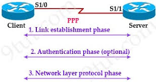
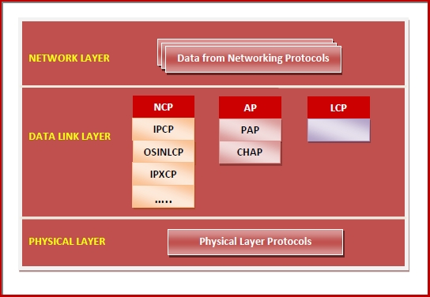
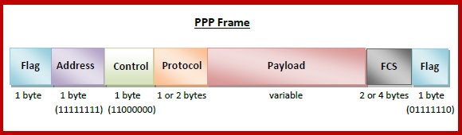

# PPP（point-to-point protocol）
[toc]

### 概述

 
#### 用途：在串口链路（只能连两台设备）上，进行账号访问控制
 

#### 1.PPP
point to point protocol，点对点协议
是链路层协议
用于在 **两台直连设备**之间 传输 多协议数据（即能够封装多种协议）
需要用**串口**连接

#### 2.主要功能
* connection authentication（连接认证）
* transmission encryption
* compression

#### 3.PPP有3个组成

从下到上
##### （1）Encapsulation Component
用于封装数据包，从而能够在物理链路上进行传输
**帧封装方式**：**HDLC**（high-level data link control，高级数据链路控制）

##### （2）LCP（link control protocol，链路控制协议）
负责建立、配置、测试、维护和终止 传输链路（即会话）
还会通过两个端点，进行 选项设置和功能使用 的协商（比如采用什么加密方式）

##### （3）NCPs（network control protocol，网络控制协议）
用于协商 网络层 的参数和功能
对于每一种更高层协议，ppp都有相应的NCP协议，比如：
* Internet Protocol Control Protocol (IPCP)

#### 4.支持的Authentication Protocols (AP)
* PAP（password authentication protocol）
不安全，因为密码是明文传输的

* CHAP（chanllenge handshake authentication protocol）
使用最多

#### 5.PPP帧格式（即HDLC帧格式）

##### （1）Flag
前后两个Flag标识帧的开始和结束

##### （2）Address
始终是11111111，因为只有一条链路，不需要寻址

##### （3）Control
始终是11000000

##### （4）Protocol
用于标识 Payload中数据 的协议

##### （5）Payload
存放网络层的数据

#### 6.PPPOE（point-to-point over ethernet）
现在PPP已经淘汰，使用的基本都是PPPOE
PPPOE **对PPP协议进行封装**，封装成 **ethernet数据帧**，从而能够在 **ethernet链路** 上进行 **传输**
* 因为PPP使用的点对点信道，一个线路上，只能连接一对机器，不能连接多个，所以成本太高
