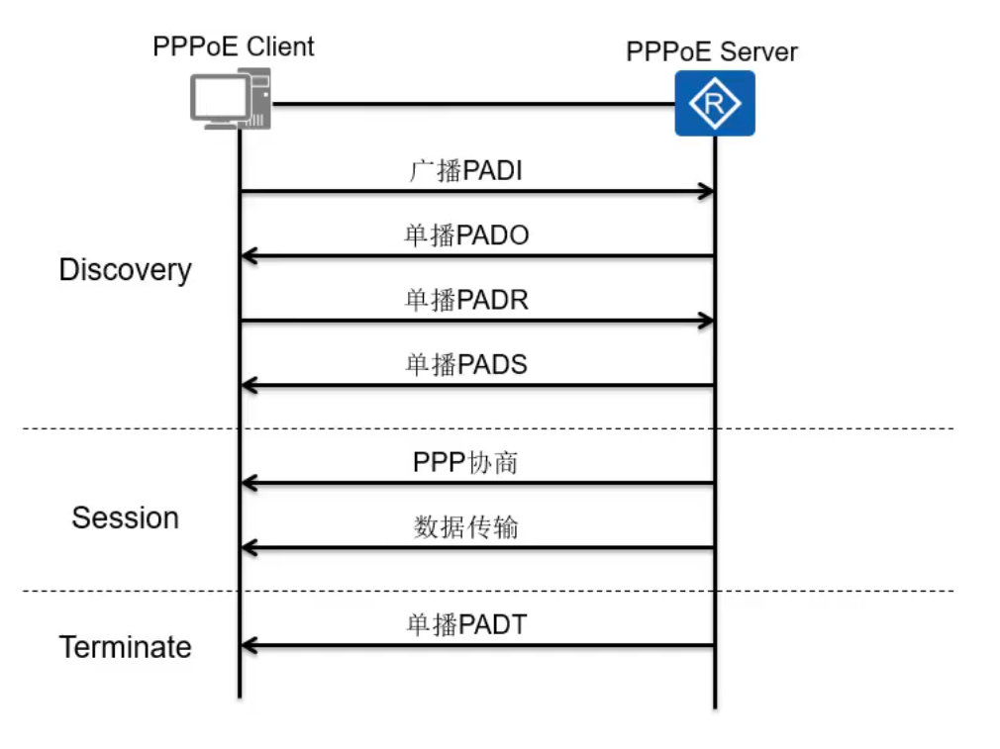

# PPPOE

[toc]

### 概述

#### 1.PPPOE
* point to point protocol over ethernet
* 将PPP协议封装成ethernet数据帧，从而能够在ethernet链路上进行传输

#### 2.PPPOE三个阶段

##### （1）discovery阶段：协商ID，确定和服务端的会话ID

* PADI（PPPoE Active Discovery Initiation）
  * 广播，发现PPPOE服务器
* PADO（PPPoE Active Discovery Offer）
  * PPPOE服务器请求后，回复一个单播的报文（携带ID）
* PADR（PPPoE Active Discovery Request）
  * 客户端发送一个Request请求，请求使用该ID
* PADS（PPPoE Active Discovery Session-confirmation
  * 服务端发送一个确认报文，下面就会用这个id进行交互（即每个报文中，会有标识ID）

##### （2）session阶段
* 进行认证：CHAP认证
* 下发策略：比如进行限速等（一般运行商网络才会下发策略）

##### （3）Terminate阶段
断开连接

#### 3.服务端需要做的配置
* 创建地址池
* 创建用户名和密码
* 虚拟PPP链路模板
* 将模板与指定物理接口绑定

#### 4.客户端需要做的配置
* 创建虚拟拨号接口（指定该接口使用PPP协议，并输入账号和密码）
* 将虚拟接口与物理接口进行绑定
