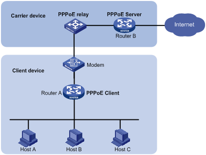

# PPPOE

<!-- @import "[TOC]" {cmd="toc" depthFrom=1 depthTo=6 orderedList=false} -->
<!-- code_chunk_output -->

- [PPPOE](#pppoe)
    - [概述](#概述)
      - [用途：在以太网上，进行账号访问控制](#用途在以太网上进行账号访问控制)
      - [1.PPPOE](#1pppoe)
      - [2.PPPOE产生背景](#2pppoe产生背景)
      - [3.主要功能](#3主要功能)
      - [4.网络运行商如何利用PPPOE](#4网络运行商如何利用pppoe)
      - [5.PPPOE三个阶段](#5pppoe三个阶段)
        - [（1）discovery阶段：协商ID，确定和服务端的会话ID](#1discovery阶段协商id确定和服务端的会话id)
        - [（2）session阶段](#2session阶段)
        - [（3）Terminate阶段](#3terminate阶段)
      - [6.服务端需要做的配置](#6服务端需要做的配置)
      - [7.客户端需要做的配置](#7客户端需要做的配置)

<!-- /code_chunk_output -->

### 概述

 
#### 用途：在以太网上，进行账号访问控制
 

#### 1.PPPOE
将**PPP协议** **封装成** **ethernet数据帧**，从而能够在ethernet链路上进行传输
* point to point protocol over ethernet
* PPP是一个server只能被一个client连，PPPOE是一个server可以被多个client连

#### 2.PPPOE产生背景
* PPP一条链路只能支持两台设备通信，随着网络规模的扩大，无法满足要求
* PPPOE主要用来 进行账号访问控制，所以运行商用这个协议

#### 3.主要功能
* 连接认证
* 数据加密
* 数据压缩
* 对带宽进行限制、对流量进行过滤

#### 4.网络运行商如何利用PPPOE
* 网络运行商会给用户分配一个ID（即用户名）和 密码
* 还会提供 modem-router（这个router上已经配置好了PPPOE协议）
  * modem用于 数字信号 和 其他信号（比如：电信号） 之间的转换

#### 5.PPPOE三个阶段

##### （1）discovery阶段：协商ID，确定和服务端的会话ID

* PADI（PPPoE Active Discovery Initiation）
  * 广播，发现PPPOE服务器
* PADO（PPPoE Active Discovery Offer）
  * PPPOE服务器请求后，回复一个单播的报文（携带ID）
* PADR（PPPoE Active Discovery Request）
  * 客户端发送一个Request请求，请求使用该ID
* PADS（PPPoE Active Discovery Session-confirmation
  * 服务端发送一个确认报文，下面就会用这个id进行交互（即每个报文中，会有标识ID）

##### （2）session阶段
* 进行认证：CHAP认证
* 下发策略：比如进行限速等（一般运行商网络才会下发策略）

##### （3）Terminate阶段
断开连接

#### 6.服务端需要做的配置
* 创建地址池
* 创建用户名和密码
* 虚拟PPP链路模板
* 将模板与指定物理接口绑定

#### 7.客户端需要做的配置
* 创建虚拟拨号接口（指定该接口使用PPP协议，并输入账号和密码）
* 将虚拟接口与物理接口进行绑定
