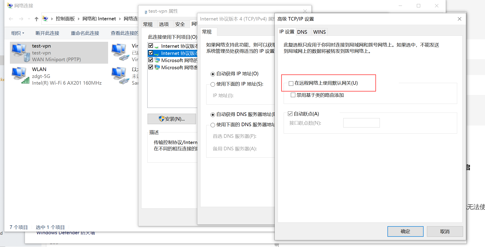

# PPTP

[toc]

### 概述

#### 1.PPTP
point to point tunneling protocol

#### 2.技术
* **加密网络层的数据**
  * 加密协议：MPPE（Microsoft's Point-to-Point Encryption protocol ，已被破解）

* 封装PPP协议
  * PPP协议提供认证协议：CHAP

* 封装增强的GRE协议

* 封装新的ip协议

#### 3.PPTP frame


#### 4.特点

* pptpd server会监听在1723端口

##### （1）优点
* 由于低级别的加密，速度较快
* 容易搭建PPTP server
* 跨平台兼容性高（很多操作系统都支持PPTP）

##### （2）缺点
* 不够安全，存在安全隐患
* 由于PPTP本身无法与NAT配合使用，因此通常需要具有PPTP直通的路由器
* 防火墙很容器组织 PPTP连接

#### 5.passthrough
是路由器的一个功能，如果没有这个功能，路由器无法转发VPN流量
* 由于PPTP会加密网络层协议，导致NAT没有办法创建映射记录
  * 因为NAT需要根据 源ip + 上层协议的状态（比如端口、icmp中的id），添加映射记录

* passthrough 利用 源ip + gre中的call id，添加映射记录

***

### 使用

#### 1.部署pptp server

##### （1）安装pptpd
```shell
yum -y install pptpd
```

##### （2）配置pptpd
```shell
$ vim /etc/pptpd.conf

localip 10.10.10.10           #本地的vip
remoteip 10.10.10.100-200     #设置地址池，当有vpn client连接时，会分配其中的地址
```

##### （3）加密配置
```shell
$ vim /etc/ppp/options.pptpd

require-mappe-128         #使用MPPE 128为加密
ms-dns 114.114.114.114    #ms:micrsoft,客户端会将DNS设置为8.8.8.8
```

##### （4）认证配置
```shell
$ vim /etc/ppp/chap-secrets

<USERNAME> <SERVER_ID> <PASSWORD> <CLIENT_IP>

#<SERVER_ID>，服务器标识(在第二个配置文件中有)：* 表示匹配所有
#<CLIENT_IP>，客户端ip：* 表示匹配所有
#比如：liyi * 123 *
```

##### （5）开启路由转发
```shell
echo 1 > /proc/sys/net/ipv4/ip_forward
```

##### （6）启动pptpd服务
```shell
systemctl restart pptpd

ss -tulnp | grep -i pptpd
```

#### 2.客户端连接
##### （1）前提
如果PPTP客户端经过的路由器使用了NAT，则该路由器必须**开启passthrough功能**

##### （2）默认网关问题
默认连接pptp server后，会将pptp server设为默认网关（这样就无法使用外网了）
所有要在client端，修改vpn连接的网络配置

