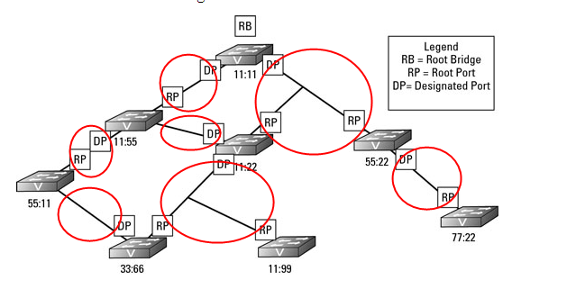

# STP

[toc]

### 概述

#### 1.STP
spanning tree protocol，用于解决交换机由于环路引发的问题：
* 广播风暴
* mac地址表不稳定
* 一个主机会重复接收到相同的数据帧

#### 2.相关术语

##### （1）Root Bridge
交换机上 所有端口 都是 Forwarding状态 且 都是Designated Port

##### （2）Root Port
能过通过 **该端口** 到达 **Root交换机**
所以Root Port会存在非Root交换机上，且非Root交换机上一定存在一个Root Port

##### （3）Designated Port
非Root Port

##### （4）Cost
端口的Cost，根据端口带宽
带宽越大，cost越小

#### 3.端口的状态
* Forwarding
* Blocking

#### 4.工作原理

##### （1）在广播域中选出一个Root Bridge
* 根据 设置的优先级
* 如果优先级相同，则选mac地址最小的

##### （2）找出Root Ports
Root端口，就是 非Root交换机 去往 Root交换机 的端口
* 所有 非Root 交换机，根据到Root交换机的最少cost，选出Root Port

##### （3）找出Designated Ports
Designated端口，在一个network segment中转发数据
* 每个network segment中都要选出一个Designated Port
* 比较这个两个Port所在交换机，哪个到 根交换机 cost最小，哪个就是Designated Port

* 红圈就是一个network segment

##### （4）阻塞环路
* 剩下没有role的端口，都被阻塞
* 阻塞端口只接收消息，不转发消息
