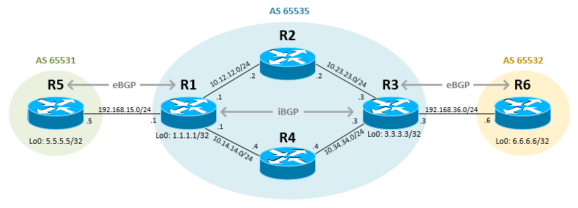
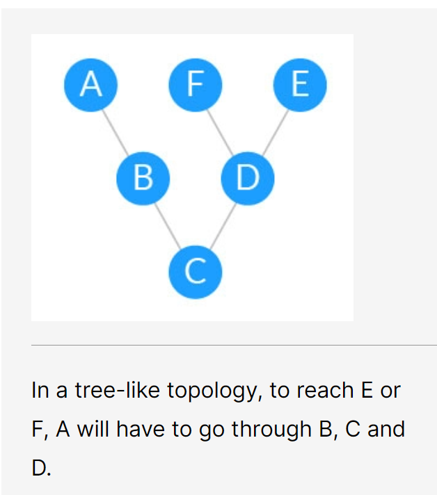
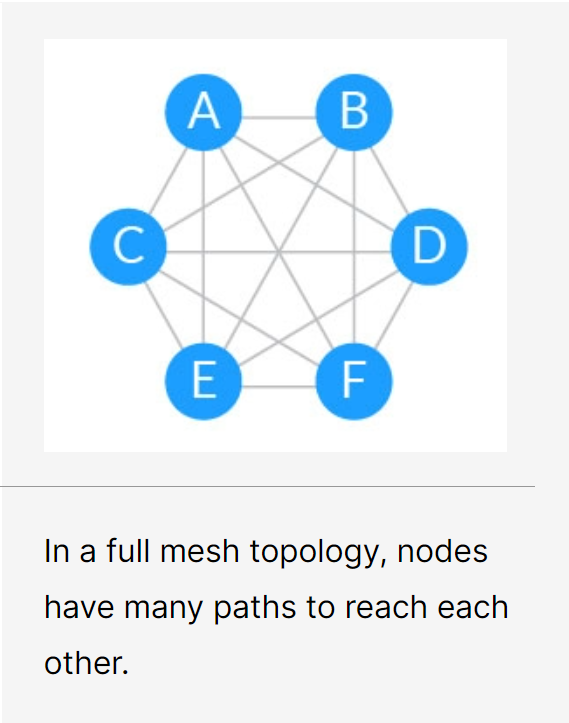

# BGP（eBGP）
[toc]

### 概述

#### 1.BGP（border gateway protocol，边界网关协议）
利用**BGP-speaking routers 和 routing tables** 在 **不同自治系统内** 的邻居路由 **交换路由信息** 的 **路由协议**

##### （1）特点
* 可扩展性高

* 每个AS（自治系统）中至少要选择一个路由器作为该AS的 BGP发言人

#### 3.术语

##### （1）bgp speaker（peer）

#### 4.拓扑

##### （1）树状拓扑（以前的EGP使用的）

当网络规模变大后（自治系统越来越多），树状拓扑的分层结构阻碍了可伸缩性

##### （2）full mesh（全网状拓扑）

全网状拓扑可以实现最大的可扩展性
