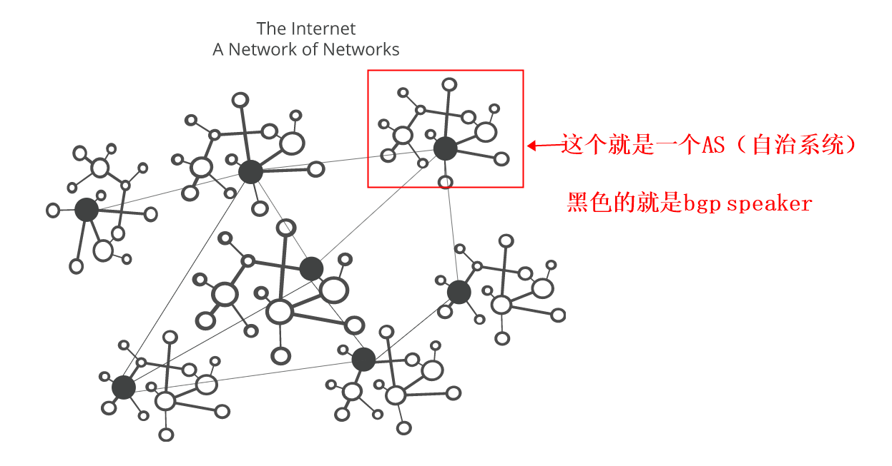
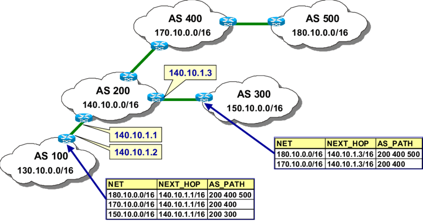
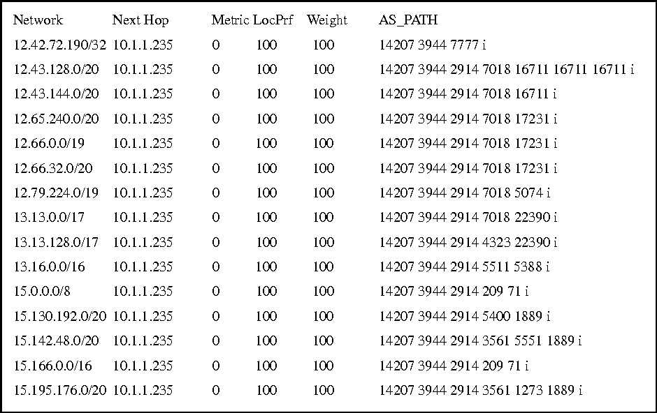
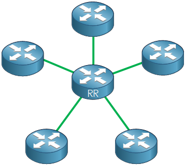

# BGP（eBGP）
[toc]

### 概述

#### 1.术语

##### （1）bgp speaker（bgp peer）
运行bgp的router，就称为bgp speaker

##### （2）bgp peers
两个bgp speaker交换路由信息，则这两个bgp speaker称为bgp peers

##### （3）bgp route reflection
目的：为了减少同一个AS中的bgp peers的数量
原理：所有bgp speaker与route reflection通信，将路由信息发送到route reflection，并且从route reflection获取路由信息

#### 2.BGP（border gateway protocol，边界网关协议）
利用**BGP-speaking 路由器（即bgp peer）** 在 **不同自治系统（AS）** 的邻居路由 **交换路由信息** 的 **路由协议**

##### （1）特点
* 可扩展性高

* 每个AS（自治系统）中至少要选择一个路由器作为该AS的 BGP发言人

##### （2）ASN（autonomous system number）
自治系统id，用于标识一个自治系统（**一般一个自治系统中的ip都有统一的前缀**）
* public ASN 用于分配给internet上的AS
* private ASN 用于私有的系统（即每个人都可以使用），但是在私有的系统中ASN也不能重复
  * 即A搭了一个网络系统，然后创建了两个AS，然后这两个AS通过BGP通信，这两个AS的ASN可以随便设置，不重复就行，因为没有通过BGP连接其他的AS

##### （3）工作原理：基于信任
每个bgp peer需要设置对端的bgp peer的信息（ip和ASN），
这样才会接受该bgp peer分享的路由信息，
交换路由是基于信任，即相信对方给的信息的正确的

#### 3.拓扑

##### （1）树状拓扑（以前的EGP使用的）

当网络规模变大后（自治系统越来越多），树状拓扑的分层结构阻碍了可伸缩性

##### （2）full mesh（全网状拓扑）

全网状拓扑可以实现最大的可扩展性

#### 5.iBGP
当两个bgp peer在同一个AS中时，则就是iBGP（internal BGP），用于内部交换路由信息

#### 4.特殊的AS号
|AS号码|说明|
|-|-|
|64512-65534|供私人使用|
