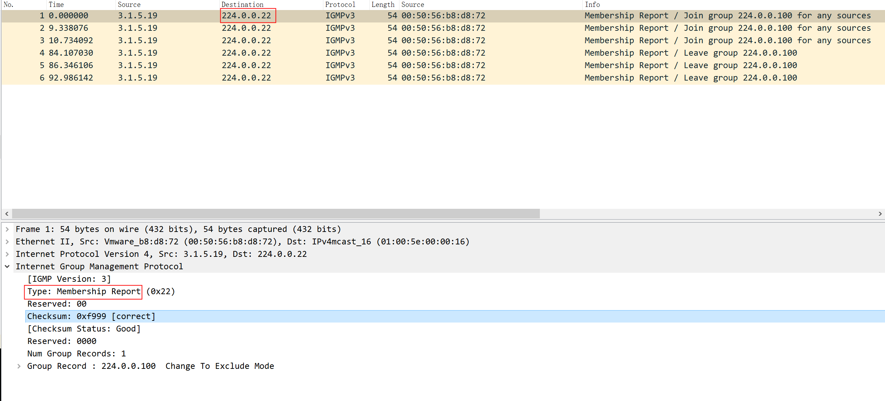

# IGMP

[toc]

### 概述

#### 1.IGMP
internet group management protocol
为了让路由器等成为组播地址的查询器，这样往某个组播地址发送消息时，就不需要广播了，而是从路由器查询到组播地址中的成员，然后直接将组播包，发送到这些成员，减轻了网络的压力

#### 2.如何工作
* 当某个接口，加入和离开某个组播地址时，会往224.0.0.22这个组播地址发送IGMP报文
* 路由器如果开启了IGMP报文监听，会接收该报文，维护一个列表（组播地址和其成员地址的关系）
* 可以从该路由器查询到，某个组播地址对应的成员列表，然后直接往这些成员发送组播包，而不需要广播发送

#### 3.IGMP报文的类型
* Membership reports
  * 当某个接口加入到某个组播地址时，会发出该类型IGMP包
* "Leave group" messages
  * 当某个接口离开某个组播地址时，会发出该类型IGMP包
* General membership queries
  * 路由器发送消息到整个网络，更新组播地址和成员信息
* Group-specific membership queries
  * 路由器发送消息到指定组播组，更新组播地址和成员信息

#### 4.抓包分析

