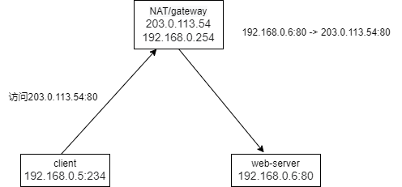

# NAT

[toc]

### 概述

#### 1.NAT Translation Table

通过NAT 转换表，进行地址映射（包括请求包和回复包）

##### （1）现在的协议大部分都是有状态的协议
* 比如基于连接的协议
* 无连接的协议，可以基于id，比如ICMP

##### （2）映射记录
* 对于有连接的协议（TCP），通过 ip+port 进行映射
  * 会在本机随机开启一个端口，连接远程机器，然后会把根据 ip+port 添加映射记录
* 对于无连接的协议（ICMP），通过 ip+id 进行映射
  * 比如ICMP协议中会有一个id字段，标识本次所有的icmp包，所以本机可以根据 ip+id 添加映射记录

#### 2.Internate address architecture

#### 3.NAT造成的问题
* 位于NAT后面的节点不能被访问到，除非在NAT上设置了特定的转换规则
  * 当两个位于不同NAT后面的节点，不能建立p2p连接

#### 4.NAT traversal（NAT穿透）

是一类技术，用于穿透NAT吗，常用的NAT traversal:

##### （1）relaying（中继转发）

* S会将A的数据转发给B，将B的数据转发给A
* 特点：
  * 稳定
  * 效率低

##### （2）connection reversal（连接反转）

* 需要一端不在NAT后面（比如图中的B）
* B通过S向A发送一个连接请求，让A会主动连接自己

##### （3）hole punching

#### 5.hairpin nat（NAT loopback）

是NAT服务器的一个功能，一般NAT服务都支持

##### （1）why need hairpin nat
当两台机器在同一个NAT后面，一台为客户端，一台为web服务器（通过NAT地址对外提供服务）
使得客户端机器，能够通过NAT地址，访问到web服务器

##### （2）工作原理
* 当client访问web服务器时
* 根据路由，是NAT的内部网卡受到这条消息
* 如果NAT具备nat loopback能力，则NAT检测到这个地址是外部网卡的地址
  * 则会把这个数据当作来自外部网卡的数据
  * 然后做相应的nat，映射到web server的内部地址

***

### hole punching(punch-through)

[参考](https://bford.info/pub/net/p2pnat/)

#### 1.hole punching
打洞是一项网络技术，用于在 分别位于NAT后的两方 之间 建立连接
* 有以下几类打洞：
  * icmp hole punching
  * udp hole punching
  * tcp hole punching

#### 2.hole punching需要满足的条件

##### （1）Consistent Endpoint Translation（一致的endpoint转换）
当A连接S时，public endpoint（即在NAT上转换后的地址）是155.99.25.11:62000,
当A连接B时，public endpoint也要是155.99.25.11:62000

#### 3.UDP hole punching工作原理

##### （1）存在三种场景（但基本原理是一样的）

* 在同一个NAT下

* 在不同的NAT下

* 有多层NAT

##### （2）工作原理
A和B 都与S 一直建立着UDP连接
* A发送连接B的请求给S
* S受到该请求后，
  * 发送B的public endpoint和private endpoint给A
  * 发送A的public endpoint和private endpoint给B
* A会尝试向B的public endpoint和private endpoint发送UDP请求，B也同理
* 当A向B的public endpoint发送一个请求后，A的NAT上就被打了一个洞（即能够允许B的public endpoint发过来的包通过，否则NAT防火墙会丢掉这个包）
* 当B向A的public endpoint发送一个请求后，B的NAT上也被打了一个洞（即能够允许A的public endpoint发过来的包通过，否则NAT防火墙会丢掉这个包）
* 当两个洞打好后，A和B就能互相接收到消息，当完成认证后，就建立了p2p连接
  * 认证是通过S提供的方式进行认证，为了防止B的private endpoint在A的私网中存在
