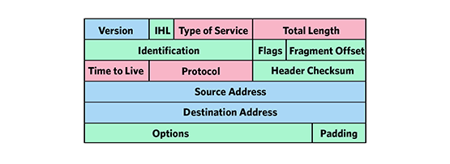

# ip（internet protocol）

[toc]

### 概述

#### 1.ip报头

##### （1）TTL（time to live）
每个ip都有一个TTL，每经过一个路由，TTL-1，当TTL=0时，ip包就会被丢弃（防止ip包被无限传播）
可以`ping <IP> -t <TTL>`，用设置的TTL减去返回的TTL，就能知道经过了多少路由

##### （2）protocol
协议号，用于标识封装的是什么协议
比如：
  * 4 IP中的IP（封装）
  * 6 TCP协议
  * 17 UDP协议

### ipv4保留地址

|地址块|地址范围|用于范围|用途|
|-|-|-|-|
|127.0.0.0/8|全范围|Host|环路地址|
|224.0.0.0/4|全范围|Internet|组播地址|
|10.0.0.0/8|全范围|Private Network|私有网络内通信|
|172.16.0.0/12|全范围（172.16.0.0–172.31.255.255）|Private Network|私有网络内通信|
|192.168.0.0/24|全范围|Private Network|私有网络内通信|
|169.254.0.0/16|全范围|Subnet|链路地址（用于没有ip时，同一链路上的主机能够设置链路地址，进行通信）|

[更多参考](https://en.wikipedia.org/wiki/Reserved_IP_addresses)
