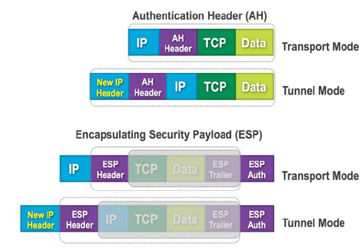

# ipsec

<!-- @import "[TOC]" {cmd="toc" depthFrom=1 depthTo=6 orderedList=false} -->
<!-- code_chunk_output -->

- [ipsec](#ipsec)
    - [概述](#概述)
      - [1.ipsec](#1ipsec)
      - [2.包含的协议](#2包含的协议)
        - [（1）IKE（internet key exchange）](#1ikeinternet-key-exchange)
        - [（2）AH（authentication header）](#2ahauthentication-header)
        - [（3）ESP（encapsulating security payload）](#3espencapsulating-security-payload)
      - [3.支持的模式](#3支持的模式)
      - [4.报文格式](#4报文格式)

<!-- /code_chunk_output -->

### 概述

#### 1.ipsec
inernet protocol security
是一种实现方式，包含多个协议

#### 2.包含的协议

##### （1）IKE（internet key exchange）
用于 在不安全的网络环境中，两个设备之间交换密钥
* IKE server会监听在 **500 UDP端口**
* 第一步先进行身份认证，然后生成一个密钥进一步加密
  * 可用的认证方式：
    * pre-shared secret，预共享密钥
    * RSA签名
    * 使用加密的RSA随机数
  * 生成密钥的过程：
    * 双方项约定两个数字 p 和 g，这两个数字所有人都可以看到  
    * A随机生成一个数 x，只有A自己知道  
    * B随机生成一个数 y，只有B自己知道    
    * A发送 p+g+x的结果到B，然后B计算 p+g+x+y的值，就是协商好的密钥   
    * 同理，B发送 p+g+y的结果到A，然后A计算 p+g+x+y的值，就是协商好的密钥   
    * 然而其他人都计算不出这个值，从而实现加密  
* 第二步，会协商密钥，进行通信，这个密钥是有有效时间的

##### （2）AH（authentication header）
用于校验数据的完整性，看数据是否被修改过

##### （3）ESP（encapsulating security payload）
用于加密数据、校验数据完整性等等

#### 3.支持的模式
* transport mode
仅仅用于加密等
 
* tunnel mode
用于建立隧道

#### 4.报文格式

