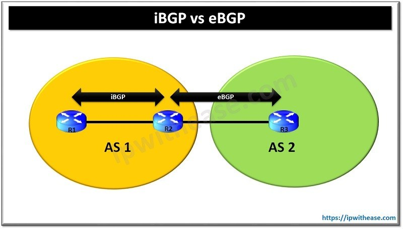

# overview

[toc]

### 概述

#### 1. AS（autonomous system）
* 一个网络的集合
* 自治系统内 可以决定该自治系统 采用什么路由协议
* 自治系统间 通过BGP协议进行连接
* 一个 自治系统 会分配一个全局的唯一的16位号码，ASN（autonomous system number）

#### 2.IGP（interior gateway protocol，内部网关协议）
用于 **同一个自治系统内** 的 路由 交换路由信息 的协议

##### （1）常用IGP
* ospf
* rip
* iBGP（因为路由条目太多，光靠原先的IGP协议无法满足，所以需要iBGP）

#### 3.EGP（exterior gateway protocol，外部网关协议）
用于 **不同自治系统内** 的邻居路由 交换路由信息 的协议

##### （1）常用EGP
* BGP

#### 4.IGP和EGP
这里IGP协议是iBGP，EGP协议是eBGP（即是EGP）

