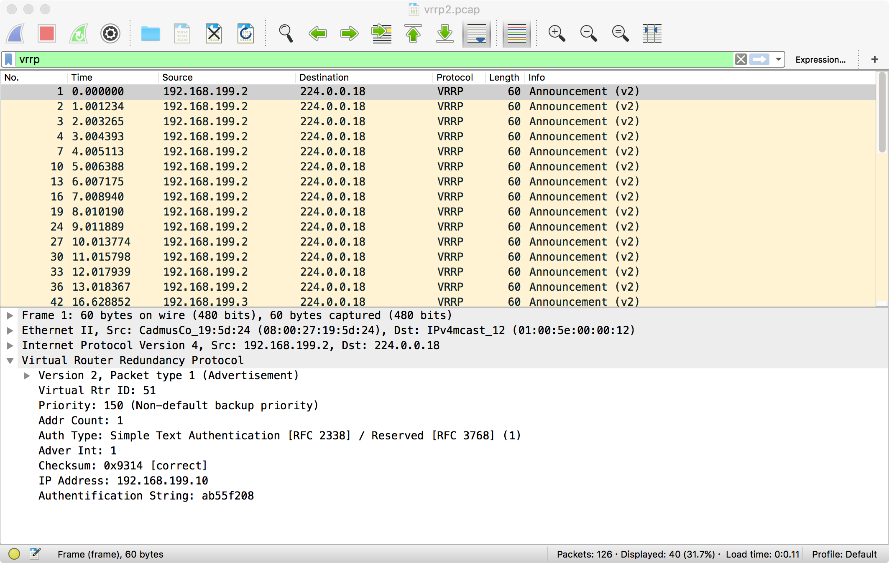

# VRRP

<!-- @import "[TOC]" {cmd="toc" depthFrom=1 depthTo=6 orderedList=false} -->
<!-- code_chunk_output -->

- [VRRP](#vrrp)
    - [概述](#概述)
      - [1.VRRP](#1vrrp)
      - [2.相关概念](#2相关概念)
        - [（1）virtual IP address](#1virtual-ip-address)
        - [（2）Virtual MAC address](#2virtual-mac-address)
        - [（3）master router](#3master-router)
        - [（4）backup routers](#4backup-routers)
        - [（5）Master advertisement timer](#5master-advertisement-timer)
        - [（6）Master dead timer](#6master-dead-timer)
        - [（7）Preempt](#7preempt)
        - [（8）Object tracking](#8object-tracking)
        - [（9）Authentication](#9authentication)
      - [3.工作原理](#3工作原理)
      - [4.抓包分析](#4抓包分析)

<!-- /code_chunk_output -->

### 概述

#### 1.VRRP
virtual router redundancy protocol
**一组** 主机 **相互通信**，**选举**出matser，并设置**vip**，从而实现高可用

#### 2.相关概念
##### （1）virtual IP address
##### （2）Virtual MAC address
##### （3）master router
##### （4）backup routers
##### （5）Master advertisement timer
master发送advertisement信息的频率
##### （6）Master dead timer
backup当多久收不到master的advertisement，就重新选举master
##### （7）Preempt
当master恢复后，会重新变成master
##### （8）Object tracking
用于健康检查，并且调整节点的优先级
比如：利用脚本检查，如果脚本检查成功可以提高优先级，如果检查失败，可以降低优先级，或者直接标记该节点为fault状态
##### （9）Authentication
支持三种认证方式：
* 无认证
* 明文认证
* md5认证

#### 3.工作原理
* VRRP 利用组播 (224.0.0.18) 进行问候机制和选举
  * 所有运行着keepalived的主机都会把相应网卡加入到 224.0.0.18这个组播组，则该网卡就能受到相应的组播消息
  * `ip maddr show`能够查看网卡所在的组播组
* 选举出master后，master会每隔一段时间利用组播发送advertisement消息
* 当backup主机，在一段时间内没有收到master消息，会重新选举出一个新的master
  * 重新选择的master会发出gratuitous ARP包，更新局域网内机器的arp表，即vip对应到新的mac地址了
* 当master再次上线后，由于其优先级较高，所以会继续成为master

#### 4.抓包分析

