# TCP

<!-- @import "[TOC]" {cmd="toc" depthFrom=1 depthTo=6 orderedList=false} -->
<!-- code_chunk_output -->

- [TCP](#tcp)
    - [概述](#概述)
      - [1.TCP特点](#1tcp特点)
      - [3.TCP的能力](#3tcp的能力)
      - [4.发送窗口 =  Min[rwnd, cwnd]](#4发送窗口---minrwnd-cwnd)
      - [5.TCP11中状态](#5tcp11中状态)
      - [6.MTU and TCP MSS](#6mtu-and-tcp-mss)
        - [（1）MTU（maximum transmission unit）](#1mtumaximum-transmission-unit)
        - [（2）MSS（maximum segment size）](#2mssmaximum-segment-size)
      - [7.tcp流](#7tcp流)
    - [TCP头部](#tcp头部)
      - [1.序号（与 字节 有关）](#1序号与-字节-有关)
      - [2.确认号](#2确认号)
      - [3.数据偏移](#3数据偏移)
      - [4.标记位](#4标记位)
        - [（1）URG（urgent，紧急的）](#1urgurgent紧急的)
        - [（2）PSH（push）](#2pshpush)
        - [（3）ACK（acknowledgement）](#3ackacknowledgement)
        - [（4）SYN（synchronize）](#4synsynchronize)
        - [（5）FIN（finish）](#5finfinish)
        - [（6）RST（reset）](#6rstreset)
      - [5.窗口（接收窗口）](#5窗口接收窗口)
    - [可靠连接原理](#可靠连接原理)
      - [1.基本方式](#1基本方式)
      - [2.改进：流水线传输](#2改进流水线传输)
      - [3.改进：以字节为单位的滑动窗口（发送窗口）](#3改进以字节为单位的滑动窗口发送窗口)
      - [4.改进：累计确认 和 选择重传(SACK)](#4改进累计确认-和-选择重传sack)
    - [流量控制](#流量控制)
      - [1.receive window（接收窗口，影响网络传输性能）](#1receive-window接收窗口影响网络传输性能)
    - [拥塞控制](#拥塞控制)
      - [1.基本原理：慢开始算法](#1基本原理慢开始算法)
        - [（1）慢开始原理](#1慢开始原理)
        - [（2）利用慢开始实现 拥塞控制](#2利用慢开始实现-拥塞控制)
      - [2.改进：快重传和快恢复](#2改进快重传和快恢复)

<!-- /code_chunk_output -->

### 概述

#### 1.TCP特点
* 面向连接
* 全双工
* 面向字节流
* 数据单元：tcp 报文段（segment）

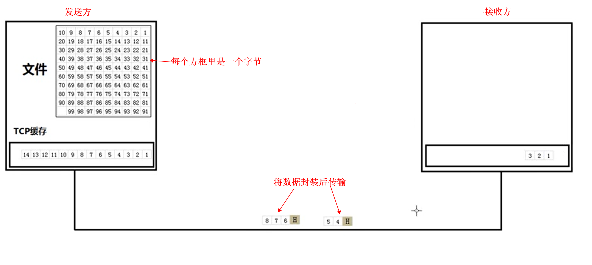

#### 3.TCP的能力
* 提供可靠传输
 
* 流量控制
发送方和接收方协商发送的数据量
 
* 拥塞控制
网络堵塞指网络由于数据量大，导致堵塞，并不是仅仅因为发送方和接收方
拥塞控制 是一个全局性的过程，涉及到所有的主机、路由器等

#### 4.发送窗口 =  Min[rwnd, cwnd]
rwnd：receive window
cwnd：congestion window

#### 5.TCP11中状态

* time_wait状态的原因：
  * 等待一定时间，确保完成client和server之间的数据传输（默认60s）

#### 6.MTU and TCP MSS

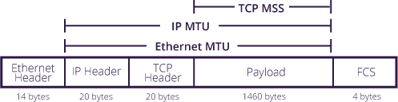

##### （1）MTU（maximum transmission unit）
* 在网卡接口上设置，能够传输的单个ip包的大小（包括header，单位字节），默认为1500字节
* 当ip包超过MTU的值，会被进行分片
* 当收到ip会将包的大小与MTU值进行比较，
  * 如果超了，会进行分片传输（当设置了'Don't Fragment'标志，则不会分片，ip包会被丢弃并告知发送者）

##### （2）MSS（maximum segment size）
* 在TCP header中的option中设置的（**根据MTU值计算出来的**），用于设置单个TCP包payload的数据量（字节），默认为1460字节
* 封装协议的TCP MSS要小一些，因为有封装的头部，所以封装协议会损耗一定的性能
* MSS值是在三次握手时确定的，会在SYN包中的option部分，声明MSS应该设为多少
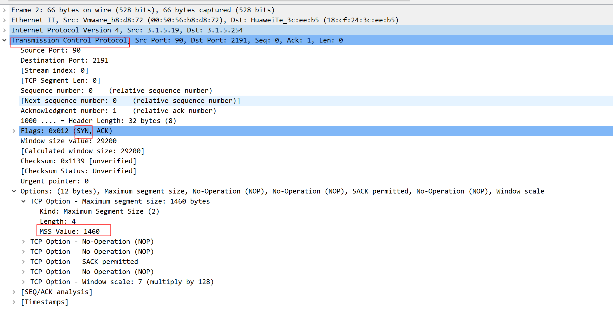

#### 7.tcp流

一个tcp流通过`<src_ip>:<src_port> <dst_ip>:<dst_port>`唯一标识
* tcp没有stream id的概念
* 在wireshark中会给tcp stream编号，第一个tcp stream就是 `stream index: 1`

***

### TCP头部
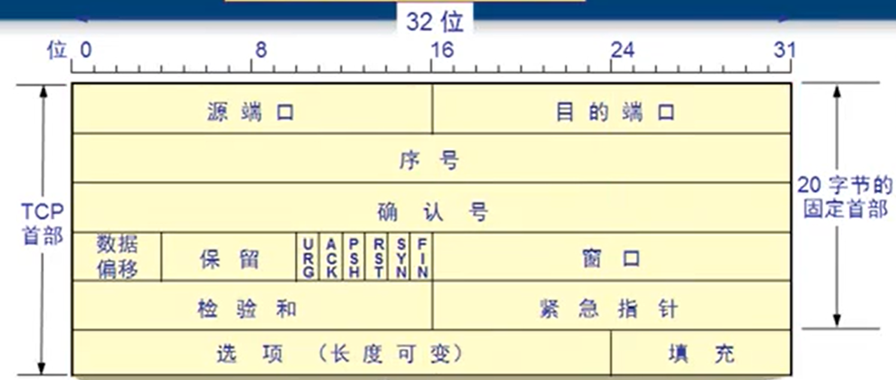

#### 1.序号（与 字节 有关）
表示 当前发送的数据 是 **从第几个字节开始的**
比如：当 序号=1，表示发送的数据的内容是从第一个字节开始的

当发起连接时，序号不一定为0，因为不一定要从第1个字节开始传送，可能从第123个字节开始发送

#### 2.确认号
当 确认号=1，表示 前n个字节（不包括第n个字节）都已经收到了，发送方下次要从第n个字节开始发送

#### 3.数据偏移
表示在该tcp报文中，从多少个字节开始，是tcp数据

#### 4.标记位

##### （1）URG（urgent，紧急的）
当 URG=1，表示 发送方 会立即发送 发送缓冲区中的内容（否则，一般会等到一定数量的数据才会发送）

##### （2）PSH（push）
当 PSH=1，表示 接收方 会立即读取 接收缓冲区中的内容（否则，一般会等到一定数量的数据才会读取）

##### （3）ACK（acknowledgement）
当 ACK=0时，确认号字段无效

##### （4）SYN（synchronize）

##### （5）FIN（finish）

##### （6）RST（reset）
当 RST=1，表示强制终止TCP连接

#### 5.窗口（接收窗口）
设置接收窗口大小，从而进行流量控制
发送方会根据接收窗口大小，设置自己的发送缓存
***

### 可靠连接原理

#### 1.基本方式
* 工作原理：停止等待协议
* 可靠传输协议：ARQ（automatic repeat request，自动重传请求），即发送方等待超时后，会进行重传
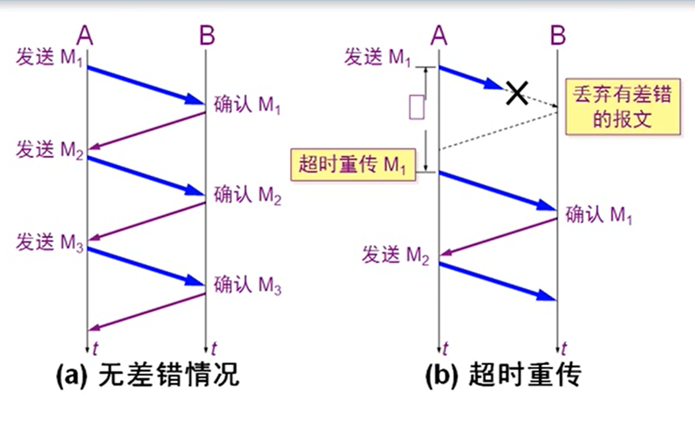

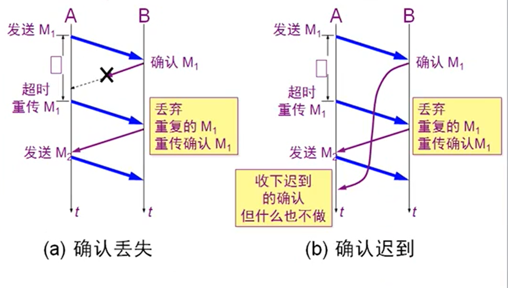

#### 2.改进：流水线传输
即 不等待 第一个段（包含多个字节） 发送成功，直接发送后面的
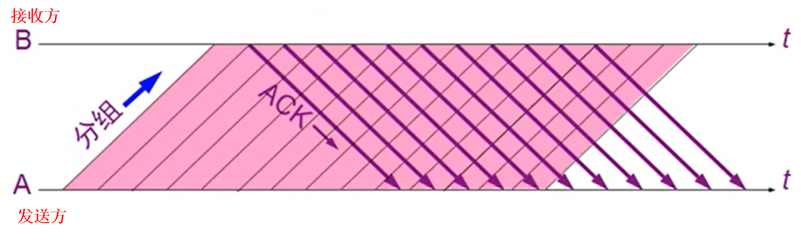

#### 3.改进：以字节为单位的滑动窗口（发送窗口）
发送方有一个发送窗口，只发送当前发送窗口的内容
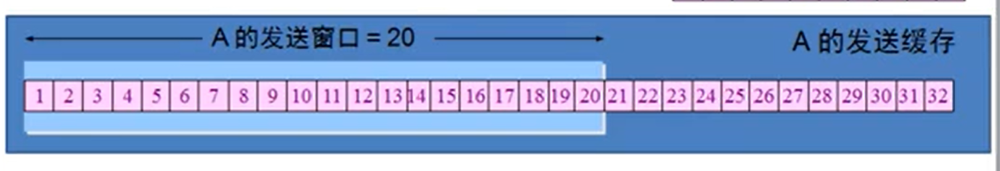
前面的字节 确认发送成功，滑动窗口会向后移动，并且把已确认的字节从缓存中移除，
然后会继续发送刚加入滑动窗口的字节

#### 4.改进：累计确认 和 选择重传(SACK)
* 累计确认
如果接收方，收到了1，2，3字节，会发送确认序号 4，表示4之前的字节都收到了，从而提高了信道利用率
 
* 选择重选（SACK，select acknowledgement）
如果接收放，收到了1，2，3，7字节，4、5、6字节丢失了，会发送确认序号4，表示4之前的字节收到了
并且会告诉发送端，丢了4-6之间的字节

***

### 流量控制

#### 1.receive window（接收窗口，影响网络传输性能）
* tcp接收缓冲区，用于缓冲还没有被应用处理的数据
* tcp hearder中会包含window size字段，告诉对方，自己还能接收多少字节的数据
  * 即对方就知道发送多少数据合适了，会根据这个设置自己的发送缓存，当发送数据后
  * 本地接收到数据，会返回一个acknowledgment报文，header中同样包含window size字段

***

### 拥塞控制
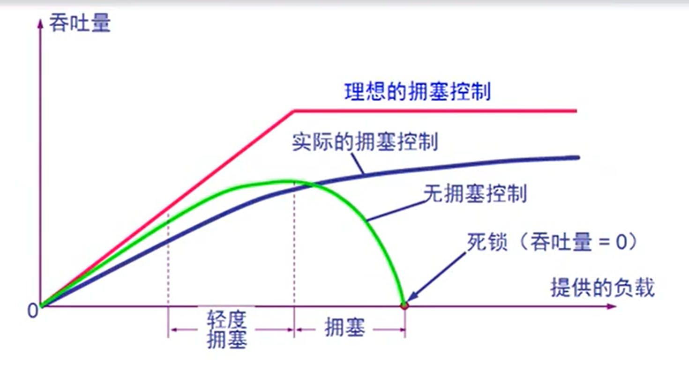

#### 1.基本原理：慢开始算法
发送方维持 拥塞窗口（congestion window，cwnd）

##### （1）慢开始原理
刚开始发送的数据量少，如果没有丢包情况，数据量会一直增大

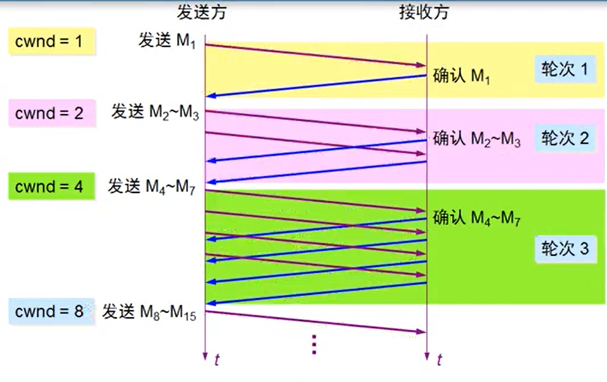

##### （2）利用慢开始实现 拥塞控制
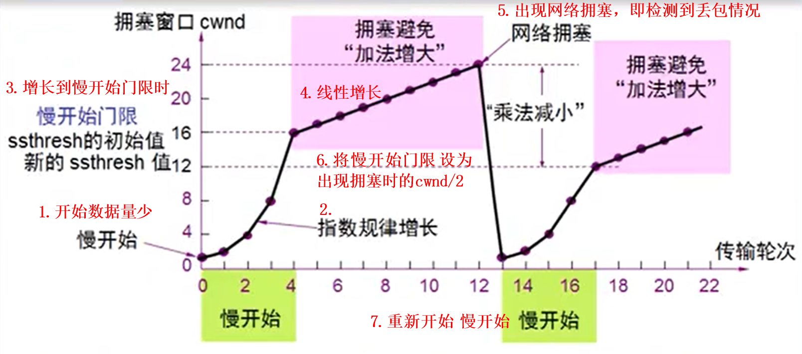

#### 2.改进：快重传和快恢复

当接收方接收到1，2，3，5字节时，就知道丢包了（网络拥塞），会连续发送 3个 确认号为4的包到发送端
发送端接收到这3个包，就表明可能没有拥塞，但也会调整拥塞窗口，调整成 cwnd/2
其他情况还是按慢开始算法处理
