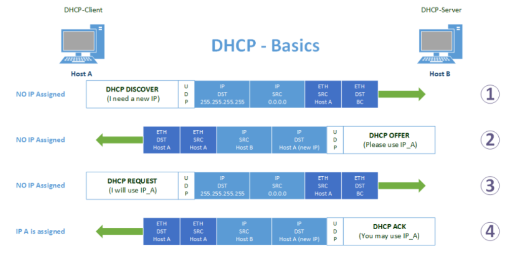

# DHCP

<!-- @import "[TOC]" {cmd="toc" depthFrom=1 depthTo=6 orderedList=false} -->
<!-- code_chunk_output -->

- [DHCP](#dhcp)
    - [概述](#概述)
      - [1.dynamic host configuration protocol](#1dynamic-host-configuration-protocol)
        - [(1) 端口](#1-端口)
      - [2.过程](#2过程)
      - [3.DHCP报文格式](#3dhcp报文格式)
        - [(1) OP Code](#1-op-code)
        - [(2) Options](#2-options)
      - [4.常见的Options](#4常见的options)
        - [(1) 不可配置的Options](#1-不可配置的options)
        - [(2) 可配置的Options](#2-可配置的options)
      - [5.dnsmasq](#5dnsmasq)
        - [(1) 配置](#1-配置)

<!-- /code_chunk_output -->

### 概述

#### 1.dynamic host configuration protocol

##### (1) 端口

server: 67 (UDP)
client: 68 (UDP)

#### 2.过程



* DISCOVERY
  * 进行广播,寻找DHCP服务器
* OFFER
  * DHCP提供IP等参数
* REQUEST
  * 客户端发送request请求，请求使用该ip（广播方式）
* ACK
  * 服务端，接受request请求，回复ACK，表示确认

注意:广播进行(因为客户端没有IP)，先到先得，一个网络里只能有一个DHCP服务器

#### 3.DHCP报文格式


##### (1) OP Code
* operation code:
  * 1: boot request
  * 2: boot reply

##### (2) Options

* 用于服务端和客户端传递**请求参数**

#### 4.常见的Options

[参考](https://help.sonicwall.com/help/sw/eng/6800/26/2/3/content/Network_DHCP_Server.042.12.htm)

##### (1) 不可配置的Options

|option number|option name|可能的值|
|-|-|-|
|53|DHCP message type|DISCOVERY、OFFER、REQUEST、ACK等|
|54|DHCP server id|ip地址|
|55|Parameter request list|当为boot equest时，请求的参数|
|255|End|表示option结束|

##### (2) 可配置的Options

|option number|option name|可能的值|
|-|-|-|
|66|TFTP server name|tftp服务器地址|
|67|boot file name|指定 从option 66指定的服务器 下载的启动文件|
|93|client system arch||

#### 5.dnsmasq

##### (1) 配置

[参考](https://thekelleys.org.uk/dnsmasq/docs/dnsmasq-man.html)
[example](https://github.com/imp/dnsmasq/blob/master/dnsmasq.conf.example)

* option设置的值不一定都会返回，需要根据request中的Parameter request list，返回相应的Option

```python
# 配置返回的数据包的option
# 比如设置option TFTP server name(66) 为 1.2.3.4
#dhcp-option=option:tftp-server,1.2.3.4
# 等价于
#dhcp-option=66,1.2.3.4

# 配置iPXE tag
#dhcp-match=set:<tag>,<option>[,<value>]
# 根据tag设置option返回的option (当有多个tag需要满足时，用逗号隔开)
#dhcp-option=tag:<tag>,option:tftp-server,1.2.3.4

# 配置对具体的host的DHCP配置，比如可以忽略某些mac地址的DHCP请求
#dhcp-hostsdir=/etc/dnsmasq/dhcp-hostsdir
```