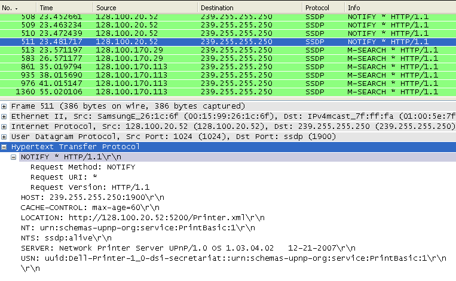

# UPnP (Universal Plug and Play)


<!-- @import "[TOC]" {cmd="toc" depthFrom=1 depthTo=6 orderedList=false} -->

<!-- code_chunk_output -->

- [UPnP (Universal Plug and Play)](#upnp-universal-plug-and-play)
    - [概述](#概述)
      - [1.Universal Plug and Play](#1universal-plug-and-play)
        - [(1) 包含的协议](#1-包含的协议)
      - [2.使用](#2使用)
        - [(1) 安装客户端](#1-安装客户端)
        - [(2) 设置端口转发](#2-设置端口转发)

<!-- /code_chunk_output -->

### 概述

#### 1.Universal Plug and Play

是一组协议，使得 客户端 能够自动设置 服务端 进行端口转发

##### (1) 包含的协议

* DHCP
    * 用于自动获取ip
* SSDP
    * 发送组播信息 (239.255.255.250)
    * 即在LAN中广播自己的信息
* HTTP等
    * 客户端广播自己的信息后，服务就会发现然后会订阅客户端的事件，从而实现自动配置



#### 2.使用

##### (1) 安装客户端

```shell
apt-get -y install miniupnpc
```

##### (2) 设置端口转发

```shell
upnpc -a <local_ip> <local_port> <external_port> <protocol> [remove_host]
# -a表示add
# local ip和port是内网的地址
# external就是服务端（即路由器）暴露的地址
# protocol就是tcp或udp
# remove_host服务器地址，不填默认为网关地址
```