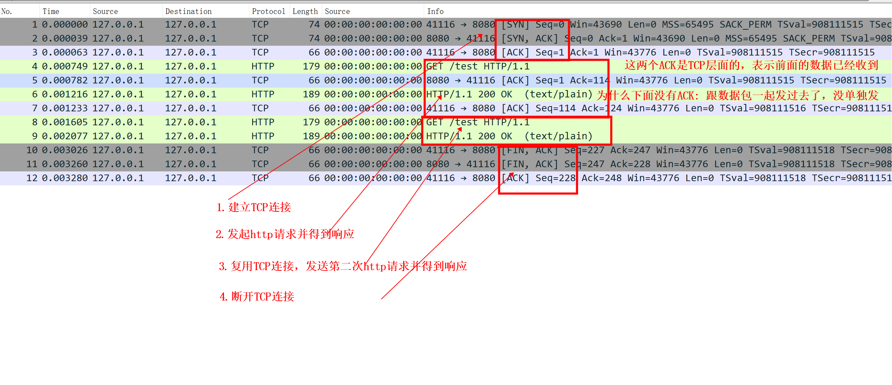
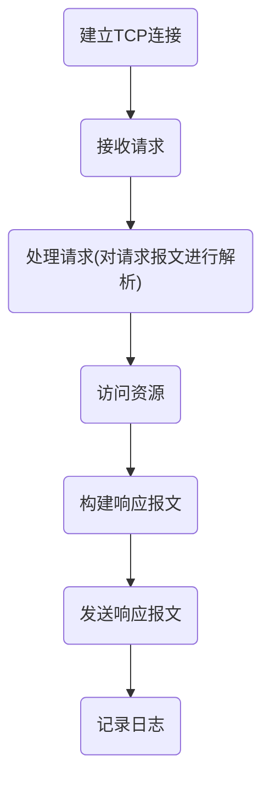
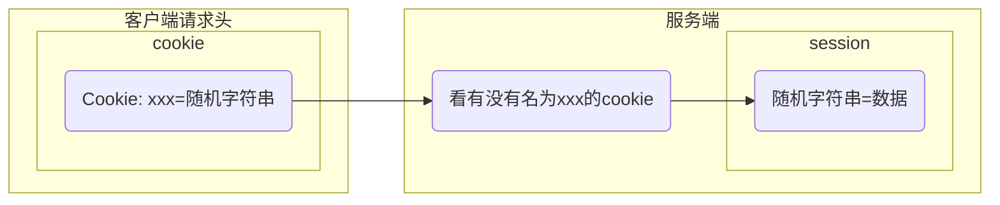

# HTTP

<!-- @import "[TOC]" {cmd="toc" depthFrom=1 depthTo=6 orderedList=false} -->
<!-- code_chunk_output -->

- [HTTP](#http)
    - [概述](#概述)
      - [1.HTTP协议特点](#1http协议特点)
      - [2.HTTP/1.0 、HTTP/1.1 和 HTTP/2.0 比较](#2http10-http11-和-http20-比较)
      - [3.一次http请求的过程](#3一次http请求的过程)
      - [4.请求报文格式](#4请求报文格式)
      - [5.响应报文格式](#5响应报文格式)
      - [6.常用请求方法](#6常用请求方法)
      - [7.url分析](#7url分析)
        - [（1）传递参数：`?<query_string>`](#1传递参数query_string)
        - [（2）锚点：`#<anchor>`](#2锚点anchor)
      - [8.模拟http请求](#8模拟http请求)
      - [9.利用python模拟http服务端](#9利用python模拟http服务端)
      - [10.超时时间](#10超时时间)
    - [HTTP请求头](#http请求头)
      - [1.注意事项](#1注意事项)
        - [（1）header的名字不能包含下划线](#1header的名字不能包含下划线)
        - [（2）不区分大小写](#2不区分大小写)
      - [2.常用请求头](#2常用请求头)
    - [补充知识](#补充知识)
      - [1.重定向是客户端进行的](#1重定向是客户端进行的)
    - [cookie](#cookie)
      - [1.cookie特点](#1cookie特点)
    - [session](#session)
      - [1.session特点](#1session特点)
      - [2.session能够存放的地方](#2session能够存放的地方)
      - [3.demo(django)](#3demodjango)

<!-- /code_chunk_output -->

### 概述



#### 1.HTTP协议特点
* HTTP协议是**无状态**的
为了追踪用户的身份和访问记录,就有了cookie和session
</br>
* 在HTTP中 一个request只能有一个response，而且这个response也是**被动的**，不能主动发起
</br>
* 一个页面一般包含多个资源,每个资源都需要单独的请求

#### 2.HTTP/1.0 、HTTP/1.1 和 HTTP/2.0 比较

|http版本|连接特点|传输形式|其他特点|
|-|-|-|-|
|HTTP/1.0|短链接|||
|HTTP/1.1|长连接（多个http连接可以复用同一个tcp连接，但**不能同时**）|文本形式|使用MIME标准,不仅仅可以输出文本文件,还有其他的文件类型（MIME:multipurpose internet mail extensions,定义了多种文件类型）|
|HTTP/2.0|多路复用（多个http连接可以**同时**使用同一个tcp连接）|将数据压缩成多个二进制消息，然后在客户端重组|server能够向client端推送信息</br>对header进行压缩|

#### 3.一次http请求的过程


#### 4.请求报文格式
```shell
Method  Path  protocol/version    #\r\n
Headers(key:value)                #\r\n
                                  #\r\n
content   #非必须，GET是没有请求主体的
```

#### 5.响应报文格式
```shell
protocol/version  StatusCode  StatusMessage   #\r\n
Headers(key:value)                            #\r\n
                                              #\r\n
content
```

#### 6.常用请求方法
* GET - 从指定的资源请求数据
用来获取数据，也可以**上传数据**，通过在**url**后面加？加键值对，由于地址栏长度有限，所有只能上传少量的数据，且数据是明文传输的
</br>
* POST - 提交表单
可以通过**url**后面加？加键值对或者**请求体**传递数据
</br>
* PUT - 操作是幂等的,所谓幂等是指不管进行多少次操作，结果都一样
PUT是上传一个资源,用的少,不安全

#### 7.url分析

##### （1）传递参数：`?<query_string>`
```shell
http://test.com/?<key1>=<value1>&<key2>=<value2>
```

##### （2）锚点：`#<anchor>`

#### 8.模拟http请求
（1）http/1.0
```shell
exec 8<>/dev/tcp/10.0.36.1/80
echo -n -e "GET / HTTP/1.0\r\n\r\n" >&8
cat <&8

#或者

echo -n -e "GET / HTTP/1.0\r\n\r\n" | nc 10.0.36.1 80
```
（2）http/1.1
```shell
echo -n -e "GET / HTTP/1.1\r\nHost:10.0.36.1\r\n\r\n" >&8
```

#### 9.利用python模拟http服务端
```python
import socket

sock = socket.socket()
sock.bind(("127.0.0.1",8080))
sock.listen()
while True:
    conn, addr = sock.accept()
    data =conn.recv(1024)      #接收到的是字节码
    print(data)                #打印HTTP请求
    conn.send(b"HTTP/1.1 200 OK\r\n\r\nreponse")
    conn.close()
```

#### 10.超时时间
* `connectTimeout`
建立tcp连接的超时时间
</br>
* `writeTimeout`
写超时时间
客户端向服务器写数据，当服务端在规定时间内没有响应，客户端就会触发写超时
</br>
* `readTimeout`
读超时时间
客户端从服务器读取数据，当服务器在规定时间内没有返回数据，客户端就会触发读超时

***

### HTTP请求头

#### 1.注意事项

##### （1）header的名字不能包含下划线

##### （2）不区分大小写

#### 2.常用请求头

|headers（case insensitive）|description|detial|
|-|-|-|
|Host|请求的host的地址（domain name or ip）||
|Cookie|用于存储所有cookie，一个cookie的格式：`<KEY>=<VALUE>;`||
|Content-Type|请求体的数据格式，常用的：`application/json`||
|X-Forwarded-*|当经过了反向代理时，会用这个标识代理前的一些信息|比如：X-Forwarded-For 用于标识源ip地址（是一种标准）,但这个请求头需要手动设置（默认不会有这个请求头）,比如前面有一层负载，需要在前面负载中设置一下，用真正的client ip设置X-Forwarded-For请求头,后端记录日志时，需要设置日志的格式用x-forwarded-for头|
|X-Original-*|当经过了反向代理时，会用这个标识一些原始的header的信息||

***

### 补充知识

#### 1.重定向是客户端进行的
服务端返回的信息包含重定向的内容，客户端会发送新的请求到重定向的地址

***

### cookie

#### 1.cookie特点
* 保存在**客户端**浏览器上的**键值对**
* 服务端可以向客户端浏览器端写cookie
* 客户端每次发请求时，**请求头**中会携带当前可访问的所有**cookie**
```python
#Request Headers
Cookie: K1=V1,K2=V2,K3=V3,...   
#里面的每一对键值对都是具体的cookie
```

***

### session

**本质是 让客户端 在 服务端 存储数据**

**cookie是将 数据 存储在 客户端，每次请求会放在请求头里发给服务端（不安全）**

<br>

**相当于cookie的一个变种，因为cookie不够安全**

#### 1.session特点
* 保存在**服务端**的数据（**本质**是**键值对**）
可能存储在文件中，文件名为键，文件内容为值，也可能存储在缓存中等等
</br>
* 当用户登录后会生成一个键值对（**键**是**随机字符串**，**值**一般是**字典**，**保存用户信息**）
```python
随机字符串: {
  #这里保存的都是用户的信息
    "k1": v1,   
    "k2": v2,
    ... ...
  }
```
* 生成的**随机字符串**会发给客户端作为**cookie**
```python
#写入客户端的cookie
xx: 随机字符串    #这里的xx为sessionid
```
* session有**超时时间**
* **保持会话**，**记录用户的登录状态**，敏感信息不会传送给客户

#### 2.session能够存放的地方
* 数据库
* 缓存
* 文件
* 缓存 + 数据库
* 加密cookie（相当于没用session）

#### 3.demo(django)
* 登录成功后，生成session，并发送给客户端
```python
#登录函数
def login(request):
  if 账号密码正确：

      #设置session
      request.session['username'] = "user01"
      request.session["other-info"] = "xx"
      return render(request)

#登录后函数
def index(request):

    #获取session的信息
    v = request.session.get("username")  
    if v:
        return HttpReponse("登录成功")
```
