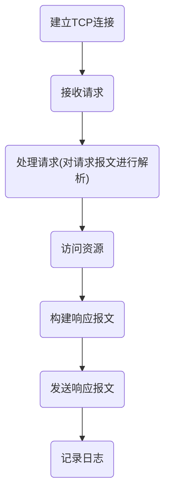

[toc]
# HTTP
### 概述
#### 1.HTTP协议特点
* HTTP协议是**无状态**的
为了追踪用户的身份和访问记录,就有了cookie和session
</br>
* 在HTTP中 一个request只能有一个response，而且这个response也是**被动的**，不能主动发起
</br>
* 一个页面一般包含多个资源,每个资源都需要单独的请求

#### 2.HTTP/1.0 和 HTTP/1.1 比较
* HTTP/1.0，**短链接**
一次连接就是一个 Request 一个 Respons
</br>
* HTTP/1.1，**长连接**
有一个keep-alive，在一个HTTP连接中，可以发送多个Request，接收多个Response，在一定时间内没有请求，才断开连接
</br>
* HTTP/1.1协议开始,使用**MIME标准**
不仅仅可以输出文本文件,还有其他的文件类型（MIME:multipurpose internet mail extensions,定义了多种文件类型）

#### 3.一次http请求的过程


#### 4.请求报文格式
```shell
Method  Path  protocol/version    #\r\n
Headers(key:value)                #\r\n
                                  #\r\n
content   #非必须，GET是没有请求主体的
```

#### 5.响应报文格式
```shell
protocol/version  StatusCode  StatusMessage   #\r\n
Headers(key:value)                            #\r\n
                                              #\r\n
content
```

#### 6.常用请求方法
* GET - 从指定的资源请求数据
用来获取数据，也可以**上传数据**，通过在**url**后面加？加键值对，由于地址栏长度有限，所有只能上传少量的数据，且数据是明文传输的
</br>
* POST - 提交表单
可以通过**url**后面加？加键值对或者**请求体**传递数据
</br>
* PUT - 操作是幂等的,所谓幂等是指不管进行多少次操作，结果都一样
PUT是上传一个资源,用的少,不安全

##### 7.模拟http请求
（1）http/1.0
```shell
exec 8<>/dev/tcp/10.0.36.1/80
echo -n -e "GET / HTTP/1.0\r\n\r\n" >&8
cat <&8

#或者

echo -n -e "GET / HTTP/1.0\r\n\r\n" | nc 10.0.36.1 80
```
（2）http/1.1
```shell
echo -n -e "GET / HTTP/1.1\r\nHost:10.0.36.1\r\n\r\n" >&8
```

#### 8.利用python模拟http服务端
```python
import socket

sock = socket.socket()
sock.bind(("127.0.0.1",8080))
sock.listen()
while True:
    conn, addr = sock.accept()
    data =conn.recv(1024)      #接收到的是字节码
    print(data)                #打印HTTP请求
    conn.send(b"HTTP/1.1 200 OK\r\n\r\nreponse")
    conn.close()
```

### 补充知识
#### 1.重定向是客户端进行的
服务端返回的信息包含重定向的内容，客户端会发送新的请求到重定向的地址

### cookie
#### 1.cookie特点
* 保存在用户浏览器端的键值对
* 服务端可以向用户浏览器端写cookie
* 客户端每次发请求时，请求头中会携带当前可访问的所有cookie
