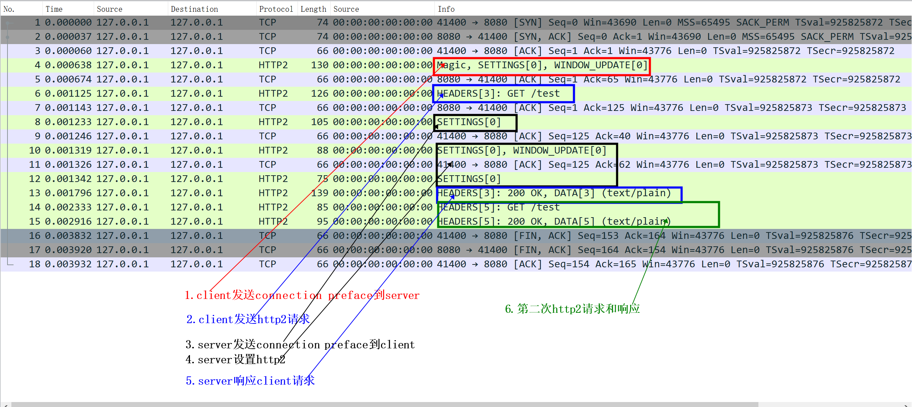

# http2


<!-- @import "[TOC]" {cmd="toc" depthFrom=1 depthTo=6 orderedList=false} -->
<!-- code_chunk_output -->

- [http2](#http2)
    - [概述](#概述)
      - [1.http2](#1http2)
      - [2.h2c vs h2](#2h2c-vs-h2)
      - [3.frame（是http2通信的最小的单元）](#3frame是http2通信的最小的单元)
        - [（1）frame type](#1frame-type)
        - [（2）stream id（奇数和偶数）](#2stream-id奇数和偶数)
      - [4.connection preface（连接前言）](#4connection-preface连接前言)

<!-- /code_chunk_output -->

### 概述

[参考](https://httpwg.org/specs/rfc7540.html)



#### 1.http2
* 是一个二进制协议
  * 即以二进制形式处理协议，而不是文本形式
* 多路复用
  * 即多个http连接可以**同时**使用同一个tcp连接
* server端能够向client端推送信息
* http header会被压缩

#### 2.h2c vs h2
* h2 is HTTP/2 over TLS (protocol negotiation via ALPN).
* h2c is HTTP/2 over TCP.

#### 3.frame（是http2通信的最小的单元）

```
+-----------------------------------------------+
|                 Length (24)                   |
+---------------+---------------+---------------+
|   Type (8)    |   Flags (8)   |
+-+-------------+---------------+-------------------------------+
|R|                 Stream Identifier (31)                      |
+=+=============================================================+
|                   Frame Payload (0...)                      ...
+---------------------------------------------------------------+
```

* length: frame的长度
* type: frame的类型
  * 不同类型的frame，payload的结构不一样（即用途不一样）
* flag
* R: 预留的
* Stream Identifier: 流的id（用于标识不同的stream）

#####（1）frame type

|frame type|说明|
|-|-|
|HEADER|传输http header|
|DATA|传输http body|
|SETTING|设置通信的相关参数（比如header的最大值、windows的大小等）|
|WINDOW_UPDATE|进行流控，动态调整windows的大小）|
|RST_STREAM|立即结束一个stream（通常是因为发生了错误）|
|GOAWAY|优雅的关闭stream，但仍然完成对已经建立的流的处理|
|PING|检查一个idle连接是否可用|

##### （2）stream id（奇数和偶数）
* 奇数：是由client发起的流
* 偶数：是由server发起的流

#### 4.connection preface（连接前言）
在建立连接前，client和server都会发送preface给对方
* 原因：防止对方做无用的操作，如果server不支持http2，client发送preface过去，server端不认识，则后面发来的数据也不会进行处理了
* client发送的preface: magic数据
  * 如果server不是http2，则不会响应和处理
* server发送的: SETTING frame
