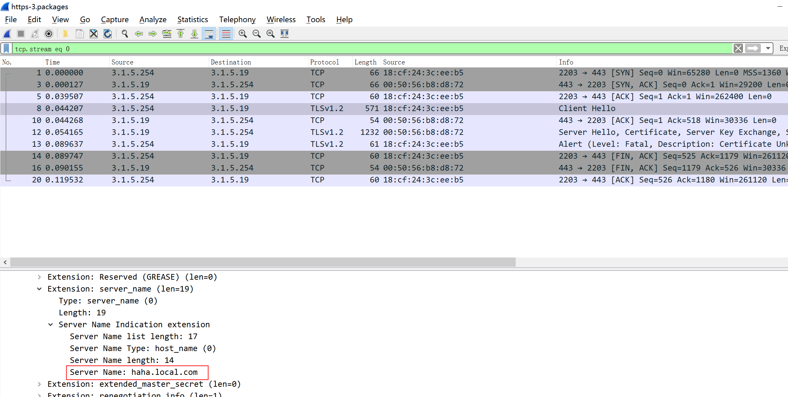

# https

<!-- @import "[TOC]" {cmd="toc" depthFrom=1 depthTo=6 orderedList=false} -->
<!-- code_chunk_output -->

- [https](#https)
    - [概述](#概述)
      - [1.TLS(是https的本质)](#1tls是https的本质)
      - [1.ALPN (Application-Layer Protocol Negotiation): 用于协商应用层的协议](#1alpn-application-layer-protocol-negotiation-用于协商应用层的协议)
      - [2.SNI](#2sni)

<!-- /code_chunk_output -->

### 概述

#### 1.TLS(是https的本质)

#### 1.ALPN (Application-Layer Protocol Negotiation): 用于协商应用层的协议
* 是TLS的扩展，用于协商应用层的协议

#### 2.SNI
sever name indication
* 用于在TLS协商时，标识访问的主机名，
  * 服务端会根据这个主机名，选择相应的virtual server，从而可以使用不同的配置（比如不同的证书）
  * SNI要和证书里的CN符合（即访问的主机名在证书的CN列表中），不然客户端会认为不安全

