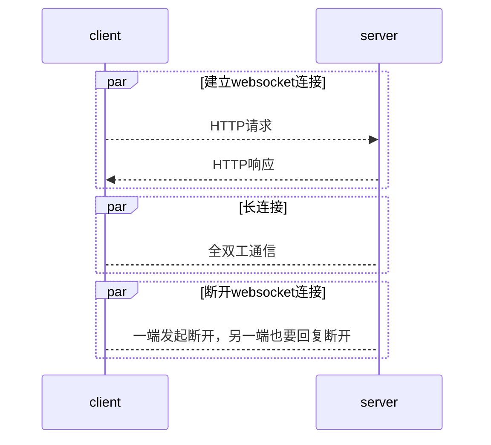

# websocket

<!-- @import "[TOC]" {cmd="toc" depthFrom=1 depthTo=6 orderedList=false} -->
<!-- code_chunk_output -->

- [websocket](#websocket)
    - [概述](#概述)
      - [1.websocket特点](#1websocket特点)
      - [2.websocket原理](#2websocket原理)
      - [3.建立websocket连接](#3建立websocket连接)
      - [4.socket和HTTP](#4socket和http)
      - [5.与http比较](#5与http比较)

<!-- /code_chunk_output -->

### 概述

#### 1.websocket特点
* 基于TCP，是HTML5下的应用层协议，高效节能的**全双工**通信机制，保证数据的实时传输
</br>
* 通过**HTTP协议** **建立连接**，但是在建立连接之后，真正的数据传输阶段是不需要http协议参与的
</br>
* 服务端可以主动向客户端**推送数据**

#### 2.websocket原理


#### 3.建立websocket连接
（1）HTTP请求头
```shell
GET ws://example.com:8181/ HTTP/1.1
Host: localhost:8181
Connection: Upgrade
Upgrade: websocket
```
（2）HTTP响应头
```shell
HTTP/1.1 101 Switching Protocols
Upgrade: websocket
Connection: Upgrade
```

#### 4.socket和HTTP
* 传统的socket技术，是tcp长连接，如果通信双方没有传输数据，这种方式很浪费资源
* HTTP协议就是为了解决这种浪费，一次请求和响应后就断开连接

#### 5.与http比较
* http实现实时推送用的是轮询：
```
短轮询：浏览器定时向服务器发送请求，服务器收到请求不管是否有数据到达都直接响应 请求，隔特定时间，浏览器又会发送相同的请求到服务器， 获取数据响应
```
```
长轮询：浏览器发起请求到服务器，服务器一直保持连接打开，直到有数据可发送。发送完数据之后，浏览器关闭连接，随即又发起一个到服务器的新请求。这一过程在页面打开期间一直持续不断
```
* WebSocket 未加密的连接是ws://，默认端口为80，加密的连接是wss://，默认端口为443
